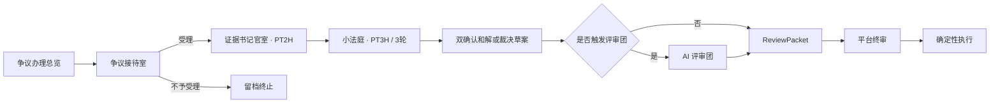

# AI Native 履约争端审理系统：架构设计（最终版）

> 英文名：AI Native Fulfillment Dispute Hearing System  
> 文档性质：企业级目标态架构基线  
> 适用范围：履约争端受理、举证、审理、评议、人审、执行、离线复盘与 AI Native 前端交互  
> 当前任务边界：本文档只定义最终架构，不修改代码、数据库、接口、工程目录、Docker 或 CI/CD  
> API 命名原则：正式版接口不使用 `/v2`、`/v3` 等路径标识，统一使用 `/api/disputes`、`/api/reviews`、`/internal/agents/...` 等生产语义路径  

---

## 0. 文档定位

本文档是 **AI Native 履约争端审理系统** 的最终架构设计基线，用于统一后续开发文档、技术清单、配置说明、接口文档、前端交互方案、测试文档和验收清单。

系统最终不再定位为订单中心、物流监控平台或泛售后工作台，而是一个专门处理用户与商家履约争端的 AI Native 审理协作系统。

最终一句话定位：

```text
系统以用户或商家主动发起的履约争端为唯一主入口，以 FulfillmentDisputeCase 为唯一主对象，通过争议接待官、证据书记官、AI 主审官、按需 AI 评议团、审核辅助官和离线复盘官协作，在 Workflow、人审门控和确定性执行器约束下，完成履约争端从受理、举证、审理、评议、审核、执行到复盘的闭环。
```

---

## 1. 产品定位与系统边界

### 1.1 产品名称

```text
中文名：AI Native 履约争端审理系统
产品化表达：AI 履约争端审理庭
英文名：AI Native Fulfillment Dispute Hearing System
英文产品化表达：AI Fulfillment Dispute Court
```

### 1.2 核心价值

系统的核心价值不是帮助用户查订单，也不是监控物流，而是处理传统系统难以稳定处理的履约争端：

```text
双方主张冲突；
证据不完整；
证据互相矛盾；
责任边界模糊；
规则适用复杂；
执行动作高风险；
平台需要审理和确认。
```

Agent 的价值主要体现在：

```text
把自然语言争端转为结构化案件；
把分散材料转为证据卷宗；
把混乱争议拆成争点、主张、证据和规则；
把复杂争议形成可审核的非最终裁决草案；
对高风险草案进行多维 AI 评议；
帮助审核员理解证据、规则、异议和执行后果；
把每次处理过程沉淀为可评估、可复盘、可优化的 Trace。
```

### 1.3 受理入口

系统只接收以下入口：

1. 用户主动发起履约争端。
2. 商家主动发起履约争端。
3. 平台客服将普通售后升级为履约争端。
4. 平台审核员要求某个售后问题进入争端审理。

前两项是主入口，后两项是后台升级入口。

### 1.4 重点场景

| 场景 | 争端本质 |
|---|---|
| 物流显示签收但用户称未收到 | 用户陈述与物流/签收证据冲突 |
| 用户退货后商家称商品被掉包 | 退回商品身份与发出商品身份冲突 |
| 商品破损但双方对责任归属不一致 | 损坏发生时点与责任边界不清 |
| 用户称少件/错发，商家称发货无误 | 发货证据与收货主张冲突 |
| 商家拒绝退款，用户不认可 | 售后处理结论存在实质争议 |
| 商家称影响二次销售，用户不认可 | 商品状态认定冲突 |
| 高价值商品退款或补发 | 权益与成本影响高，需要强人审 |
| 补证责任或规则适用不清 | 举证责任、规则条件和处理方案不确定 |

### 1.5 明确排除

以下能力不作为系统主模块：

```text
普通订单查询；
全量订单中心；
普通物流查询；
物流监控大盘；
发货时效运营看板；
普通催发货；
普通退款进度查询；
无争议退款/退货；
库存调度；
仓储作业；
配送调度；
商家经营分析；
通用客服机器人。
```

边界原则：

```text
订单不是主对象，订单是争端案件的上下文证据。
物流不是产品入口，物流是争端案件的证据来源。
售后不是泛工作台，履约争端审理才是系统主场。
```

---

## 2. 架构设计总原则

### 2.1 四条红线

```text
Agent 不最终裁决。
Workflow 不承载开放式认知。
Human Review 不可绕过。
Tool Executor 不接受未审批动作。
```

### 2.2 六个基本分工

| 层 | 负责 | 不负责 |
|---|---|---|
| Workflow | 状态、流程、等待、超时、恢复、重试、审计 | 语义理解、证据推理 |
| Agent | 非结构化理解、证据分析、规则解释、草案生成 | 最终裁决、直接执行 |
| Harness | 上下文、记忆、工具、权限、Guardrail、Trace、Hook | 业务事实源 |
| Skill | 场景化审理方法、证据要求、推理模板 | 状态推进、执行动作 |
| Human Review | 高风险动作最终确认、责任锚点 | 自动化工具执行 |
| Tool Executor | 执行已审批确定性动作 | 判断责任、自由决策 |

### 2.3 业务事实源原则

```text
PostgreSQL + Workflow State = 业务事实源；
Evidence 原件与证据快照 = 证据事实源；
Agent Memory = 上下文增强，不是事实源；
Elasticsearch = 可重建检索投影，不是事实源；
Redis = 短期缓存/锁，不是事实源；
Langfuse = Agent Trace 与观测，不是业务事实源。
```

### 2.4 Agent 不是流程节点

C1-C6 不再定义为六个独立 Agent，而是 AI 主审官在 `DisputeHearingWorkflow` 控制下执行的六个审理 Stage：

```text
C1 Issue Framing Stage
C2 Evidence Gap Stage
C3 Evidence Request Stage
C4 Evidence Cross-check Stage
C5 Rule Application Stage
C6 Draft Generation Stage
```

每个 Stage 由以下组合完成：

```text
DisputeHearingWorkflow
+ AI Presiding Judge Agent
+ Stage-specific Skill
+ Context Builder
+ Tool Gateway
+ Output Schema Validator
+ Guardrail Checker
+ Trace Recorder
```

### 2.5 按需多 Agent

系统不做全流程多 Agent 平铺。AI 评议团只在以下条件下按需触发：

```text
高金额；
低置信度；
重大证据冲突；
规则适用不确定；
退货掉包；
签收未收到；
疑似欺诈；
审核员主动要求复核。
```

---

## 3. 总体架构

### 3.1 总体架构图

```text
用户 / 商家 / 平台客服 / 平台审核员
                  │
                  ▼
          AI Native 争端发起入口
                  │
                  ▼
       Dispute Intake Officer Agent
      争议识别、主张抽取、受理建议
                  │
                  ▼
          FulfillmentDisputeCase
                  │
                  ▼
            Evidence Clerk Agent
      证据卷宗、时间线、矩阵、冲突与缺证
                  │
                  ▼
     Admissibility & Hearing Router
       ┌──────────┼──────────┐
       ▼          ▼          ▼
 NOT_ADMISSIBLE             ACCEPTED
 不予受理并留档               进入房间式争端审理
                              │
                              ▼
                AI Presiding Judge Agent
                 C1-C6 受控审理循环
                              │
                       Risk Gate 判断
                              │
                 ┌────────────┴────────────┐
                 ▼                         ▼
        无需评议，进入方案规划        AI Deliberation Panel
                                      五类 Critic 质询
                 └────────────┬────────────┘
                              ▼
                       Remedy Planner
                              │
                              ▼
                   Approval Policy Engine
                              │
                              ▼
          Platform Human Review + Review Copilot
                              │
                批准 / 修改后批准 / 退回 / 拒绝 / 升级
                              ▼
                         Tool Executor
                              │
                              ▼
                  Case Closure + Evaluation Agent
```

### 3.2 分层架构

| 层 | 责任 | 主要组件 |
|---|---|---|
| AI Native 交互层 | 争端发起、证据协作、审理过程可视化、人审协作 | Vue 前端、动态工作区、AI 证据工作室、AI 审理庭、审核台 |
| Agentic Workflow 层 | 状态机、补证等待、人审暂停、重试、恢复、Signal | Temporal Workflows |
| Agent Runtime Harness 层 | Agent 身份、上下文、记忆、工具、Skill、循环、校验、Guardrail、Hook、Trace | Python Agent Runtime |
| Agent 认知层 | 受理、证据、审理、评议、审核辅助、离线评估 | 六类 Agent |
| 确定性业务层 | 案件事实、权限、人审、策略、执行、审计 | Java API Service |
| 数据与证据层 | 业务事实、证据对象、检索投影、短期缓存 | PostgreSQL、MinIO、Elasticsearch、Redis |
| 模型与观测层 | 模型网关、Trace、成本、评估 | LiteLLM、Langfuse |

### 3.3 服务拓扑

```text
Browser
  │
  ▼
Nginx
  │
  ├── /                         → Frontend Vue App
  ├── /api/disputes             → Java API Service
  ├── /api/reviews              → Java API Service
  ├── /agent-api/*              → Python Agent Service（仅受控代理）
  └── /ocr-api/*                → OCR Parser Service（仅受控代理）

Java API Service
  ├── PostgreSQL
  ├── Redis
  ├── MinIO
  ├── Elasticsearch
  ├── Temporal Worker
  ├── OCR Parser Service
  └── Python Agent Service

Python Agent Service
  ├── Agent Runtime Harness
  ├── Skill Library
  ├── LiteLLM Proxy
  └── Langfuse
```

---

## 4. 核心业务对象

### 4.1 FulfillmentDisputeCase

履约争端案件是唯一聚合根。

关键字段：

```text
case_id
case_no
initiator_role
user_id
merchant_id
order_id
after_sales_id
logistics_id
dispute_type
case_status
risk_level
current_stage
hearing_route
created_at
updated_at
closed_at
trace_id
```

### 4.2 DisputeSubmission

记录争端原始提交，不可静默覆盖。

```text
submission_id
case_id
initiator_role
raw_text
order_reference
after_sales_reference
logistics_reference
attachment_refs
channel
submitted_at
source_hash
```

### 4.3 PartyClaim

当事方主张表达“谁针对什么争点提出什么事实与诉求”。

```text
claim_id
case_id
party_role
issue_id
statement
requested_outcome
evidence_refs[]
source_ref
submitted_at
```

### 4.4 EvidenceDossier

证据卷宗是某一时点的不可变快照。

包含：

```text
证据目录；
原始文件引用；
解析文本引用；
事件时间线；
来源、哈希、解析状态、可信度；
主张—争点—证据矩阵；
冲突证据；
缺失证据；
补证建议；
脱敏信息与访问权限。
```

卷宗更新必须创建新版本，不能覆盖旧版本。

### 4.5 Issue

争点是审理的最小判断单元。

示例：

```text
用户是否实际收到商品？
退回商品是否为商家原发商品？
商品破损发生在签收前还是签收后？
少件是否发生在发货环节？
商家拒绝退款是否符合平台规则？
```

每个争点包含：

```text
issue_id
case_id
issue_question
issue_type
party_claim_refs
supporting_evidence_refs
opposing_evidence_refs
rule_refs
finding
confidence
pending_questions
```

### 4.6 AdjudicationDraft

AI 主审官生成的非最终裁决草案。

要求：

```text
必须 non_final=true；
必须引用证据和规则；
必须标明置信度；
必须列出不确定性；
必须列出审核员关注点；
不能包含最终执行命令。
```

### 4.7 DeliberationReport

AI 评议团的质询报告，不是裁决。

包含：

```text
evidence_findings
rule_findings
risk_findings
remedy_findings
fairness_findings
major_objections
required_revisions
panel_trace_refs
```

### 4.8 ReviewPacket

平台审核员的唯一决策输入视图，必须冻结版本。

至少包含：

```text
案件摘要；
风险标签；
双方主张；
争点；
证据时间线；
证据矩阵；
规则引用与版本；
AI 主审官草案；
AI 评议团报告；
Remedy Plan；
Approval Policy 结果；
Trace 和异常记录；
审核辅助官上下文入口。
```

---

## 5. AI 履约争端审理庭 Agent 架构

### 5.1 Agent 总览

| Agent | 运行方式 | 核心产物 | 是否可最终裁决 | 是否可执行 |
|---|---|---|---|---|
| Dispute Intake Officer / 争议接待官 | 在线常驻 | 受理建议、主张摘要 | 否 | 否 |
| Evidence Clerk / 证据书记官 | 在线常驻 | EvidenceDossier | 否 | 否 |
| AI Presiding Judge / AI 主审官 | 在线常驻 | 争点、缺证、规则适用、草案 | 否 | 否 |
| AI Deliberation Panel / AI 评议团 | 高风险按需 | DeliberationReport | 否 | 否 |
| Review Copilot / 审核辅助官 | 人审期间按需 | 审核解释、差异摘要 | 否 | 否 |
| Evaluation Agent / 离线复盘官 | 离线异步 | 质量评估、改进建议 | 否 | 否 |

### 5.2 争议接待官

职责：

```text
判断请求是否构成履约争端；
抽取发起方、订单引用、售后引用、物流引用；
抽取用户/商家主张；
识别诉求和期望处理结果；
识别初始风险信号；
输出受理建议。
```

禁止：

```text
判断责任；
承诺退款；
承诺补发；
关闭案件；
调用执行工具；
把普通查询包装成争端。
```

### 5.3 证据书记官

职责：

```text
收集订单、物流、支付、售后、聊天、仓储、质检等证据；
调用 OCR/文档解析服务；
生成时间线；
构建证据目录；
构建 Claim-Issue-Evidence Matrix；
识别证据缺口、冲突、重复、异常和解析失败；
输出版本化 EvidenceDossier。
```

禁止：

```text
判断责任；
建议退款/补发/驳回；
隐藏不利证据；
把当事人陈述当作平台事实。
```

### 5.4 AI 主审官

在 `DisputeHearingWorkflow` 控制下执行：

```text
C1 争点归纳；
C2 缺证识别；
C3 补证请求；
C4 证据交叉核验；
C5 规则适用；
C6 非最终裁决草案生成。
```

禁止：

```text
输出最终裁决；
直接触发退款、补发、驳回、关闭；
创造不存在的平台规则；
绕过人审；
无限循环；
跳过补证等待。
```

### 5.5 AI 评议团

按需触发，包含：

```text
Evidence Critic：证据质询员；
Rule Critic：规则质询员；
Risk Critic：风险质询员；
Remedy Critic：执行方案质询员；
Fairness Critic：公平性/一致性质询员。
```

聚合规则：

```text
重大异议不得被平均分抵消；
Critic 失败不视为无异议；
Critic 超时必须展示；
任一 BLOCKER 级异议必须触发修订或人工重点审核；
评议团只输出 DeliberationReport，不审批、不执行。
```

### 5.6 审核辅助官

只服务平台审核员。

职责：

```text
解释 AI 主审官草案；
解释 AI 评议团异议；
摘要关键证据；
回答审核员追问；
对比不同方案影响；
生成审核意见草稿；
生成用户/商家通知文案草稿。
```

禁止：

```text
替审核员批准；
替审核员驳回；
修改 RemedyPlan；
触发 Tool Executor。
```

### 5.7 Evaluation Agent

离线运行。

职责：

```text
评估受理准确率；
评估卷宗完整率；
评估争点覆盖率；
评估规则引用准确率；
分析人审修改；
分析评议团有效性；
沉淀失败样本；
提出 Prompt/Skill/规则改进建议。
```

禁止：

```text
参与当前案件实时处理；
自动修改线上 Prompt；
自动发布 Skill；
把单案结论写入全局记忆。
```

---

## 6. Agent Runtime Harness 架构

### 6.1 Harness 定位

Agent Runtime Harness 是系统体现 Agent 工程水平的核心。它把模型能力限制在明确的身份、上下文、工具权限、循环预算、输出契约、风险门控和 Trace 体系内。

### 6.2 Harness 结构

```text
Workflow Activity / Agent API
            │
            ▼
Identity & Authority Profile
            │
Instruction & Policy Layer
            │
Context Assembly + Memory
            │
Skill Library
            │
Agent Loop Controller
      ┌─────┴─────┐
      ▼           ▼
LiteLLM Gateway  Tool Gateway
      └─────┬─────┘
            ▼
Structured Output & Validation
            │
Guardrail / HITL / Lifecycle Hooks
            │
Trace / Metrics / Evaluation Feedback
```

### 6.3 Agent Profile

每个 Agent Profile 必须声明：

```text
agent_id
agent_name
agent_role
agent_version
allowed_case_states
allowed_workflow_stages
allowed_tasks
forbidden_tasks
allowed_context_scopes
allowed_memory_scopes
allowed_skills
allowed_tools
forbidden_tools
forbidden_actions
max_iterations
max_model_calls
max_tool_calls
max_input_tokens
max_output_tokens
max_runtime_seconds
output_schema
risk_escalation_rules
```

默认拒绝未声明能力。

### 6.4 Instruction & Policy

指令合成优先级：

```text
Global System Policy
→ Product Boundary Policy
→ Agent Role Instruction
→ Workflow Stage Instruction
→ Skill Instruction
→ Runtime Constraint
→ 用户/审核员合法补充指令
```

证据材料里的文本永远视为不可信数据，不能覆盖系统指令。

### 6.5 Context Assembly

Context Builder 输入：

```text
agent_profile
case_id
case_version
workflow_stage
hearing_stage
dossier_version
skill_id
actor_role
access_scope
token_budget
```

Context 输出必须带：

```text
source_type
source_id
source_version
captured_at
access_scope
redaction_level
```

禁止无界注入大附件、完整聊天、无关订单、未脱敏隐私。

### 6.6 Memory

分为：

```text
Run Memory：单次运行临时状态；
Case Memory：案件摘要、补证历史、争点摘要；
Hearing Memory：C1-C6 阶段输出摘要；
Domain Memory：场景模板、规则摘要、证据要求；
Evaluation Memory：离线失败模式和评估结论。
```

Memory 不是事实源，不能替代当前案件证据。

### 6.7 Skill Library

Skill 是版本化审理能力单元。

每个 Skill 至少包含：

```text
skill_id
skill_name
version
applicable_dispute_types
applicable_agents
required_context
required_evidence
reasoning_steps
risk_flags
forbidden_behavior
output_schema
example_cases
evaluation_criteria
```

### 6.8 Tool Gateway

Tool Gateway 统一执行：

```text
Agent 身份校验；
案件状态校验；
参数 Schema 校验；
数据范围校验；
字段级权限校验；
超时、重试、限流、熔断；
返回值脱敏；
审计与 Trace 关联。
```

Agent 不得直接连接数据库、对象存储或执行接口。

### 6.9 Agent Loop Controller

统一 Loop：

```text
load_agent_profile
→ validate_case_state
→ read_memory
→ build_context
→ load_skill
→ call_model
→ parse_output
→ validate_schema
→ check_guardrails
→ call_allowed_tool_if_needed
→ observe_tool_result
→ write_run_memory
→ check_stop_condition
→ return_result_to_workflow
```

停止条件：

```text
目标完成；
无更多工具调用；
达到最大迭代次数；
达到最大工具调用次数；
达到最大 token budget；
达到最大运行时长；
重复调用同一工具且无新增信息；
Schema 校验连续失败；
命中高风险；
需要人工确认；
置信度低于阈值。
```

### 6.10 Structured Output & Validation

所有输出必须通过：

```text
JSON/Pydantic Schema 校验；
枚举、金额、日期和引用完整性校验；
证据引用真实性校验；
规则版本校验；
案件状态和 Agent 权限校验；
禁止动作和越权字段校验；
置信度和不确定性表达校验。
```

### 6.11 Guardrail

覆盖：

```text
Prompt 注入；
越权工具调用；
敏感信息泄漏；
无依据结论；
虚假证据引用；
虚假规则引用；
最终裁决表达；
不可逆动作诱导；
偏见和不公平表达；
越权上下文访问。
```

### 6.12 HITL Interrupt

必须中断的情况：

```text
关键证据真实性存疑；
关键规则缺失或冲突；
高金额或不可逆动作；
Agent 低置信度；
评议团重大异议；
连续输出校验失败；
身份、权限或数据范围异常。
```

### 6.13 Lifecycle Hooks

统一 Hook：

```text
before_agent_run
before_context_build
after_context_build
before_llm_call
after_llm_call
before_tool_call
after_tool_call
before_memory_read
after_memory_write
before_human_interrupt
after_human_resume
on_guardrail_violation
on_agent_error
after_agent_run
```

Hook 用于审计、指标、脱敏、成本记录和失败归类，不能绕过业务门控。

---

## 7. Workflow 架构

### 7.1 FulfillmentDisputeWorkflow

主状态：

```text
RECEIVED
→ INTAKE_ANALYZING
→ DOSSIER_BUILDING
→ ADMISSIBILITY_ROUTING
→ NOT_ADMISSIBLE | ACCEPTED
→ WAITING_EVIDENCE
→ DELIBERATING
→ REMEDY_PLANNING
→ WAITING_HUMAN_REVIEW
→ APPROVED | RETURNED_FOR_EVIDENCE | REJECTED
→ EXECUTING
→ CLOSED | EXECUTION_FAILED | MANUAL_TAKEOVER
```

负责：

```text
案件幂等启动；
状态推进；
子 Workflow 编排；
补证等待；
人审 Signal；
执行重试；
审计落库。
```

### 7.2 DisputeHearingWorkflow

流程：

```text
C1 Issue Framing
→ C2 Evidence Gap
→ [需要补证] C3 Evidence Request → WAITING_EVIDENCE
→ C4 Evidence Cross-check
→ C5 Rule Application
→ C6 Draft Generation
→ Risk Gate
→ [需要] DeliberationPanelWorkflow
→ Draft Revision
→ HEARING_COMPLETED
```

### 7.3 DeliberationPanelWorkflow

流程：

```text
freeze_input_snapshot
→ select_critics
→ run_critics_in_parallel
→ collect_critic_reports
→ aggregate_deliberation_report
→ return_to_presiding_judge_or_human_review
```

### 7.4 HumanReviewWorkflow

创建不可变 ReviewPacket，等待审核员 Signal：

```text
APPROVE
MODIFY_AND_APPROVE
RETURN_FOR_EVIDENCE
REJECT
ESCALATE
```

### 7.5 ExecutionWorkflow

只接收已审批动作。每个动作使用 `approval_id + action_type + target_id` 构造幂等键。执行前必须校验审批状态、有效期、参数、权限和 action_hash。

---

## 8. 受理结果与统一审理路径

### 8.1 NOT_ADMISSIBLE

不构成履约争端，本系统留档终止。

禁止：

```text
生成 RemedyPlan；
进入 Platform Human Review；
触发 Tool Executor；
不邀请相对方，不开放证据室与小法庭。
```

### 8.2 ACCEPTED

构成履约争端后，统一进入证据书记官室和小法庭。案件复杂度不再通过两条产品流程分叉，而通过补证轮次、风险策略和按需评审团控制。

所有已受理案件必须经过：

```text
证据书记官室与 EvidenceDossier；
小法庭与非最终裁决草案；
Remedy Planner；
Approval Policy Engine；
Platform Human Review；
Tool Executor。
```

### 8.3 风险差异

低风险、证据充分且双方一致时可以较早收敛并跳过评审团；事实冲突、证据不足、规则不清、高金额或高风险案件执行更多补证轮次并触发 AI 评议团。二者都使用同一房间、时钟和人审链。

---

## 9. AI Native 前端交互架构

### 9.1 前端定位

前端不是传统管理后台，而是 **AI Native 履约争端审理工作空间**。

核心原则：

```text
Intent-first：先表达争端目标，再生成案件工作区；
Evidence-first：所有判断可回到证据；
Process-transparent：展示 AI 审理过程而非只展示结论；
Human-gated：所有高风险动作都以人审卡片确认；
Generative UI：Agent 输出结构化 UI Schema，前端只渲染白名单组件；
Role-aware：用户、商家、审核员看到不同信息和操作；
Traceable：AI 内容可追踪版本、证据和来源。
```

### 9.2 页面结构

```text
/disputes                     争议办理总览
/disputes/:caseId/intake      争议接待室
/disputes/:caseId/evidence    证据书记官室
/disputes/:caseId/hearing     小法庭
/disputes/:caseId/outcome     最终结果
/reviews                      平台审核任务
/reviews/:reviewId            平台终审
```

### 9.3 争端发起入口

以自然语言 + 引导式材料收集为核心。

组件：

```text
争端描述输入框；
订单/售后/物流引用输入；
证据附件上传；
发起方身份说明；
争议接待官受理分析卡；
缺失信息提示；
是否进入本系统的说明；
不予受理留档提示。
```

AI Native 交互：

```text
用户输入自然语言；
争议接待官返回结构化受理卡；
前端动态显示缺失字段；
非争端请求直接展示转交解释；
构成争端则进入案件工作台。
```

### 9.4 争端案件工作台

组件：

```text
案件状态轨道；
争端类型；
风险等级；
双方主张摘要；
当前阶段；
待补证材料；
截止时间；
证据工作室入口；
AI 审理庭入口；
通知记录；
操作历史。
```

状态轨道必须展示：

```text
受理中 → 卷宗构建中 → 路由中 → 简易/完整审理 → 评议中 → 人审中 → 执行中 → 已关闭
```

### 9.5 AI 证据工作室

核心组件：

```text
证据卷宗版本选择器；
原始证据预览；
OCR/文档解析结果；
证据目录；
事件时间线；
双方主张区；
证据缺口区；
证据冲突区；
Claim-Issue-Evidence Matrix；
证据可靠性标签；
证据引用跳转；
证据版本 Diff。
```

AI Native 能力：

```text
问：这份证据支持哪个主张？
问：当前还缺什么材料？
问：哪些证据互相冲突？
问：哪些证据需要人工重点查看？
```

回答必须基于证据引用，不得返回无来源结论。

### 9.6 AI 审理庭

核心组件：

```text
C1-C6 审理阶段时间线；
争点列表；
证据缺口；
补证请求；
证据交叉核验结果；
规则适用说明；
AI 主审官草案；
Risk Gate 结果；
AI 评议团触发状态；
五类 Critic 报告；
草案修订记录；
非最终裁决标识。
```

每条 AI 输出必须展示：

```text
生成时间；
模型版本；
Prompt/Skill 版本；
证据引用；
规则引用；
置信度；
不确定性；
Trace 入口。
```

### 9.7 平台审核台

以 ReviewPacket 为中心。

组件：

```text
审核任务摘要；
案件摘要；
双方主张；
证据矩阵；
关键原件入口；
AI 主审官草案；
AI 评议团重大异议；
RemedyPlan；
Approval Policy 说明；
审核辅助官问答；
批准/修改后批准/退回补证/拒绝/升级。
```

审核动作要求：

```text
必须二次确认；
必须展示将要执行的动作参数；
必须填写审核理由；
必须校验 packet_version；
必须校验 action_hash。
```

### 9.8 前端技术边界

```text
前端不持有任何服务密钥；
前端不直接调用模型；
前端不直接调用 Python 内部 Agent API；
前端只通过 Java API 和 Nginx 代理访问授权数据；
前端只渲染白名单 UI Schema；
Agent 生成 UI 不能直接执行操作；
高风险操作必须进入审核动作组件。
```

---

## 10. Remedy、Policy、人审与执行

### 10.1 Remedy Planner

Remedy Planner 是确定性规划组件，不是重新断案的 Agent。

候选动作：

```text
全额退款；
部分退款；
补发；
换货；
退货退款；
驳回诉求；
继续补证；
关闭售后；
通知双方。
```

Planner 只映射已形成的审理结果，不能改变事实和规则适用。

### 10.2 Approval Policy Engine

所有正式版业务动作都必须人审，`auto_approve=false`。

输出：

```text
risk_level
required_reviewer_role
required_review_count
allowed_actions
forbidden_actions
escalation_reason
policy_version
```

### 10.3 Platform Human Review

平台审核员负责最终确认事实、规则、方案和执行动作，并承担业务责任。

### 10.4 Tool Executor

执行前置条件：

```text
审批记录存在且状态为批准；
审批未过期；
动作与参数未被篡改；
操作者、案件和目标资源权限匹配；
幂等键未成功执行；
依赖动作已完成。
```

Tool Executor 不接受开放式自然语言命令。

---

## 11. 工具权限矩阵

| 能力 | 接待官 | 证据书记官 | 主审官 | 评议团 | 审核辅助官 | Evaluation | Tool Executor |
|---|---:|---:|---:|---:|---:|---:|---:|
| 读取案件基础信息 | ✓ | ✓ | ✓ | ✓ | ✓ | 脱敏 | 必要字段 |
| 读取证据原件 | 最小 | ✓ | ✓ | ✓ | ✓ | 脱敏 | ✗ |
| 查询订单/物流/支付 | 最小只读 | ✓只读 | ✓只读 | ✓只读 | ✓只读 | ✗ | ✗ |
| 解析证据 | ✗ | ✓ | ✗ | ✗ | ✗ | ✗ | ✗ |
| 检索规则 | 受理规则 | 证据规则 | ✓ | ✓ | ✓ | ✓ | ✗ |
| 创建补证建议 | 初始 | ✓ | ✓ | 仅质询 | 仅解释 | ✗ | ✗ |
| 生成裁决草案 | ✗ | ✗ | ✓ | ✗ | ✗ | ✗ | ✗ |
| 生成评议报告 | ✗ | ✗ | ✗ | ✓ | ✗ | ✗ | ✗ |
| 修改案件状态 | ✗ | ✗ | ✗ | ✗ | ✗ | ✗ | 经 Workflow |
| 批准方案 | ✗ | ✗ | ✗ | ✗ | ✗ | ✗ | ✗ |
| 退款/补发/关闭 | ✗ | ✗ | ✗ | ✗ | ✗ | ✗ | 审批后 ✓ |

---

## 12. API 架构

### 12.1 API 命名

正式版不使用 `/v2`、`/v3` 路径。

外部 API：

```text
/api/disputes
/api/reviews
```

内部 API：

```text
/internal/agents/...
/internal/evidence/...
```

版本治理通过：

```text
Header；
Schema version；
Prompt version；
Skill version；
Agent Profile version；
Ruleset version。
```

### 12.2 外部 API

```text
POST /api/disputes
GET  /api/disputes/{caseId}
GET  /api/disputes
POST /api/disputes/{caseId}/evidence
GET  /api/disputes/{caseId}/evidence-dossiers/{version}
GET  /api/disputes/{caseId}/events
GET  /api/disputes/{caseId}/hearing

GET  /api/reviews
GET  /api/reviews/{reviewId}/packet
POST /api/reviews/{reviewId}/decision
POST /api/reviews/{reviewId}/copilot/query
```

### 12.3 内部 API

```text
POST /internal/agents/intake/analyze
POST /internal/agents/evidence/build
POST /internal/agents/hearing/run-stage
POST /internal/agents/deliberation/run
POST /internal/agents/review-copilot/query
POST /internal/agents/evaluation/analyze

POST /internal/evidence/parse
GET  /internal/evidence/tasks/{taskId}
```

内部 API 必须使用服务身份，不允许前端直接访问。

---

## 13. 数据对象设计

### 13.1 核心实体表

```text
fulfillment_dispute_case
dispute_submission
party_claim
evidence_item
evidence_dossier
evidence_dossier_item
case_timeline_event
issue
claim_issue_evidence_link
evidence_request
hearing_state
hearing_stage_record
adjudication_draft
deliberation_report
deliberation_finding
remedy_plan
remedy_action
approval_policy_decision
review_packet
human_review_record
action_record
agent_run
agent_tool_call
agent_guardrail_event
agent_memory_entry
skill_version
prompt_version
evaluation_record
audit_log
```

### 13.2 不可变版本对象

```text
EvidenceDossier；
AdjudicationDraft；
DeliberationReport；
ReviewPacket；
RemedyPlan；
HumanReviewRecord；
ActionRecord。
```

修改必须创建新版本，不得覆盖旧版本。

---

## 14. 安全、审计与可观测性

### 14.1 安全

```text
RBAC + 数据范围；
Agent 最小权限与默认拒绝；
证据 Prompt 注入隔离；
敏感字段脱敏；
短期对象签名 URL；
审批与执行分离；
动作 hash 与双重幂等。
```

### 14.2 审计

必须记录：

```text
身份访问；
案件状态变化；
证据上传和解析；
卷宗版本变化；
Agent 输入引用；
Agent 工具调用；
Agent 输出引用；
Profile/Prompt/Skill/模型/规则版本；
Guardrail 命中；
评议团异议；
人审决定和理由；
Tool Executor 请求、响应和外部流水号。
```

### 14.3 可观测性

统一关联：

```text
request_id
trace_id
case_id
workflow_id
workflow_run_id
agent_run_id
review_id
action_id
```

监控：

```text
Workflow 成功率、重试和等待；
Agent Schema 通过率、引用错误率、预算超限；
工具调用成功率、时延和熔断；
补证次数、超时率和有效率；
人审接受/修改/退回/拒绝率；
执行成功率、幂等命中和结果未知率；
模型时延、Token 和成本；
相似案件一致性和公平性。
```

---

## 15. 典型场景流转

### 15.1 签收未收到

```text
用户发起争端
→ 接待官识别物流签收与用户陈述冲突
→ 书记官收集物流轨迹、签收凭证、用户沟通记录
→ 主审官归纳“是否有效交付”争点
→ 缺证则发起补证
→ 证据交叉核验
→ 高风险触发 Evidence Critic / Fairness Critic
→ 生成非最终草案
→ 人审确认
→ 执行退款/补发/继续补证等已审批动作
```

### 15.2 退货掉包

```text
商家发起争端
→ 书记官构建商品身份链
→ 主审官核验发货、退回、序列号、仓库开箱、质检证据
→ 高风险触发 Evidence/Risk/Fairness Critic
→ 重大证据缺口则转人工重点复核
```

### 15.3 破损责任不清

```text
围绕发货前状态、包装、运输、签收、首次反馈时间建立争点；
规则适用区分运输责任、质量问题和使用损坏；
不得仅依据单张图片下结论。
```

### 15.4 少件错发

```text
对照订单明细、拣货、称重、出库、物流和开箱证据；
证据闭合且规则清晰可简易审理；
存在仓储记录冲突则完整审理。
```

---

## 16. 评估与复盘闭环

### 16.1 指标

```text
争端受理准确率；
非争端误收率；
卷宗完整率；
证据引用准确率；
补证有效率；
争点覆盖率；
规则引用准确率；
无依据陈述率；
草案被人工接受/修改/退回/拒绝比例；
评议团重大异议发现率；
人审处理时长；
案件总时长；
Tool 执行成功率；
相似案件一致性；
公平性指标；
模型 Token、成本和时延。
```

### 16.2 发布门禁

Prompt、模型、Skill、规则或 Agent Profile 变更必须经过：

```text
离线数据集回放；
Schema 校验；
安全测试；
偏差分析；
人工抽检；
成本评估。
```

未达到阈值不得发布。

---

## 17. 最终架构总结

最终主线：

```text
FulfillmentDisputeCase
→ Dispute Intake Officer Agent
→ Evidence Clerk Agent
→ Admissibility & Hearing Router
→ ACCEPTED 统一房间式审理
→ AI Presiding Judge Agent C1-C6
→ AI Deliberation Panel（按需）
→ Remedy Planner
→ Approval Policy Engine
→ Platform Human Review + Review Copilot Agent
→ Tool Executor
→ Case Closure
→ Evaluation Agent
```

最终边界：

```text
AI 提供认知能力，但不拥有最终决定权；
Workflow 提供可靠性，但不替代业务判断；
Human Review 提供责任锚点；
Tool Executor 提供确定性、幂等和可审计执行；
Frontend 提供 AI Native 人机协作工作空间，而不是传统订单后台。
```

---

## 附录 A：旧概念到最终版映射

| 旧概念 | 最终版 |
|---|---|
| 订单履约协作系统 | AI Native 履约争端审理系统 |
| 泛售后履约中心 | 履约争端审理庭 |
| Case Intake Agent | Dispute Intake Officer Agent |
| Evidence Dossier Builder | Evidence Clerk Agent |
| Dispute Router | Admissibility & Hearing Router |
| 明确规则流 | ACCEPTED 低风险快速收敛 |
| C1-C6 Agent 集合 | AI Presiding Judge Agent 的 C1-C6 Stage |
| 无独立评议层 | AI Deliberation Panel |
| 审核界面 | Platform Human Review + Review Copilot |
| Agent 公共能力分散 | Agent Runtime Harness |
| 普通前端后台 | AI Native 争端审理工作空间 |

---

## 18. 房间式协作架构最终定版

### 18.1 总览不是普通订单中心

`/disputes` 是争议办理总览，只读取：

```text
外部接口导入的争议订单；
争议接待官创建的争议订单。
```

桌面端左侧展示当前角色涉及的全部争议订单，右侧展示选中案件的审理游园状态路线。点击订单只切换右侧旅程，点击当前房间节点才进入办理页面。

### 18.2 房间协作层



Java API Service 新增房间协作层，职责包括：

```text
Case Participant：案件成员与权限；
Case Room：房间开放、封存和关闭；
Room Message：不可变对话和附件引用；
Phase Clock：服务端时钟投影；
Case Event：可重放 SSE 事件；
Notification Outbox：传票信箱可靠投递。
```

Temporal 仍是流程与时钟状态源，PostgreSQL 保存查询投影。浏览器倒计时不能触发业务状态转换。

### 18.3 共享庭审权限

| 行为 | 用户 | 商家 | 平台审核员 |
|---|---:|---:|---:|
| 查看共享庭审事件 | 是 | 是 | 是 |
| 提交陈述与补证 | 是 | 是 | 否 |
| 创建或确认和解方案 | 是 | 是 | 否 |
| 查看审核辅助官 | 否 | 否 | ReviewPacket 冻结后 |
| 做出最终审核决定 | 否 | 否 | 是 |

审核员可以在庭审期间只读旁观，但不得提前改变证据或代表任何一方发言。

### 18.4 时效架构

```text
EVIDENCE_SUBMISSION：PT2H
HEARING：PT3H
MAX_HEARING_ROUNDS：3
```

举证双方提前完成可以提前开庭。小法庭固定三轮陈述，每轮双方各有一次“提交本轮”动作；双方都提交或 5 分钟到期后自动封存本轮。庭审期间的材料补充不重置三小时时钟，也不把流程改回补证循环。

前三轮 AI 主审官只做争点归纳、证据解释区、风险信号和下一轮问题；第三轮结束或三小时到期后必须执行 C6 强制收敛，生成确定的非最终裁决执行方案草案。`FACTS_SUFFICIENT` 仅可作为内部置信度信号，不再提前终止三轮陈述。

### 18.5 证据与和解

证据目录双方共享，原件按 `PARTIES / PRIVATE / PLATFORM` 授权。可信度采用 `VERIFIED / PLAUSIBLE / SUSPICIOUS / REJECTED / NEEDS_HUMAN_REVIEW`。

和解采用版本化 `settlement_proposal` 与双方 `settlement_confirmation`。只有用户和商家确认同一当前版本才触发和解型裁决草案；该草案仍进入平台终审。

### 18.6 最终方案后按需评议

AI 评审团不进入每一轮庭审，只在 AI 主审官生成最终裁决方案草案之后运行。触发条件：

```text
高风险；
主审官低置信度；
重大证据冲突；
规则适用不确定；
Guardrail 或 Approval Policy 要求。
```

评审团读取最终方案、双方证据区、双方证据解释区、法官推理与风险信号进行 100 分制复核，阈值为 80 分。评分未达标时最多要求 AI 主审官重生成 2 次；仍未通过时进入高优先级平台人审。

条件全部不满足时跳过评议团以控制时延和 Token 成本，但 ReviewPacket、人类终审与 Tool Executor 不得跳过。

### 18.7 实时与通知

房间通过 REST 写入、SSE 读取：

```text
POST 命令或消息
→ 数据库事务提交消息与 case_timeline_event
→ Outbox 生成角色通知
→ SSE 按 sequence_no 推送
→ 断线使用 Last-Event-ID 续传
```

传票信箱只在平台内投递，按角色脱敏并使用业务事件键幂等。
