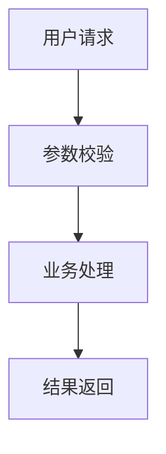

# 正式版开发文档生成提示词

你是一名资深软件架构师、技术负责人、工程规范专家和 Codex 开发指挥专家。

我将上传以下资料：

1. 项目总体架构文档
2. 技术选型清单
3. 相关业务说明、模块说明或补充材料

请你严格基于我上传的资料，生成一份 **极其详细、周密、可直接指挥 Codex 进行正式版开发的开发文档**。

---

## 一、核心目标

请生成一份 `.md` 格式的正式开发文档，用于指导 Codex 从零到一完成项目开发。

注意：

**不要生成 MVP 版本。**  
**不要做简化版。**  
**不要只覆盖核心链路。**  
**不要省略架构中已经设计的模块。**

本开发文档必须覆盖上传架构中的所有内容，并按照正式工程项目的标准进行设计，包括但不限于：

- 总体工程目标
- 系统边界
- 模块拆分
- 仓库结构
- 代码分层规范
- 接口设计规范
- 数据模型设计
- 核心业务流程
- Agent / Workflow / Tool / API / 数据库 / 部署等相关模块
- 配置管理
- 异常处理
- 日志规范
- 测试规范
- 安全规范
- 可观测性
- 部署方案
- Codex 开发执行顺序
- 每个阶段的验收标准

---

## 二、最高优先级要求

### 1. 严格基于上传资料

你必须以我上传的架构文档和技术清单为唯一主要依据。

不得随意扩展与架构无关的模块。  
不得引入未在技术清单中明确出现、且没有必要性的技术。  
不得把正式版降级成 MVP。  
不得遗漏架构中已经规划的模块。

如果发现上传资料中存在不明确、不完整或冲突的地方，请在文档中以以下方式处理：

```md
> 待确认事项：
> - xxx
> - xxx
```

不要因为存在不确定项就停止生成文档。

### 2. 正式版工程标准

本项目目标是正式版工程，而不是验证 Demo。

开发文档必须体现正式项目应有的工程完整性，包括：

- 清晰的工程分层
- 清晰的职责边界
- 清晰的模块依赖关系
- 清晰的接口契约
- 清晰的数据流转
- 清晰的异常与降级策略
- 清晰的测试与验收标准
- 清晰的部署与运维方案

### 3. Codex 可执行性

本文档不是概念方案，而是用于指挥 Codex 开发的执行文档。

因此必须做到：

- 任务拆解清晰
- 文件修改范围明确
- 阶段顺序明确
- 每个阶段输入、输出、验收标准明确
- 每个模块职责边界明确
- 每个开发阶段都有禁止事项
- 能够让 Codex 按阶段稳定推进，不随意发散

---

## 三、开发文档输出结构

请严格按照以下结构生成 Markdown 文档。

---

# 项目正式版开发文档

## 1. 文档说明

说明本文档的用途：

- 用于指导 Codex 进行正式版项目开发
- 用于约束项目工程结构和代码规范
- 用于保证架构设计能够完整落地
- 用于后续开发、测试、部署、维护和迭代

---

## 2. 项目背景与建设目标

根据上传资料，总结：

- 项目要解决的问题
- 项目的核心业务价值
- 项目的正式版建设目标
- 本版本覆盖范围
- 本版本不属于 MVP，而是完整正式版实现

---

## 3. 总体架构理解

根据上传架构文档，详细梳理：

- 系统整体架构
- 核心模块组成
- 模块之间的调用关系
- 数据流
- 控制流
- Agent / Workflow / Tool / Service / Database / API / Frontend / Deployment 等组件关系

如果架构中存在多语言服务，例如 Java、Python、前端、数据库、消息队列、向量库等，需要说明它们之间如何通信、如何解耦、如何部署。

---

## 4. 正式版功能范围

列出正式版必须实现的全部功能模块。

要求：

- 按业务域拆分
- 按技术模块拆分
- 按开发优先级排序
- 明确每个模块的职责、输入、输出、依赖和验收标准

格式参考：

```md
### 4.x 模块名称

#### 模块职责

#### 核心能力

#### 输入

#### 输出

#### 依赖模块

#### 关键实现点

#### 异常情况

#### 验收标准
```

---

## 5. 仓库结构设计

请给出正式版推荐仓库结构。

要求：

- 结构清晰
- 层次分明
- 适合长期维护
- 适合多人协作
- 适合 Codex 分阶段开发
- 符合主流工程规范

如果是单体项目，请给出单体仓库结构。  
如果是多服务项目，请给出 monorepo 或 multi-repo 的推荐结构，并说明理由。

仓库结构需要细化到目录级别，例如：

```md
project-root/
  backend/
  frontend/
  agent-service/
  workflow-engine/
  docs/
  deploy/
  scripts/
  tests/
  README.md
```

每个目录都要说明用途。

---

## 6. 后端工程结构规范

如果项目包含后端服务，请详细设计后端分层结构。

必须包括：

- controller / api 层
- application / usecase 层
- domain 层
- service 层
- infrastructure 层
- repository / mapper 层
- config 层
- common 层
- exception 层
- dto / vo / entity / model 层
- integration / client 层
- test 层

请说明每一层职责，以及不允许做什么。

重点要求：

- Controller 不写业务逻辑
- Service 不直接暴露数据库细节
- DTO、Entity、VO、DO、BO 的边界清晰
- 外部 API 调用统一放在 client / integration 层
- 异常统一处理
- 日志统一规范
- 配置集中管理

---

## 7. Agent / Workflow / Tool 工程设计

如果上传架构中涉及 Agent、Workflow、Tool Calling、MCP、Planner、Executor、Router、Reflection、Memory、Trace 等模块，请详细设计。

必须包括：

- Agent 模块职责
- Workflow 编排方式
- Tool 注册与调用规范
- Tool Schema 设计规范
- Planner 输入输出协议
- Executor 执行协议
- Router 路由策略
- Trace 记录规范
- Reflection / Evaluation 流程
- Prompt 管理规范
- 上下文管理规范
- 失败重试与降级策略
- 人工确认 HITL 机制，如架构中包含

要求不要泛泛而谈，要给出可执行的工程设计。

---

## 8. API 接口设计规范

请根据架构内容设计 API 规范。

包括：

- REST API 或 RPC API 设计原则
- URL 命名规范
- 请求方法规范
- 请求参数规范
- 响应体规范
- 错误码规范
- 分页规范
- 幂等性规范
- 鉴权规范
- API 版本管理
- OpenAPI / Swagger 文档要求

如果能根据上传架构推导出具体接口，请按模块列出接口清单。

格式参考：

```md
### 接口名称

- Method:
- Path:
- Description:
- Request:
- Response:
- Error Codes:
- Auth:
- Idempotency:
```

---

## 9. 数据库与数据模型设计

根据上传架构和技术清单，设计数据库层开发要求。

必须包括：

- 数据库选型说明
- 表设计原则
- 核心表清单
- 字段命名规范
- 主键规范
- 索引规范
- 唯一约束
- 软删除规范
- 创建时间 / 更新时间规范
- 审计字段规范
- 数据迁移规范
- 数据一致性策略
- 事务边界
- 多数据源处理方式，如涉及

如架构中涉及向量库、缓存、消息队列、对象存储，也要分别说明其数据结构和使用规范。

---

## 10. 核心业务流程设计

根据上传架构，梳理所有核心业务流程。

每个流程都要包括：

- 触发入口
- 参与模块
- 主流程
- 分支流程
- 异常流程
- 数据变化
- 日志记录点
- Trace 记录点
- 验收标准

建议使用 Mermaid 流程图表达，例如：



---

## 11. 配置管理规范

请设计正式版配置管理方案。

包括：

- 环境划分：local / dev / test / uat / prod
- 配置文件结构
- 敏感配置管理
- 环境变量规范
- Docker Compose 配置
- 数据库连接配置
- 第三方服务配置
- LLM / Agent 相关配置
- 日志级别配置
- Feature Flag，如需要

---

## 12. 异常处理与错误码规范

请设计统一异常体系。

包括：

- 业务异常
- 参数异常
- 鉴权异常
- 外部服务异常
- 数据库异常
- Workflow 执行异常
- Agent 推理异常
- Tool 调用异常
- 超时异常
- 幂等冲突异常

必须给出错误码设计规范和示例。

---

## 13. 日志、Trace 与可观测性规范

正式版必须具备可观测性。

请设计：

- 日志级别规范
- 日志字段规范
- 请求链路 ID
- Trace ID
- Span 设计
- Agent 执行轨迹记录
- Workflow 节点执行记录
- Tool 调用记录
- 错误日志规范
- 慢请求记录
- 指标监控
- 告警指标
- Dashboard 建议

---

## 14. 安全设计规范

请根据正式版要求设计安全规范。

包括：

- 认证鉴权
- 权限模型
- API 安全
- 参数校验
- 防止越权
- 敏感信息脱敏
- 日志脱敏
- Prompt 注入防护，如涉及 Agent
- Tool 调用权限控制
- 外部 API 调用安全
- 数据库安全
- 配置密钥安全
- 审计日志

---

## 15. 代码规范

代码规范至关重要。

请给出正式版代码规范要求，包括：

- 命名规范
- 包结构规范
- 类职责规范
- 方法长度建议
- 注释规范
- 异常处理规范
- 日志规范
- DTO / Entity / VO 转换规范
- 常量管理规范
- 枚举管理规范
- 配置类规范
- 单元测试规范
- 代码格式化规范
- 依赖管理规范
- 禁止事项

必须明确：

- 什么代码可以写在哪里
- 什么代码不能写在哪里
- 如何避免大类、大方法、循环依赖、重复代码
- 如何保证 Codex 生成代码符合工程标准

---

## 16. 测试方案

请设计完整测试方案。

包括：

- 单元测试
- 集成测试
- API 测试
- 数据库测试
- Workflow 测试
- Agent 测试
- Tool 调用测试
- 异常流程测试
- 权限测试
- 回归测试
- 性能测试
- 部署验证测试

每个模块都要有测试重点和验收标准。

---

## 17. 部署方案

请根据技术清单设计正式版部署方案。

必须包括：

- 本地开发部署
- Docker Compose 部署
- 服务启动顺序
- 环境变量配置
- 数据库初始化
- 缓存初始化
- 消息队列初始化，如涉及
- 向量库初始化，如涉及
- 日志挂载
- 数据卷挂载
- 健康检查
- 服务重启策略
- 端口规划

如果后续可演进到 Kubernetes，也可以增加“未来演进方案”，但不要影响当前正式版落地。

---

## 18. CI/CD 与工程质量保障

请设计：

- Git 分支规范
- Commit Message 规范
- Pull Request 规范
- Code Review 规范
- 自动化测试流程
- 静态代码检查
- 格式化检查
- 构建流程
- 镜像构建流程
- 发布流程
- 回滚策略

---

## 19. Codex 开发任务拆解

这是文档最重要的部分之一。

请将整个正式版开发任务拆解成 Codex 可执行的阶段。

要求：

- 每个阶段目标明确
- 每个阶段输入明确
- 每个阶段输出明确
- 每个阶段涉及文件明确
- 每个阶段禁止事项明确
- 每个阶段验收标准明确
- 阶段之间依赖关系清晰
- 不允许 Codex 随意改动无关文件
- 不允许 Codex 跳过测试
- 不允许 Codex 破坏既有结构

格式参考：

```md
### Phase 1：工程骨架初始化

#### 目标

#### Codex 需要创建或修改的文件

#### 具体任务

#### 代码规范要求

#### 禁止事项

#### 验收标准
```

---

## 20. Codex 执行提示词模板

请在文档最后生成一组可直接复制给 Codex 使用的开发提示词模板。

至少包括：

1. 初始化仓库结构提示词
2. 创建后端基础工程提示词
3. 创建数据库模型提示词
4. 创建核心业务模块提示词
5. 创建 Agent / Workflow 模块提示词
6. 创建 API 接口提示词
7. 创建测试用例提示词
8. 修复代码规范问题提示词
9. 生成部署文件提示词
10. 全项目 Review 提示词

每个提示词都要明确：

- 任务目标
- 修改范围
- 禁止事项
- 输出要求
- 验收标准

---

## 21. 最终验收清单

请生成正式版完整验收 Checklist。

包括：

- 架构覆盖完整性
- 功能完整性
- 代码规范
- API 可用性
- 数据库正确性
- Agent / Workflow 正确性
- 测试覆盖
- 异常处理
- 日志与 Trace
- 安全
- 部署
- 文档
- 可维护性

---

## 四、输出要求

最终只输出完整的 Markdown 文档内容。

不要输出闲聊解释。  
不要输出“下面是文档”之类的开场白。  
不要省略关键章节。  
不要生成过于简略的纲要。  
不要只写原则，要写成 Codex 可以据此开发的详细工程文档。

文档必须足够详细，适合作为正式版项目开发的主控文档。
