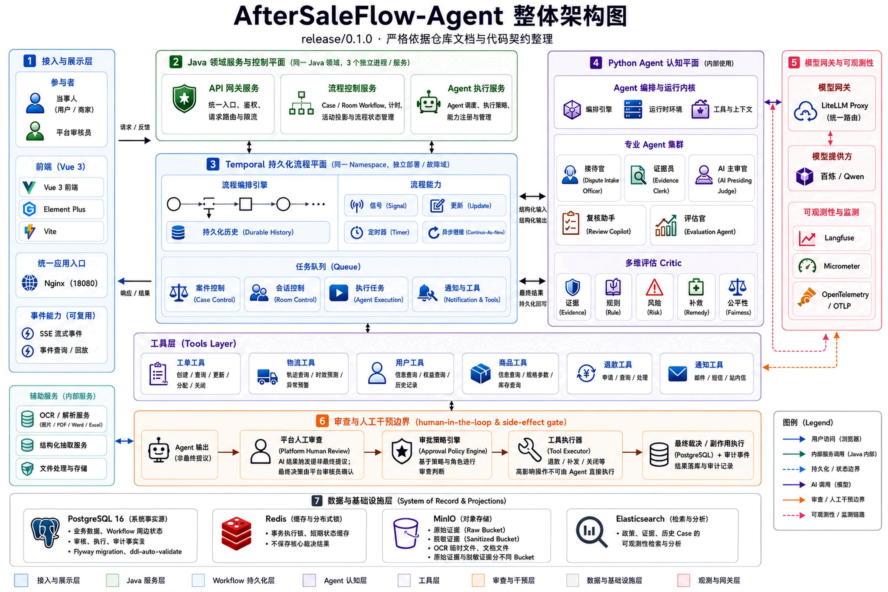
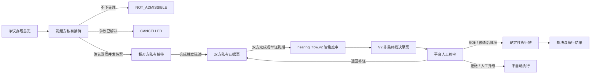
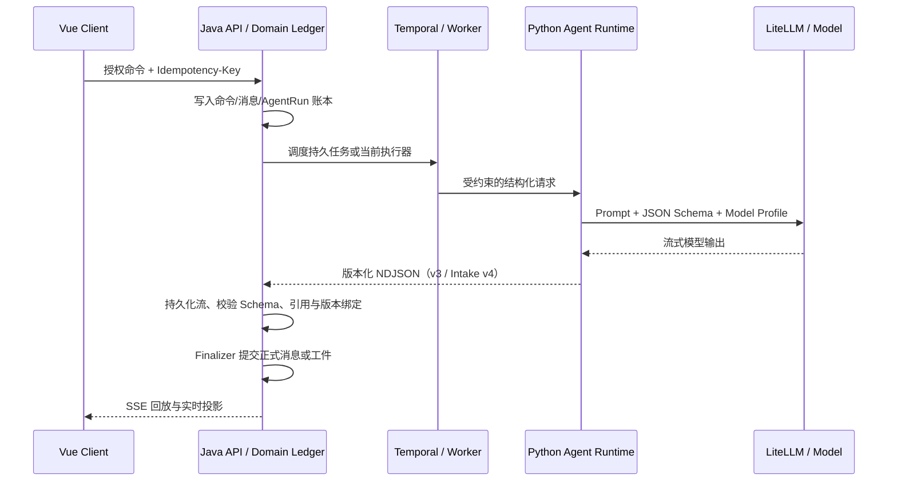

<div align="center">

# AfterSaleFlow-Agent

### AI Native 履约争端审理协作平台

**让大模型参与事实整理、证据核验、庭审推理与审核辅助，但不让模型越过正式裁决和高影响执行边界。**

<p>
  
  
  
  
  
  
  
  
  
</p>

[项目定位](#项目定位) · [业务闭环](#业务闭环) · [Agent-体系](#agent-体系) · [架构设计](#架构设计) · [快速开始](#快速开始) · [质量保障](#质量保障)

</div>

> **文档基线**：`main`，截至 2026-09-04；代码、合同与文档以当前 `main` 提交共同构成发布基线。
> **合同基线**：当前生产合同组合统一为 `production-contract-baseline.v1`。本次是首次生产 clean break：旧 `target-e2e` UAT 身份不再兼容；从该基线开始，各 wire/schema 版本保持不可变，用于生产重放与后续演进。
> **当前 UAT 基线**：接待室 V4 三 Frame 并行图已在全新浏览器案件 `CASE_P9_6A98633E_11` 上完成六站全链路验证；该结论属于隔离 UAT 证据，不等同于默认生产开关已开启。
> **重要边界**：所有模型输出均为结构化建议或草案；最终裁决由平台人工终审确认，高影响动作只能由审批后、哈希绑定且幂等的 Tool Executor 执行。

<a href="docs/assets/architecture/AfterSaleFlow-Agent-architecture.png">
  
</a>

---

## 项目定位

AfterSaleFlow-Agent 是一个面向**用户与商家履约争端**的 AI Native 审理协作系统。它不是把大模型简单包裹成聊天机器人，而是将 AI 放入一条具备权限隔离、状态机、证据账本、人工终审、确定性执行与完整审计的业务闭环中。

系统解决的核心问题是：传统售后系统能够记录工单，却难以稳定完成跨角色事实收集、证据核验、争点归纳、规则适用和裁决草案生成；纯 Agent 系统虽然灵活，却通常缺乏正式状态、幂等恢复、权限边界和副作用治理。AfterSaleFlow-Agent 通过 **Java 领域账本 + Temporal 持久流程 + Python 认知运行时 + 人工终审** 的职责拆分，将模型能力限制在可验证、可回放、可追责的边界内。

### 核心设计目标

| 目标 | 设计回答 |
| --- | --- |
| 业务事实不能被模型覆盖 | Java 与 PostgreSQL 是身份、消息、证据、裁决、审核、执行和审计的正式事实源 |
| 长流程不能依赖进程存活 | Temporal 管理持久等待、Signal、Timer、重试和恢复；生产 Case/Room 路径已完成隔离 UAT，发布仍受显式门禁保护 |
| Agent 不能获得无限权限 | 每个角色使用默认拒绝的 Agent Profile，显式限定状态、上下文、Skill、工具、预算和输出 Schema |
| 流式输出不能直接成为正式结果 | Python 输出先作为 provisional stream；只有 Java Finalizer 验收并持久化的 final 才能成为正式消息或工件 |
| 高影响动作必须可控 | 人工终审 → 审批策略 → Tool Executor → ActionRecord，Agent 无退款、补发、驳回、关单或审批权限 |
| 重试不能产生重复裁决或重复执行 | 幂等键、请求哈希、单调序号、append-only 账本、outbox/inbox、fencing token 与操作记录共同约束 |
| 私有会话不能跨参与方泄漏 | USER 与 MERCHANT 按精确 actor、房间、会话和 audience 隔离，庭审只消费已授权的正式材料 |
| 系统必须可解释和可审计 | AgentRun、输入快照、Prompt/模型/Schema/策略版本、引用、输出哈希、Token 与 Trace 全链路留痕 |

### 当前 `main` 版本快照

| 维度 | 当前基线 |
| --- | --- |
| 生产 Contract Baseline | `production-contract-baseline.v1`；统一目录，不重写持久化 wire/schema 版本 |
| 接待室认知图 | 新 epoch 使用 `PARALLEL_FRAMES_V1`：V4 三个显式兄弟 Frame `DIALOGUE_FRAME`、`DOSSIER_FRAME`、`QUALITY_FRAME`；独立校验后由受权威约束的合并路径提交 |
| Graph / Stream 身份 | `production-runtime-graph.2026-08-18.3`；Intake 并行流使用 `agent-stream.v4`，Evidence、Hearing 与 Outcome 使用 `agent-stream.v3` |
| Evidence 合同 | `evidence_room_context.v2`、`evidence_turn_stream.v3`、`evidence-turn-result.v3` |
| 模型配置 | LiteLLM 统一路由 `qwen3.8-flash`；默认关闭 thinking，并启用严格 JSON Schema |
| 运行时依赖 | Java 21、Spring Boot `3.5.15`、Temporal Java SDK `1.35.0`；Python 3.11、LangGraph `1.2.6`、LangChain Core `1.4.9` |
| 数据库版本 | Java Flyway 迁移上限 `V094__production_runtime_graph_patch_release_identity.sql` |
| 浏览器 UAT | 从前端表单创建全新案件，经双方接待、证据、庭审、人工终审到 Outcome，进度达到 `6 / 6` |

运行平台需要与源码版本分开理解：仓库 Compose 默认仍固定 `temporalio/auto-setup:1.25.2`；上述 deployment-pinned UAT 在经单独授权升级并验证的 Temporal Server `1.29.7` 上完成。仓库不会在启动时自动替换核心组件版本，生产平台升级必须单独授权。

---

## 业务闭环

### 六站争议旅程



| 业务站点 | 核心能力 | 不变量 |
| --- | --- | --- |
| **案情接待** | 双方按顺序进入相互隔离的私有会话；完善结构化卷宗、诉求与争点；给出受理建议 | 发起方可以是 USER 或 MERCHANT；接待官只建档追问，不定责、不承诺赔付 |
| **证据核验** | 上传与批次提交、OCR/文档解析、真实性与一致性核验、事实—证据矩阵、补证建议、封卷 | 双方证据目录私有；模型只处理 Java 授权材料；发起方至少提交一份正式证据 |
| **智能庭审** | 固定 15 阶段流程、双方陈述、补充证据、卷宗冻结、Judge V1、Jury Review、Judge V2 | Python 不推进阶段；只有冻结卷宗可以进入裁决链；V1/Jury/V2 以 ID 与哈希形成不可覆盖链 |
| **裁决草案** | 展示非最终 V2 草案、事实认定、证据评估、规则适用、证据缺口与审核关注项 | 草案不是正式裁决，预生成执行计划也不是已执行结果 |
| **人工终审** | 冻结 ReviewPacket、Review Copilot、授权审核员决定、修改差异校验 | 只有平台审核员可决定；Copilot 只读冻结材料，不能审批或触发执行 |
| **执行结果** | 展示最终裁决、人工意见、批准方案、ActionRecord 与外部回执 | 页面只读；无真实 ActionRecord 时只能展示明确标注的模拟动画 |

### `hearing_flow.v2` 固定 15 阶段

<details>
<summary>展开查看庭审阶段</summary>

1. `COURT_PREPARING`
2. `CASE_INTRODUCTION`
3. `EVIDENCE_INTRODUCTION`
4. `INTAKE_QUESTIONS_GENERATING`
5. `PARTY_ANSWERS_OPEN`
6. `INTAKE_SYNTHESIZING`
7. `EVIDENCE_REQUESTS_GENERATING`
8. `PARTY_EVIDENCE_OPEN`
9. `EVIDENCE_SYNTHESIZING`
10. `DOSSIER_FREEZING`
11. `JUDGE_V1_GENERATING`
12. `JURY_REVIEWING`
13. `JUDGE_V2_GENERATING`
14. `HUMAN_REVIEW_OPEN`
15. `CLOSED`

当事方只在 `PARTY_ANSWERS_OPEN` 与 `PARTY_EVIDENCE_OPEN` 拥有终态提交动作；其余阶段由系统或受治理的 Agent 操作驱动。V2 完成后仍必须进入人工终审，不能直接执行。

</details>

### 人工终审决策

平台审核员可以提交五类决定：

- `APPROVE`
- `MODIFY_AND_APPROVE`
- `REQUEST_MORE_EVIDENCE`
- `REJECT`
- `ESCALATE_MANUAL`

其中只有前两类可以生成批准动作快照并进入 Tool Executor；其余决定均不会触发退款、补发或关单。

---

## Agent 体系

### 专业角色

| Agent | 核心职责 | 受控输入 | 结构化输出 | 明确禁止 |
| --- | --- | --- | --- | --- |
| **Dispute Intake Officer / 接待官** | 争端准入、诉求抽取、卷宗完善、缺失信息追问 | 当前参与方表单、私聊窗口、订单/售后/物流引用 | 接待话术、卷宗 Patch、受理建议、缺失字段、置信度 | 收正式证据、责任认定、赔付承诺、流程越级 |
| **Evidence Clerk / 证据官** | 证据目录、时间线、重复/冲突识别、真实性建议、事实—证据矩阵 | 当前 actor 获授权的证据 envelope、OCR/元数据、事实目标 | 补证请求、核验建议、真实性标记、矩阵 Patch、人工复核任务 | 引用不可见材料、填补事实空白、直接定责 |
| **AI Presiding Judge / AI 主审官** | 冻结卷宗审阅、Judge V1、吸收评审意见、Judge V2 | `trial_dossier.v1`、冻结规则、V1 与 Jury Report | 事实认定、规则适用、补救方案、非最终裁决草案 | 冻结前裁决、最终裁决、工具执行 |
| **Review Copilot / 复核助手** | 解释冻结材料、总结差异、标注不确定性与审核重点 | 单一版本化 ReviewPacket 及其可引用 fact/rule/draft/deliberation refs | 带引用的回答、审核焦点、不确定项 | 审批、拒绝、触发执行、读取 Packet 之外的上下文 |
| **Evaluation Agent / 评估官** | 对 closed case、AgentRun、审核与动作执行离线评估 | 脱敏 closed case 与 redacted trace | 离线质量分析和改进建议 | 在线案件变更、自动应用修改 |

### 多维 Critic 合议

系统提供五个窄职责 Critic，对同一冻结输入独立评估：

- **Evidence Critic**：证据充分性、引用关系与事实支撑风险
- **Rule Critic**：规则版本、适用条件与论证完整性
- **Risk Critic**：案件风险、异常模式与潜在升级点
- **Remedy Critic**：补救方案、金额约束和可执行性
- **Fairness Critic**：相似案件一致性、程序公平与偏差风险

合议面板以冻结输入指纹绑定所有报告；任一 Critic 不可用时不会伪装成“无异议”，而是显式转入 `MANUAL_REVIEW_REQUIRED`。阻断级意见触发 `REVISION_REQUIRED`，少数意见和失败状态都会保留给审核员。

### Agent Harness：把模型调用变成受治理的认知事务

Python 侧不是任意 Prompt 调用集合，而是由 Harness 统一约束：

```text
可信 Invocation Context
  -> Context Pack / State Lens
  -> Prompt 与不可信案件内容分离
  -> LangGraph / LCEL 节点执行
  -> Provider JSON Schema
  -> Pydantic 校验
  -> 引用白名单与业务 Guardrail
  -> 可见字段流式投影
  -> 结构化 Proposal
  -> Java Finalizer
```

主要治理能力包括：

- **身份与作用域绑定**：actor、角色、case、room、audience、Prompt/Model/Tool Profile 均由服务端创建，浏览器不能覆盖。
- **默认拒绝的 Agent Profile**：显式声明可运行案件状态、上下文范围、Skill、工具、风险策略和输出 Schema。
- **LoopBudget**：每个角色拥有独立的迭代、工具调用、模型调用、Token、截止时间、停滞检测和修复预算。
- **上下文最小化**：Context Pack 和 State Lens 只选择当前节点需要的字段；私有接待和证据会话不进入共享庭审上下文。
- **多模态授权**：图片像素仅能通过内部 EvidenceAssetLoader 按清单加载；模型不能声称看过未加载材料。
- **确定性后处理**：稳定 ID、去重、排序、矩阵合并、哈希、权限、截止时间和流程推进不交给模型。
- **隐藏推理保护**：不请求、不持久化、不流式暴露 chain-of-thought；公开流仅包含服务端白名单字段。

### 一次 AgentRun 的正式提交路径



---

## 架构设计

### 1. 一类状态只有一个权威写入者

| 状态类别 | 权威边界 | 说明 |
| --- | --- | --- |
| 正式领域事实 | **Java + Domain PostgreSQL** | 身份、权限、消息、证据、提交、冻结工件、审核决定、执行记录和查询投影 |
| 持久业务过程 | **Temporal Event History** | 负责案件/房间阶段、等待、Timer、取消、重试、补偿与命令顺序；生产 Case/Room 路径已完成隔离 UAT，启用仍由发布门禁控制 |
| 认知执行状态 | **Python LangGraph + Graph PostgreSQL** | 负责 checkpoint、认知 revision、命令结果、上下文摘要与有界 fan-out；Intake V4 使用三个独立 Frame 并行执行 |
| 模型对象流 | **LangChain Core / LCEL** | Prompt、Message、ChatModel、Parser、stream、callback 与 tracing，不拥有领域权限或阶段推进权 |
| 证据二进制 | **MinIO** | 原始证据、脱敏证据、OCR 临时文件、政策文件和导出文件分桶管理 |
| 搜索与实时加速 | **Elasticsearch / Redis** | 可重建搜索投影、缓存、短期状态、实时唤醒和执行锁；永远不是裁决正确性的事实源 |
| 前端状态 | **Vue** | 交互与授权投影展示，不从模型文本或本地计时器推断正式阶段 |

该拆分避免 Java、Temporal 和 LangGraph 同时计算“下一阶段”，也避免模型输出直接覆盖业务账本。

### 2. Java 领域服务与控制平面

同一 Java 21 / Spring Boot 镜像通过 Profile 拆为三个独立进程：

| 进程 | 职责 | 故障隔离意义 |
| --- | --- | --- |
| `java-api-service` | HTTP、身份与参与关系校验、领域事务、命令接收、查询、SSE | API 扩缩容不与长任务 Worker 绑定 |
| `java-control-worker` | Case/Room Workflow、Timer、领域 Activity、投影 Activity、恢复与协调 | 模型故障不阻断计时、取消和流程控制 |
| `java-agent-worker` | AgentRun 与模型相关 Activity，隔离模型执行容量 | Provider 变慢不会占满控制面队列 |

Java 内部以领域模块组织案件、接待、证据、庭审、合议、审核、执行、通知、审计和 AgentRun。数据库由 Flyway 管理，Hibernate 使用 `ddl-auto=validate`，正式消息、动作和审计事实采用追加写与约束保护。

### 3. Temporal 持久化流程平面

正式协议队列按故障域拆分：

```text
case-control
room-control
agent-execution
notification-and-tools
```

当前生产运行时由 Java 领域状态机、Temporal Case/Room Workflow 和 Python Graph Runtime 共同组成。Temporal 管理等待、Signal、Timer、重试、Continue-As-New 与恢复；Java 继续独占正式领域写入；Python 只提交 proposal。`case-dispute-task-queue` 仅保留给需要迁移的旧 EvidenceWindow History，新建生产环境不得向该兼容队列投递。

### 4. Python 认知平面

Python Agent Service 只暴露内部 FastAPI 接口。正式 Intake V4 将对话、卷宗与质量评估拆为三个并行 Frame，使用 `agent-stream.v4` 提交独立帧结果；Evidence、Hearing 与 Outcome 使用持久 Graph Gateway 和 `agent-stream.v3`。运行时具备 PostgreSQL checkpoint、命令账本、lease/fencing、版本注册表和 proposal-only 跨服务协议；庭审 15 阶段 cursor、等待和正式工件提交仍由 Java 管理。

Hearing 认知拓扑按职责拆成四个显式 family：

```text
hearing.intake.v1   -> intake questions / intake synthesis
hearing.evidence.v1 -> evidence requests / evidence synthesis
hearing.judge.v1    -> judge V1 / judge V2
hearing.jury.v1     -> jury review
```

每个拓扑都是显式 typed `StateGraph`，未知路由失败关闭；证据 fan-out 使用稳定键 reducer 和有界并发，不允许最后写入覆盖冲突。

### 5. 基础源码与生产运行构件

| 维度 | 可复用基础层 | 生产运行构件 |
| --- | --- | --- |
| Java 源码 | `apps/domain-service/src/main`：领域账本、API、Workflow 与通用适配器 | `apps/domain-service/src/production-runtime`：显式装配生产 Bean、Worker 注册和激活校验 |
| Java 构件 | 默认 JAR 用于开发、编译和通用测试 | Maven `production-runtime` profile 生成 `*-production-runtime.jar`，生产镜像只启动该构件 |
| Python Graph | 通用 gateway、checkpoint、executor 与房间 Graph | `production_runtime*` 模块绑定正式四房间图和 `PRODUCTION` execution lane |
| 数据 | 开发环境可使用本地默认库 | 首次生产 clean break 必须使用全新 Domain/Graph 数据库和全新 Temporal namespace |
| 发布门禁 | 默认开关继续 fail-closed | 生产配置显式提供签名激活、版本绑定、数据库隔离和 Worker 路由权威 |

`production-runtime` 不是测试源码集，也不是兼容层；它是当前生产应用的装配边界。UAT 工具位于 `tools/uat/production-runtime`，与生产代码所有权明确分离。

### 6. Schema-first 跨服务合同

`contracts/agent-platform/v1` 将跨服务边界固定为 JSON Schema，包括：

- `case-command-ref`
- `room-graph-command`
- `room-graph-result`
- `agent-stream-event`
- `agent-execution-manifest`
- `artifact-ref`
- `process-projection`
- `graph-reconcile-response`
- compatibility matrix 与正反向 fixtures

生产路径使用 RFC 8785 JSON Canonicalization 与 SHA-256 绑定请求、结果和工件；Java 与 Pydantic 类型在接收端再次验证 Schema、ID、版本、作用域和哈希。跨服务接口传递引用和摘要，而不是把完整证据、矩阵或 PII 放进 Temporal History。

---

## 关键工程能力

### 可恢复的流式交互

- Python → Java 使用 NDJSON 流；Java 先持久化，再向浏览器提供 SSE。
- 案件流与 AgentRun 流都支持持久化 cursor、受众过滤、心跳和断线重放。
- 浏览器通过 `Last-Event-ID` 从 PostgreSQL 高水位继续读取，Redis 仅用于低延迟唤醒。
- `visible_delta` 只是临时预览；终态必须唯一，终态后禁止继续发送帧。
- raw JSON、工具参数、私有矩阵、内部 A2A 内容和隐藏推理不进入公开流。

### 幂等、顺序与故障恢复

- 所有写操作使用 `Idempotency-Key` 或服务端生成的稳定命令 ID。
- 同一 ID 与同一请求哈希返回既有结果；同一 ID 搭配不同内容返回冲突。
- 案件事件、消息、阶段动作与 Agent 流使用单调 sequence，网络到达顺序不等于业务顺序。
- 当前与目标路径均保留 AgentRun 账本；目标路径进一步拆分 logical run、attempt 和 stream event。
- 正式副作用通过 ActionRecord、外部幂等键、结果查询和补偿/人工恢复路径防止重复执行。
- 系统不宣称网络级 exactly-once，而是通过 at-least-once delivery + idempotency + fencing 获得业务等价的一次提交语义。

### 审理与副作用双重闸门

```text
Agent Proposal
  -> Java Schema / Reference / Policy Finalizer
  -> Platform Human Review
  -> Approval Policy Engine
  -> Tool Executor
  -> ActionRecord / External Receipt
  -> Read-only Outcome Projection
```

Tool Executor 不接受“模型建议执行”作为授权。它必须重新验证审批记录、动作快照版本与哈希、有效期、操作者角色、风险策略和幂等键。当前本地环境默认启用模拟执行，不对真实退款或履约系统做生产能力声明。

### 安全与隐私

- Java 是唯一外部 API 与授权边界，`/internal/**` 不经 Nginx 对浏览器开放。
- 当前内部调用要求 service identity/secret；目标候选支持 mTLS 与短时 ES256 签名调用信封。
- 信封绑定 tenant surrogate、case、room epoch、actor scope、command、nonce、capability、profile version 与 payload hash。
- USER/MERCHANT 资源按精确 actor ID 和参与关系校验，不能仅按角色过滤。
- 用户文本、商家文本和证据内容始终作为不可信 Prompt 输入，不能改变 system policy。
- 上传文件校验扩展名、MIME、大小和内容类型；原始与脱敏证据使用不同 Bucket。
- 日志屏蔽服务密钥、数据库密码、API Key 与完整敏感证据；CI 包含 Secret Scan。

### 可观测性

系统通过 request ID、trace ID 和 OpenTelemetry context 串联：

```text
Browser -> Java Command -> Outbox/Temporal -> AgentRun
        -> Python LangGraph -> LCEL -> LiteLLM -> Model Provider
```

- **Langfuse**：Prompt、模型、Token、Latency 和 Agent Trace
- **Micrometer**：Java 指标与 Prometheus 兼容度量
- **OpenTelemetry / OTLP**：跨 Java、Python、Temporal 与模型网关的 Trace
- **LiteLLM**：唯一模型路由、认证和 Provider 适配层
- **审计账本**：角色、输入快照、版本、引用、结果哈希、审核和动作回执

---

## 数据与基础设施

| 组件 | 当前用途 | 正确性定位 |
| --- | --- | --- |
| **PostgreSQL 16** | Java 领域账本、审计、Temporal、Langfuse、LiteLLM 与独立 Graph 数据库 | 业务事实、过程持久化和认知 checkpoint 的主要持久化介质；逻辑数据库/角色隔离 |
| **Redis 7.2** | 短期状态、缓存、实时唤醒、执行锁 | 加速组件，不保存核心裁决结果 |
| **MinIO** | 原始/脱敏证据、OCR 临时文件、政策文件、审核导出、候选运行材料 | 证据二进制与不可变快照存储 |
| **Elasticsearch 8.13** | 政策、证据与历史 Case 检索投影 | 可从事实源重建，不作为正式裁决事实源 |
| **Temporal Server** | Workflow History、Signal、Timer、Activity retry | 持久过程与失败恢复 |
| **LiteLLM Proxy** | 模型统一路由；默认模型别名由环境配置 | Provider 与业务运行时之间的唯一模型网关 |
| **Langfuse** | Agent/LLM 追踪 | 可观测性，不是业务事实源 |
| **Nginx** | Docker 全量环境统一入口 | 只公开前端、Java API 和受控管理路径，拒绝内部 Agent/OCR 路由 |

---

## 技术栈

| 层 | 主要技术 |
| --- | --- |
| 前端 | Vue 3.5、Vue Router、Element Plus 2.9、Vite 6、Vitest、Playwright |
| Java 领域层 | Java 21、Spring Boot 3.5.15、Spring MVC、Spring Security、JPA、Flyway、Temporal Java SDK 1.35.0、Micrometer、OpenTelemetry |
| Python Agent | Python 3.11、FastAPI、Pydantic、LangGraph 1.2.6、LangChain Core 1.4.9、PostgreSQL Checkpointer 3.1.0、Langfuse、OpenTelemetry |
| OCR / Parser | FastAPI、PaddleOCR、PaddlePaddle、MarkItDown、MinIO SDK |
| 数据与中间件 | PostgreSQL 16、Redis 7.2、Elasticsearch 8.13、MinIO、Temporal、LiteLLM、Langfuse、Nginx |
| 工程化 | Docker Compose、Maven、pnpm、GitHub Actions、Testcontainers、ArchUnit、Pytest、Playwright |

---

## 仓库结构

详细的目录所有权、依赖方向和新增文件落位规则见
[仓库布局与边界](docs/development/repository-layout.md)。

```text
AfterSaleFlow-Agent/
├── apps/                        # 所有可部署应用
│   ├── domain-service/          # Java 领域账本、API、Temporal Workflow/Worker
│   │   └── src/
│   │       ├── main/            # 可复用领域与运行时核心
│   │       ├── production-runtime/ # 正式生产装配源码集
│   │       └── test/            # Java 单元/集成测试
│   ├── agent-runtime/           # Python Agent、LangGraph、模型与 Graph Runtime
│   ├── web/                     # Vue 六站争议旅程与审核工作台
│   └── ocr-parser/              # 图片、PDF、Word、Excel 解析
├── contracts/                   # 生产合同目录、不可变 Schema 与兼容 fixtures
│   ├── catalog/                 # production-contract-baseline.v1
│   └── agent-platform/          # 按领域和协议版本组织的机器合同
├── infra/                       # 环境和部署资产
│   ├── services/                # Temporal、PostgreSQL、Redis、MinIO 等基础服务配置
│   ├── compose/                 # 隔离环境 Compose（含 production-runtime UAT）
│   ├── environments/            # 环境资源（生产运行时 UAT 资源显式带 uat 后缀）
│   ├── kubernetes/              # 生产 Kubernetes 清单
│   └── observability/           # 告警、指标与 Dashboard
├── tools/                       # 开发、生成、验证、UAT 与恢复工具
│   ├── dev/
│   ├── generate/
│   ├── verify/
│   ├── uat/
│   └── operations/
├── tests/                       # 跨应用 Static、API、E2E、性能和基础设施测试
├── docs/
│   ├── architecture/            # 权威架构、ADR、SLO 与状态所有权
│   ├── acceptance/              # 全链路 UAT 夹具和生产验证门禁
│   ├── contracts/               # hearing_flow.v2 等业务合同
│   ├── api/                     # 公共 API 与 SSE 约定
│   ├── database/                # 数据源、Migration 与存储边界
│   ├── deployment/              # 本地部署、Worker 拓扑与运行说明
│   ├── development/             # 贡献流程与代码规范
│   ├── frontend/                # 前端模块职责与安全边界
│   ├── security/                # 安全报告和开发安全规则
│   ├── testing/                 # Smoke Test 与 replay fixture 说明
│   ├── release/                 # 发布、回滚和 Code Review gate
│   └── runbooks/                # 故障恢复、迁移和生产演练手册
├── docker-compose.yml           # 本地/CI 全服务拓扑
└── .github/workflows/           # 质量门禁和工程证据流水线
```

---

## 快速开始

### 前置条件

- Docker Desktop，Linux 容器模式
- Docker Compose v2
- 至少 **12 GB** 可用内存、**25 GB** 可用磁盘
- Bash、curl、Python 3
- 有效的阿里云百炼 `DASHSCOPE_API_KEY`

### 一键启动完整环境

```bash
git clone https://github.com/Jupiter363/AfterSaleFlow-Agent.git
cd AfterSaleFlow-Agent
git checkout main

cp .env.example .env
./tools/generate/generate-secrets.sh

# 编辑本地 .env，写入真实 DASHSCOPE_API_KEY；不要提交该文件
./tools/dev/dev-up.sh
```

`dev-up.sh` 会完成配置校验、镜像构建、健康检查和 Smoke Test。完整应用入口：

```text
http://localhost:18080
```

`.env.example` 是仓库可复现默认值，不会自动把 Temporal 或其他核心组件升级到本轮 UAT 使用的版本。任何核心组件升级都应单独评审、备份、迁移并获得明确授权。

停止服务并保留数据卷：

```bash
./tools/dev/dev-down.sh
```

明确清空本项目数据卷并重建：

```bash
CONFIRM_RESET=YES ./tools/dev/dev-reset.sh
```

### Windows 快速开发

保留数据库、Temporal、Python Agent、OCR 等依赖在 Docker 中，让 Java 与 Vite 直接运行：

```powershell
.\tools\dev\dev-local.ps1
```

停止本地 Java/Vite：

```powershell
.\tools\dev\dev-local.ps1 -Stop
```

本地 Vite `5173` 会代理 Java `8080`；Docker 全量环境必须从 Nginx `18080` 进入。隔离 production-runtime 运维拓扑可能使用 Java `8081`，它不是普通本地开发或默认生产入口。

---

## 服务与端口

所有宿主机端口默认只绑定 `127.0.0.1`。

| 服务 | 地址 / 端口 | 说明 |
| --- | --- | --- |
| 完整应用 | `http://localhost:18080` | Nginx 统一入口 |
| Frontend | `http://localhost:5173` | Compose 直连前端；本地开发时由 Vite 提供 API 代理 |
| Java API | `http://localhost:8080` | REST、SSE、OpenAPI、领域事务 |
| Python Agent | `http://localhost:18000` | 内部 Agent 服务健康检查 |
| OCR Parser | `http://localhost:18010` | 内部解析服务健康检查 |
| Temporal | `127.0.0.1:7233` | Workflow Server |
| PostgreSQL | `127.0.0.1:15432` | 多逻辑数据库 |
| Redis | `127.0.0.1:16379` | 缓存、短期状态和执行锁 |
| Langfuse | `http://localhost:13000` | Agent Trace |
| LiteLLM | `http://localhost:14000` | 模型网关管理入口 |
| MinIO | `http://localhost:19000` / `19001` | API / Console |
| Elasticsearch | `http://localhost:19200` | 检索与排障 |

OpenAPI：

```text
http://localhost:8080/v3/api-docs
http://localhost:8080/swagger-ui.html
```

### 公共 API 根

```text
/api/disputes       案件、房间、证据、庭审、草案、结果与事件流
/api/notifications  平台信箱、未读数与已读状态
/api/reviews        审核队列、冻结 Packet、Copilot 与人工决定
```

服务间接口统一位于 `/internal/**`，必须携带服务身份，且不会由 Nginx 暴露给浏览器。

---

## 关键配置

| 配置 | 默认/作用 |
| --- | --- |
| `DASHSCOPE_API_KEY` | 百炼模型凭据，必须只写入本地 `.env` |
| `LITELLM_DEFAULT_MODEL` | 默认模型别名，仓库默认 `qwen3.8-flash` |
| `LLM_ENABLE_THINKING` | 默认 `false`；当前 Qwen UAT 不依赖隐藏推理输出 |
| `LLM_STRICT_JSON_SCHEMA_ENABLED` | 默认 `true`；Provider 输出先通过严格 Schema，再进入 Pydantic 与业务 Guardrail |
| `FEATURE_HUMAN_REVIEW_REQUIRED` | 默认 `true`，强制人工终审 |
| `FEATURE_TOOL_EXECUTOR_SIMULATION` | 默认 `true`，本地环境不声称真实退款/履约执行 |
| `EVIDENCE_WINDOW` | 默认 `PT2H` |
| `HEARING_WINDOW` | 默认 `PT3H` |
| `HEARING_PARTY_STAGE_WINDOW` | 默认 `PT20M` |
| `SSE_HEARTBEAT` | 默认 `PT15S` |
| `APP_ORCHESTRATION_NEW_EPOCH_MODE` | 默认 `LEGACY`，非默认路径必须显式开启并通过门禁 |
| `GRAPH_GATEWAY_MODE` | 默认 `DISABLED`，候选模式必须具备 Graph DB、签名、版本和授权绑定 |
| `TEMPORAL_IMAGE` | Compose 默认 `temporalio/auto-setup:1.25.2`；本轮 UAT 的 `1.29.7` 不是仓库自动升级默认值 |
| `OTEL_TRACING_ENABLED` | OpenTelemetry Trace 开关 |

---

## 质量保障

项目质量门禁不是单一单元测试，而是覆盖静态合同、跨服务兼容、数据库、浏览器和故障恢复的分层验证：

- Secret Scan 与敏感信息防泄漏
- 静态架构合同、当前功能合同、冻结工程证据校验
- Java 单元测试、ArchUnit、PostgreSQL/Testcontainers 集成测试
- Temporal time-skipping、History replay、Worker 重启与 Activity completion-loss 测试
- Python Agent/Harness/Graph/Guardrail/Reducer/Contract 测试
- OCR Parser 测试
- Vue/Vitest 组件测试、构建检查与 Playwright 浏览器布局回归
- Docker Compose 配置验证、全栈启动和健康检查
- API、E2E 与 Load Smoke
- 重复、延迟、乱序、断线、Redis 故障、模型截断、Schema 漂移和 stale fence 等负向场景

### 当前 UAT 证据

- 使用真实前端表单创建 `CASE_P9_6A98633E_11`，未通过后端接口预置案件。
- `qwen3.8-flash` 在 thinking 关闭、严格 JSON Schema 开启的配置下完成双方 Intake；“下一步核验重点”输出为面向用户的中文动作，不再暴露内部英文字段名。
- 案件继续通过 Evidence、Hearing、人工终审与 Outcome，最终进度为 `6 / 6`。
- 本轮对应机制的 Java、Python 与前端聚焦回归通过；该证据不替代下方全仓发布检查。

### 本地完整发布检查

```bash
python -m pytest tests/static -q

cd apps/domain-service
./mvnw -s .mvn/settings.xml -B -ntp test
cd ../..

cd apps/agent-runtime
python -m pytest -q
cd ../..

cd apps/ocr-parser
python -m pytest -q
cd ../..

cd apps/web
pnpm test
pnpm build
pnpm test:browser
cd ../..

docker compose config --quiet
docker compose up -d --build --wait --wait-timeout 360
./tools/verify/smoke-test.sh
python -m pytest tests/integration/api tests/e2e tests/performance -q
```

---

## 当前边界与非目标

当前 `main` 将 `production-runtime` 作为正式代码基线，同时明确保持以下发布边界：

- 当前不实现申诉/复审业务。
- 当前正式庭审仍由 Java 持有 15 阶段 cursor、等待和正式工件写入；Python 通过四个显式 Graph Family 执行七个受治理操作，但不拥有流程推进权。
- 全房间 Temporal-first 与 Intake V4 并行图已经完成隔离 UAT；部署时仍必须显式提供生产激活、Graph DB 和 Worker 版本权威。
- `GRAPH_GATEWAY_MODE=PRODUCTION` 不由普通本地启动隐式开启；缺少生产权威时必须 fail-closed。
- 本次首次生产基线不兼容旧 UAT 的 `target-e2e` 标识或持久状态；部署必须使用新数据库和新 Temporal namespace，禁止原地猜测迁移。
- Temporal Server `1.29.7` 是本轮经授权的 UAT 平台证据，不是仓库默认配置；README 与启动脚本不得被视为核心组件升级授权。
- 当前本地和 CI 使用 Docker Compose；仓库不以本版本宣称 Kubernetes 生产 HA 已落地。
- 当前不引入 Kafka、MCP 或向量数据库。
- 当前不宣称已经接入真实生产退款、补发或履约系统；Tool Executor 默认模拟，真实适配器必须具备外部幂等、状态查询、回执与补偿合同。
- 后端保留部分和解兼容接口，但当前主 UI 不开放和解流程。

---

## 文档索引

| 文档 | 用途 |
| --- | --- |
| [`docs/README.md`](docs/README.md) | 当前生产文档统一入口与保留规则 |
| [`docs/acceptance/canonical-full-chain-uat-fixture.md`](docs/acceptance/canonical-full-chain-uat-fixture.md) | 可重复六站回归的固定夹具 |
| [`docs/release/current-uat-baseline.md`](docs/release/current-uat-baseline.md) | 当前 `main` 的版本身份与 fresh-case 浏览器 UAT 证据 |
| [`docs/architecture/README.md`](docs/architecture/README.md) | 当前权威架构文档入口 |
| [`docs/architecture/temporal-first-agent-platform.md`](docs/architecture/temporal-first-agent-platform.md) | Temporal-first 当前架构、容量与状态权威 |
| [`docs/architecture/temporal-first-slo.md`](docs/architecture/temporal-first-slo.md) | 可用性、延迟、容量和错误预算合同 |
| [`docs/architecture/adr/`](docs/architecture/adr/) | 状态所有权、命令投递、AgentRun、Graph、部署、安全和预生产 E2E 决策 |
| [`docs/contracts/hearing-flow-v2.md`](docs/contracts/hearing-flow-v2.md) | 固定 15 阶段庭审与裁决工件合同 |
| [`docs/acceptance/temporal-first-agent-platform-verification-checklist.md`](docs/acceptance/temporal-first-agent-platform-verification-checklist.md) | P0/P1/P2 发布门禁、容量、故障注入、安全与灾备证据 |
| [`docs/api/README.md`](docs/api/README.md) | API、身份、幂等、SSE 和 OpenAPI 约定 |
| [`docs/database/README.md`](docs/database/README.md) | PostgreSQL、Redis、MinIO 与 Elasticsearch 边界 |
| [`docs/deployment/README.md`](docs/deployment/README.md) | Compose、本地联调、Worker 拓扑与运维命令 |
| [`docs/release/README.md`](docs/release/README.md) | Code Review、发布和回滚门禁 |
| [`docs/security/security-policy.md`](docs/security/security-policy.md) | 安全报告与核心安全边界 |

---

## 贡献与安全

提交代码前请阅读[贡献指南](docs/development/contributing.md)、[代码规范](docs/development/code-style.md)和[安全说明](docs/security/security-policy.md)。

安全问题请私下报告给维护者，不要在公开 Issue 中披露凭据、敏感证据、越权路径或可利用细节。任何涉及正式裁决、审批、Tool Executor、跨参与方可见性、Temporal 写入权或 Graph Domain 写入权的修改，都必须同时补齐正向、负向、幂等、重放和相邻回归测试。

---

<div align="center">

**AfterSaleFlow-Agent — AI 提供认知能力，系统提供边界、恢复与责任。**

</div>
