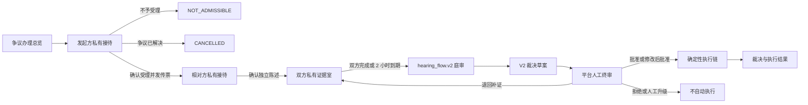

# 当前房间功能基线

- 基线编号：`current-room-functions.v1`
- 盘点日期：2026-07-17
- 代码分支：`main`
- 代码基线：`dc6846fbf75455361bc88b132306dcca65eb0598`
- 文档状态：Temporal/LangGraph 重构前的现状验收基线
- 目标架构：[`temporal-first-agent-platform.md`](../architecture/temporal-first-agent-platform.md)
- 生产验证：[`temporal-first-agent-platform-verification-checklist.md`](./temporal-first-agent-platform-verification-checklist.md)

## 1. 目的和判定规则

本文回答的是“当前代码实际提供什么功能”，不是“目标架构准备提供什么功能”。
后续将房间工作流迁移到 Temporal、LangGraph 或新的执行协议时，本文中的回归编号
必须逐项保持，除非产品明确批准行为变更并同时更新本基线。

判定优先级如下：

1. 生产代码、数据库约束和运行时权限是现状事实。
2. 自动化测试用于确认关键分支和前端交互。
3. 旧设计稿、实施计划和目标架构只作解释，不能覆盖当前实现。
4. “后端兼容能力”不等于“当前主界面已开放能力”。
5. 布局线程数、具体轮询实现等技术细节不是功能不变量；可见结果、权限、顺序、
   幂等和恢复语义才是重构不变量。

本文把“房间”按用户旅程的广义含义使用。前端展示六个办理站点，但 Java
`RoomType` 目前只有 `INTAKE`、`EVIDENCE`、`HEARING`、`REVIEW` 四种。
`DRAFT` 和 `OUTCOME` 是独立路由与查询投影，不是 `case_room` 类型。

## 2. 当前完整旅程



| 站点 | 前端路由 | Java `RoomType` | 当前用途 |
| --- | --- | --- | --- |
| 案情接待 | `/disputes/:caseId/intake` | `INTAKE` | 双方按顺序完成相互隔离的事实陈述 |
| 证据核验 | `/disputes/:caseId/evidence` | `EVIDENCE` | 私有举证、书记官核验、完成确认和封卷 |
| 智能庭审 | `/disputes/:caseId/hearing` | `HEARING` | 固定 15 阶段庭审、补证、V1、评审团和 V2 |
| 裁决草案 | `/disputes/:caseId/draft` | 无 | 查询和展示非最终 V2 草案 |
| 人工终审 | `/reviews`、`/reviews/:reviewId` | `REVIEW` | 冻结材料审阅、Copilot 和人工决定 |
| 执行结果 | `/disputes/:caseId/outcome` | 无 | 只读展示正式裁决与真实或模拟执行投影 |

### 2.1 总览导航规则

- `[OVR-001]` 总览按当前身份加载案件列表和选中案件的六站旅程图。
- `[OVR-002]` 当前阶段正常进入；已完成阶段以 `?view=history` 打开；未来阶段锁定。
- `[OVR-003]` 相对方未完成私有接待时，即使案件全局已进入证据阶段，也必须先进入
  自己的接待室。
- `[OVR-004]` 用户和商家可以发起争议，提交的是结构化诉求种子，不是退款、补发等
  执行动作；平台审核员不能发起争议。
- `[OVR-005]` 演示身份可以模拟外部争议导入；审核员只能删除后端允许删除的演示案件。
- `[OVR-006]` 身份切换返回总览并重新加载角色投影；审核员删除当前案件后，其他已打开
  页面会自动返回总览。
- `[OVR-007]` 当事方不能进入人工终审工作台；平台审核员可以从草案或审核队列进入。

## 3. 角色、参与关系与可见性

案件发起方不固定为用户。`USER` 或 `MERCHANT` 都可以是发起方，另一方是相对方；
所有发起方规则必须读取案件上的 `initiatorRole` 和参与人 ID，不能把 `USER` 写死为发起方。

| 能力 | `USER` / `MERCHANT` 当事方 | `PLATFORM_REVIEWER` | `ADMIN` / `SYSTEM` |
| --- | --- | --- | --- |
| 总览和案件详情 | 只读自己的参与案件投影 | 读取审核所需投影 | 按后端管理权限读取 |
| 接待发言 | 仅自己的私有 Agent Session | 禁止冒充当事方发言 | 不作为当事方发言入口 |
| 证据室发言和材料管理 | 仅自己的私有会话和获授权材料 | 可读平台审核投影，不能冒充提交 | 仅按明确管理接口执行 |
| 庭审提交 | 仅本人、仅开放阶段、每阶段一次终态动作 | 只读 | 只读或内部编排 |
| 草案 | 只读非最终草案 | 只读并可进入终审 | 按后端权限读取 |
| 人工终审 | 无入口 | 只有授权审核员可决定，其他审核员只读 | 后端管理权限不等于审核员身份 |
| 正式执行 | 无 | 审核决定只产生批准快照，不直接执行 | 当前执行接口要求管理员及完整批准快照 |

### 3.1 必须保持的权限不变量

- `[SEC-001]` 每次读取和写入都绑定案件参与关系、角色、房间、actor ID 和 audience。
- `[SEC-002]` 私有消息必须按精确 actor ID 过滤，仅按 `USER` 或 `MERCHANT` 角色过滤不够。
- `[SEC-003]` 平台审核员和管理员不能伪装成当事方调用房间发言或阶段提交接口。
- `[SEC-004]` Python 内部接口要求 service secret；浏览器不能覆盖可信 actor、Prompt Profile、
  Model Profile 或 Tool Capability。
- `[SEC-005]` Prompt 中可信 system 指令与不可信案件内容分离；模型输出经过 Pydantic、引用
  白名单和 Java 业务护栏后才能形成正式事实。
- `[SEC-006]` 所有 Agent 默认无审批、退款、补发、关单和正式执行权限。

## 4. 跨房间公共能力

### 4.1 消息、事件和幂等

- `[CORE-001]` 房间消息、阶段动作、Agent 结果和案件时间线事件均持久化；重试不能产生
  重复正式消息、重复阶段动作或重复执行。
- `[CORE-002]` 房间消息和案件事件具有单调 sequence，客户端不能以本地到达顺序替代
  服务端顺序。
- `[CORE-003]` 案件 SSE 支持游标重放、持久化 catch-up、受众过滤、心跳和断线清理。
- `[CORE-004]` 当前页面可查询并恢复所属房间的 active AgentRun；刷新或短暂断线不能让
  已被接受的运行永久消失。
- `[CORE-005]` 角色切换和页面离开必须取消 SSE、清空旧角色的消息/记忆/材料，并拒绝
  迟到的旧请求结果写入新角色视图。

### 4.2 Agent 流式协议

当前 Python 到 Java 使用 `agent_stream.v1` NDJSON，Java 持久化后再通过 SSE 提供给前端。
公开事件只有：

1. `start`
2. `visible_delta`
3. `usage`
4. `final`
5. `error`

- `[CORE-006]` 流必须从 `sequence=0` 的 `start` 开始，以唯一的 `final` 或 `error` 结束；
  终态后不能继续产生帧。
- `[CORE-007]` `visible_delta` 只允许操作和节点注册表中的公开字段。raw JSON、隐藏推理、
  私有矩阵、工具参数和内部 A2A 内容不得出现在公开流中。
- `[CORE-008]` delta 是即时预览，Java Finalizer 验收并持久化的 final 才是正式结果。
- `[CORE-009]` 当前事件协议没有 attempt/reset 事件。重构可以升级协议，但必须定义清晰的
  重试展示语义，不能把不同 attempt 的文本直接拼接。

### 4.3 历史模式与全局通知

- `[CORE-010]` 已完成的接待、证据、庭审、草案和终审均支持历史只读；历史模式锁定
  输入、上传、删除、确认、取消、Copilot、决定和流程推进。
- `[CORE-011]` 全局传票信箱支持列表、未读数、深链、单条已读、全部已读和删除。
- `[CORE-012]` 当前 App 每 15 秒刷新通知、每 3 秒同步案件状态；SSE 事件仍是房间内
  低延迟更新和可恢复链路。

### 4.4 当前 UI 交互基线

- `[UI-001]` 接待室和证据室使用约 740px 固定高度外壳，在 1060px 容器断点切换布局。
- `[UI-002]` 庭审在 1220px 以上显示三栏，以下把证据栏切换为可访问抽屉。
- `[UI-003]` 关键按钮和弹窗控制至少 44px；弹窗/抽屉支持焦点移入、Tab 陷阱、Escape
  关闭和关闭后焦点恢复。
- `[UI-004]` 长文件名、长卷宗、长错误和庭审正文不能撑破固定画布；庭审正文达到
  1500 个 Unicode 字符时提供折叠和展开。
- `[UI-005]` 当前证据室验证过 100 张材料卡、庭审验证过 50 条消息及双方共 100 份证据
  的独立滚动区域。

## 5. 案情接待室

### 5.1 可见内容和用户动作

- `[INT-001]` 发起方和相对方拥有完全隔离的私有消息线程、Agent Session、turn memory
  和房间开场；一方不能读取另一方的原始私聊。
- `[INT-002]` 发起方未完成前，相对方接待状态为 `LOCKED`，不能发言、确认或绕过接待
  进入证据室。
- `[INT-003]` 发起方与接待官完善卷宗后，可以确认受理、不予受理或在受理前声明争议
  已解决；相对方不能取消案件。
- `[INT-004]` 发起方确认受理后，系统邀请双方参与人、标记发起方接待完成、发送传票，
  但案件仍停留在 `INTAKE`，不会立即开放证据室。
- `[INT-005]` 相对方在独立线程补充陈述；其完整性从自己的陈述重新计算，不继承发起方
  的完成度。确认后形成 `BILATERAL_FROZEN` 案件事实矩阵。
- `[INT-006]` 相对方确认后才关闭接待室、开放证据室、启动 2 小时举证时钟。
- `[INT-007]` 不予受理进入 `NOT_ADMISSIBLE`，不邀请相对方、不开放后续房间；发起方
  取消进入 `CANCELLED`。

页面右侧结构化卷宗当前展示：

- 案情标题、一句话摘要和原始陈述；
- 订单、售后和物流等业务引用；
- 用户主张、商家主张和发起方位置；
- 诉求归一化、请求原因和请求项目；
- 相对方态度、争议核心、核心争点；
- 风险、缺失信息、接待质量和后续核验重点。

- `[INT-008]` 原始陈述及外部引用必须保真，不得把看似内部枚举或 ID 的文本翻译、替换
  或裁剪。
- `[INT-009]` 当事方发送后立即显示自己的消息；Agent 运行期间可流式更新卷宗分区，
  最终接待官话术必须以确定性护栏改写后的结果为准。
- `[INT-010]` memory frame、内部交接备注和模型内部字段不能直接显示在当事方卷宗中。

### 5.2 当前 Agent 实现

接待 Agent 已使用单轮 LangGraph `StateGraph`：

```text
load_context
  -> reason_with_llm
  -> render_case_detail_dossier
  -> validate_readiness
```

当前图通过 `builder.compile()` 后单次 `invoke`，没有 LangGraph checkpointer。跨回合的完整
消息、`room_turn_memory`、`memory_frame` 和卷宗由 Java/PostgreSQL 持久化，再随下一次
请求回传 Python。

输出包括 `room_utterance`、`dossier_patch`、`scroll_snapshot`、`canvas_operations`、
`memory_frame`、`admission_recommendation`、`missing_fields`、知识问答标记和置信度。
LLM 不能跳过卷宗 Skill 或 readiness 校验自行推进案件。

### 5.3 主要接口和正式事实

| 类别 | 当前接口或事实 |
| --- | --- |
| 接待状态 | `GET /api/disputes/{caseId}/intake/status` |
| 接待确认 | `POST /api/disputes/{caseId}/intake/confirm` |
| 受理前取消 | `POST /api/disputes/{caseId}/intake/cancel` |
| 私有消息 | `/api/disputes/{caseId}/rooms/INTAKE/messages` |
| 记忆读取 | `/api/disputes/{caseId}/rooms/INTAKE/turn-memory/latest` |
| 正式事实 | 私有消息、会话记忆、卷宗快照、事实矩阵、参与人、传票和案件状态 |

## 6. 证据书记官室

### 6.1 私有空间和材料生命周期

- `[EVD-001]` 双方分别与证据书记官进行私有对话。证据室不提供“对方私有证据共享墙”；
  当事方只能看到自己当前获授权的材料，可信平台角色按服务端投影查看完整审核材料。
- `[EVD-002]` 正式提交且满足可见策略的材料进入庭审后，才可出现在双方庭审证据栏。
- `[EVD-003]` 上传先生成 `PENDING_SUBMISSION` 材料；只有当前当事人拥有的待提交材料
  可以删除，已提交材料不可按待提交逻辑删除。
- `[EVD-004]` 一次可以把 1 至 50 份待提交材料组成幂等批次。提交后生成不可变证据引用
  消息，并触发当前 actor 的书记官 AgentRun。
- `[EVD-005]` 纯文本解释也写入不可变书记官会话；发送、上传和批次结果在角色切换后
  到达时，不能污染新角色线程。
- `[EVD-006]` 支持材料内容下载、OCR/解析结果、核验以及逐份模型处理授权。

当前上传合同：

| 项目 | 约束 |
| --- | --- |
| 单文件大小 | 最大 25 MiB |
| MIME | PNG、JPEG、PDF、TXT、Markdown、DOCX、XLSX |
| 内容校验 | 同时校验声明 MIME 和文件签名/魔数 |
| 证明事实 | 去空白后 5 至 1000 字符 |
| 真实性声明 | `truth_attested=true` 必填 |
| 来源类型 | 必须与当前参与方匹配 |
| 可见范围 | `PRIVATE`、`PARTIES`、`PLATFORM`，仍受服务端 actor 策略约束 |

前端存在视频图标和 `video/*` 类型分支，但后端允许 MIME 中没有视频。因此视频上传不是
当前已实现能力，重构不能依据前端图标误判合同。

### 6.2 核验和 Agent 输出

核验状态包括：

- `VERIFIED`
- `PLAUSIBLE`
- `SUSPICIOUS`
- `REJECTED`
- `NEEDS_HUMAN_REVIEW`

页面展示真实性、相关性、完整性、评估置信度、模态、限制和人工复核原因。

- `[EVD-007]` 低真实性与低相关性必须分别解释。低相关性不能被显示或持久化为“伪造”。
- `[EVD-008]` 低置信度不会自动阻止当事方完成举证；需要人工复核的材料进入只读复核队列。
- `[EVD-009]` 平台审核员能看到双方需要人工复核的项目；普通当事方不能看到对方私有项。

证据 Agent 当前也是无 checkpointer 的单轮 `StateGraph`：

```text
load_context
  -> reason_with_llm
  -> apply_authenticity_guardrails
```

Java 先按当前 actor 生成 `EvidenceContextEnvelopeV1`；Python 由同一 envelope 构建模型
上下文和护栏 working set。输出包括书记官话术、补证请求、核验建议、真实性标记、证据
评估、事实证据矩阵 patch、人工复核任务和内部交接。模型原始输出不能直接落正式证据
判断，必须经过护栏和 Java Finalizer。

### 6.3 完成、封卷和时间

- `[EVD-010]` 双方分别确认举证完成，重复确认幂等。完成后当前方进入持久化等待状态，
  不能仅依靠前端本地布尔值开放庭审。
- `[EVD-011]` 争议发起方至少要正式提交一份证据；相对方可以零证据完成。这里同样不能
  把发起方固定为 `USER`。
- `[EVD-012]` 双方提前完成时，系统冻结唯一卷宗版本、封存证据室、提前结束举证时钟、
  开放默认 3 小时庭审并启动 `hearing_flow.v2`。
- `[EVD-013]` 默认 2 小时举证窗口当前由 Temporal `EvidenceWindowWorkflow` 管理；
  USER/MERCHANT completion Signal 使用 Set 去重，双方完成可提前结束。
- `[EVD-014]` 到期允许单方缺席并按现状封卷推进；但发起方仍无正式证据时，当前到期
  路径会失败关闭，不能开庭。这是现状风险，不是理想目标，迁移时必须显式决定兼容还是修复。
- `[EVD-015]` Temporal 代码实际在截止前 30 分钟提醒；源码注释中的“15 分钟”不是运行
  行为。

### 6.4 主要接口和正式事实

| 类别 | 当前接口或事实 |
| --- | --- |
| 上传/目录 | `POST/GET /api/disputes/{caseId}/evidence` |
| 批次/删除 | `POST /evidence/submissions`、`DELETE /evidence/{evidenceId}` |
| 内容/核验 | `GET /evidence/{evidenceId}/content`、`POST /evidence/{evidenceId}/verify` |
| 完成状态 | `POST /evidence/complete`、`GET /evidence/completion` |
| 冻结卷宗 | `GET /evidence-dossiers/{version}`、`GET /evidence-dossiers/latest` |
| 正式事实 | 原始对象引用、hash、解析结果、提交批次、核验结果、完成记录、冻结卷宗和矩阵 |

## 7. 智能庭审室

### 7.1 权威阶段

当前庭审不是旧规格中的“通用三轮”，而是 Java/PostgreSQL 持有的固定
`hearing_flow.v2` 15 阶段：

1. `COURT_PREPARING`
2. `CASE_INTRODUCTION`
3. `EVIDENCE_INTRODUCTION`
4. `INTAKE_QUESTIONS_GENERATING`
5. `PARTY_ANSWERS_OPEN`
6. `INTAKE_SYNTHESIZING`
7. `EVIDENCE_REQUESTS_GENERATING`
8. `PARTY_EVIDENCE_OPEN`
9. `EVIDENCE_SYNTHESIZING`
10. `DOSSIER_FREEZING`
11. `JUDGE_V1_GENERATING`
12. `JURY_REVIEWING`
13. `JUDGE_V2_GENERATING`
14. `HUMAN_REVIEW_OPEN`
15. `CLOSED`

- `[HRG-001]` 阶段顺序固定，当前 `HearingFlowRuntimeService` 和数据库 stage/action 行是庭审
  cursor 的权威来源；Python 不能直接推进阶段。
- `[HRG-002]` 全局庭审窗口默认 3 小时；两个当事方开放阶段默认各 20 分钟，且阶段截止
  不能超过全局截止。双方共享同一个阶段 deadline。
- `[HRG-003]` 当前超时由 Spring 每 15 秒扫描，不由 Temporal 管理。迁移到 Temporal 后，
  外部可见截止时间和超时结果必须保持一致。
- `[HRG-004]` 每个当事方在每个开放阶段只有一个终态动作：`SUBMITTED` 或
  `AUTO_TIMEOUT`；重复提交和终态后的迟到提交必须拒绝或幂等返回，不能覆盖原动作。

### 7.2 当事方交互和公开规则

- `[HRG-005]` 当前主界面在 `PARTY_ANSWERS_OPEN` 接收一段自然语言陈述，最长 20,000
  字符；提交后立即锁定。`POST /answers` 仍兼容旧问题答案 bundle，但不是主 UI 路径。
- `[HRG-006]` 一方的原始陈述在双方都进入终态前不向对方公开；之后才进入共享庭审记录
  和综合阶段。
- `[HRG-007]` `PARTY_EVIDENCE_OPEN` 允许并行上传多份补充材料，随后提交一个共享批次；
  也允许明确提交“无材料可补”。批次最多 50 份证据，备注最多 1000 字符。
- `[HRG-008]` 当前参与方证据栏在左，对方已获授权证据栏在右且只读；平台审核员看到
  同一庭审的只读投影，没有当事方提交控件。
- `[HRG-009]` 庭审进度按六个业务组展示，不显示旧轮次概念；系统通知、模板消息、Agent
  发言和当事方动作保留不同 provenance。
- `[HRG-010]` 数字人席位包括接待官、证据书记官、法官和评审团；当事方页面不展示内部
  审计助手或 raw A2A 内容。

### 7.3 卷宗、裁决链和失败恢复

- `[HRG-011]` 只有冻结 `trial_dossier.v1` 后才允许法官模型运行；冻结前的动态上下文不能
  直接成为裁决依据。
- `[HRG-012]` 决策链固定为 `Judge V1 -> Jury Review -> Judge V2`，不是按需调用评审团。
- `[HRG-013]` V1、评审报告和 V2 通过 artifact ID、hash 和 parent hash 绑定；V2 只能
  生成一次，不能由迟到结果覆盖。
- `[HRG-014]` V2 完成后异步移交人工终审；恢复调度器当前每 30 秒重试幂等 handoff。
- `[HRG-015]` Agent 可恢复失败支持审计化重试；不可恢复失败将 flow/stage 标记为失败，
  不能静默跳过后续裁决节点。
- `[HRG-016]` `POST /hearing/complete` 只是读取/跳转门，不负责推进庭审状态。
- `[HRG-017]` 庭审卷轴展示卷宗、补证、矩阵修订、V1、评审报告、V2 和终审 handoff；
  V2 就绪后仍需用户显式点击进入草案室。
- `[HRG-018]` 只有收到持久化结案事件后才开放结果页；前端不能根据一段模型文本推断结案。

### 7.4 当前 Python 实现

[`hearing_flow.py`](../../python-agent-service/app/agents/hearing_flow.py) 当前不是 LangGraph。
它提供七个相互独立、一次调用的受治理模型操作：

1. intake questions
2. intake synthesis
3. evidence requests
4. evidence synthesis
5. judge V1
6. jury review
7. judge V2

Java 组装每个阶段输入、创建 AgentRun、验收结果、持久化 artifact 并推进下一阶段。证据文件
评估当前以线程池并行；需要保持的是“所有授权文件得到终态后只合并一次”的语义，不是
“每文件一个线程”的具体实现。

### 7.5 和解兼容能力

后端仍保留版本化和解提案、双方确认、旧版本失效接口，状态包括
`PENDING_CONFIRMATION`、`CONFIRMED`、`SUPERSEDED`、`REJECTED`。但当前庭审主页面和
前端测试明确要求正常主线不展示和解提案与确认。

- `[HRG-019]` 重构不能把后端兼容接口误开放到当前主 UI。若重新启用和解，需要独立产品
  决策、权限和回归范围。

### 7.6 主要接口和正式事实

| 类别 | 当前接口或事实 |
| --- | --- |
| 庭审快照 | `GET /api/disputes/{caseId}/hearing` |
| 自然语言陈述 | `POST /hearing/statements` |
| 旧答案兼容 | `POST /hearing/answers` |
| 补证终态 | `POST /hearing/evidence-batches` |
| 读取/跳转门 | `POST /hearing/complete` |
| 和解兼容 | `/hearing/settlements` 及版本确认接口 |
| 正式事实 | flow instance、stage、party action、trial dossier、V1、jury report、V2、handoff |

权威阶段合同见 [`hearing-flow-v2.md`](../contracts/hearing-flow-v2.md)。

## 8. 裁决草案室

草案室是独立前端路由，但读取 `GET /api/disputes/{caseId}/outcome` 的投影，不是独立
`RoomType`。

- `[DRF-001]` 当事方和审核员都可以读取非最终 V2 草案，但页面必须明确标注“非最终草案”。
- `[DRF-002]` 页面展示推荐方向、草案版本、置信度、正文、事实认定及证据/规则依据、证据
  评估、证据缺口、冻结规则适用和审核员关注事项。
- `[DRF-003]` 页面展示预生成执行方案、前置条件和通知，但这些内容仍是待人工审核的
  proposal，不得表现为已执行结果。
- `[DRF-004]` 页面兼容历史字符串数组和当前结构化 V2，不得因旧记录缺少新字段而空白。
- `[DRF-005]` 只有平台审核员、非历史模式、且任务为 `PENDING`、`ASSIGNED` 或
  `IN_REVIEW` 时可进入终审。若尚未开始，点击会先启动任务再导航。
- `[DRF-006]` 当事方无终审入口；历史草案只读，即使审核员也不能再次发起终审。

## 9. 人工终审

### 9.1 审核队列

- `[REV-001]` `/reviews` 和 `/reviews/:reviewId` 前端路由只允许 `PLATFORM_REVIEWER`。
- `[REV-002]` 队列同时加载 `PENDING` 和 `IN_REVIEW` 任务，支持审核员重新进入进行中的任务。
- `[REV-003]` 队列显示优先级、到期时间和案件引用，不在列表中泄露整份冻结材料。

### 9.2 冻结 Packet 和 Copilot

- `[REV-004]` 工作台读取冻结 `ReviewPacket`。Packet 包含案件、主张、争点、证据矩阵、
  V2 草案、补救方案、风险、版本、action hash、AgentRun refs、冻结时间和过期时间。
- `[REV-005]` 材料按总览、证据、草案等标签页显示；历史字段和 snake_case 结构仍可读。
- `[REV-006]` 审核辅助官只能基于冻结 Packet 问答，通过统一 AgentRun 流式组件输出并支持
  断线恢复，不能读取 Packet 冻结后的未授权上下文。
- `[REV-007]` 另一个审核员可以只读；只有任务授权审核员能够提交决定。
- `[REV-008]` Packet 未冻结前不显示最终决定控件；历史模式锁定 Copilot 和所有决定控件。

### 9.3 人工决定和执行边界

当前决定类型：

- `APPROVE`
- `MODIFY_AND_APPROVE`
- `REQUEST_MORE_EVIDENCE`
- `REJECT`
- `ESCALATE_MANUAL`

- `[REV-009]` 每个决定都必须填写理由并二次确认；重复幂等请求不能生成第二条批准记录。
- `[REV-010]` `MODIFY_AND_APPROVE` 必须产生真实执行计划 diff，且不能修改冻结不可变字段；
  `APPROVE` 必须精确采用冻结原方案。
- `[REV-011]` 批准或修改后批准只移交确定性执行链，Agent 和审核页面都不能直接调用
  退款、补发或关单工具。
- `[REV-012]` 退回补证、拒绝和人工升级均不执行动作；其案件状态和后续入口必须由服务端
  决定，前端不能伪造成功结果。

主要接口：

| 类别 | 当前接口 |
| --- | --- |
| 队列 | `GET /api/reviews?status=...` |
| 冻结材料 | `GET /api/reviews/{taskId}/packet` |
| 开始审核 | `POST /api/reviews/{taskId}/start` |
| 人工决定 | `POST /api/reviews/{taskId}/decision` |
| Copilot | `POST /api/reviews/{taskId}/copilot/query`、`GET .../copilot/active` |

## 10. 裁决与执行结果页

结果页完全只读，不提供审核或执行按钮。

- `[OUT-001]` 正式四段结果以 `final_decision.human_confirmed=true` 为基本门槛；有审核任务
  状态时还必须为 `APPROVED`。无任务状态的历史记录保留兼容读取。
- `[OUT-002]` 未满足正式结果边界时只显示等待状态，不泄露草案、审核意见、批准计划或
  执行细节。
- `[OUT-003]` 正式结果分为庭审 V2、人工终审意见、最终批准方案、执行情况四段。
- `[OUT-004]` 存在真实 `action_record` 时，展示动作类型、状态、外部回执、结果字段和受控
  错误；不能用前端动画覆盖真实失败状态。
- `[OUT-005]` 没有真实回执时，当前页面会播放纯前端模拟执行动画，并明确说明它不代表
  真实资金或履约结果。这个动画是展示兼容，不是正式执行事实。
- `[OUT-006]` 正式执行要求审批快照版本、hash、有效期、角色和幂等全部通过；当前
  `ActionRecord` 状态为 `PENDING`、`RUNNING`、`SUCCEEDED`、`FAILED`、`COMPENSATING`、
  `COMPENSATED`。
- `[OUT-007]` 平台审核员不能绕过审核链直接执行；当前执行入口面向管理员并受 Tool
  Executor 再校验。

## 11. 当前技术所有权

| 层 | 当前实际所有权 | 当前不拥有的权力 |
| --- | --- | --- |
| Vue 前端 | 路由、角色投影展示、输入交互、SSE/轮询恢复、历史只读和可访问性 | 不决定正式阶段、证据真伪、裁决或执行成功 |
| Java + PostgreSQL | 案件/房间状态、权限、消息、证据、庭审 15 阶段、草案、审核、执行和审计事实 | 不应把模型未验收输出直接当正式事实 |
| Temporal | 当前仅实际编排 2 小时举证窗口、双方完成 Signal、提醒和到期 Activity | 当前不拥有接待、15 阶段庭审、审核或执行主流程 |
| Python + LangGraph | 接待和证据的单轮认知图、结构化 proposal 和确定性 Python 护栏 | 不持有跨回合权威状态，不推进 Java 宏观流程 |
| Python hearing flow | 七个独立模型操作及结构化输出 | 当前不是 LangGraph，也不持有 15 阶段 cursor |
| LangChain/模型运行器 | Prompt、Message、ChatModel、Parser 和流式对象执行 | 不拥有权限、最终业务判断和工具执行授权 |

这张表描述迁移前现状。目标架构中 Temporal 将接管更多“时间和失败”控制，但 Java
领域账本、Python 认知图和前端投影的权限边界仍需按目标架构验证清单验收。

## 12. 规格、目标架构与当前实现差异

| 编号 | 容易误判的说法 | 当前代码事实 |
| --- | --- | --- |
| `GAP-001` | 庭审是通用三轮 | 当前是固定 15 阶段 `hearing_flow.v2` |
| `GAP-002` | 评审团按需调用 | 当前 V2 主链固定经过评审团 |
| `GAP-003` | 证据室双方共享目录 | 双方证据室私有，庭审才共享获授权正式材料 |
| `GAP-004` | 支持视频证据上传 | 前端有图标分支，后端 MIME 合同不接受视频 |
| `GAP-005` | 和解是当前庭审主功能 | 后端兼容接口仍在，当前主 UI 明确隐藏 |
| `GAP-006` | 举证截止前 15 分钟提醒 | 注释写 15 分钟，实际常量是 30 分钟 |
| `GAP-007` | Temporal 已管理所有房间时间 | 当前只管理举证窗口，庭审超时由 Spring Scheduler 扫描 |
| `GAP-008` | 接待/证据已有持久 LangGraph 状态 | 当前无 checkpointer，跨回合记忆由 Java 往返持久化 |
| `GAP-009` | 庭审 Python 已使用 LangGraph | 当前 `hearing_flow.py` 是七个独立操作 |
| `GAP-010` | AgentRun 由 Temporal Activity 统一恢复 | 当前主要由 Java Worker/恢复调度器执行和重试 |
| `GAP-011` | 结果页动画代表真实执行 | 无 action record 时只是明确标注的前端模拟 |
| `GAP-012` | `DRAFT`、`OUTCOME` 都是房间 | 它们是前端/查询投影，不是 Java `RoomType` |

## 13. 重构回归门禁

### 13.1 必过场景

| 场景组 | 最小验收场景 | 覆盖编号 |
| --- | --- | --- |
| 身份隔离 | 同角色不同 actor、角色切换、迟到响应、审核员伪装全部失败关闭 | `SEC-*`、`CORE-005` |
| 接待顺序 | 发起方接受、拒绝、取消，相对方锁定和独立确认四条分支 | `INT-001` 至 `INT-010` |
| 证据生命周期 | 上传、删除待提交、批次幂等、核验、双方完成、超时和发起方零证据 | `EVD-001` 至 `EVD-015` |
| 庭审顺序 | 15 阶段、双方超时/提交竞态、补证、V1-Jury-V2 hash 链和 handoff | `HRG-001` 至 `HRG-018` |
| 草案边界 | 非最终标识、历史兼容、当事方无终审入口 | `DRF-001` 至 `DRF-006` |
| 人工终审 | 冻结 Packet、授权审核员、理由、二次确认、修改 diff 和非批准分支 | `REV-001` 至 `REV-012` |
| 正式结果 | 审批边界、真实回执、失败状态、无回执模拟标识 | `OUT-001` 至 `OUT-007` |
| 恢复能力 | 案件 SSE、AgentRun SSE、刷新恢复、终态唯一和顺序重放 | `CORE-001` 至 `CORE-009` |
| 历史只读 | 六站已完成投影逐一验证所有写入口关闭 | `CORE-010` |
| UI 稳定 | 固定壳、断点、100 证据、长文本、焦点和 Escape | `UI-001` 至 `UI-005` |

### 13.2 推荐测试映射

| 模块 | 当前自动化入口 |
| --- | --- |
| 总览/导航 | `frontend/src/views/disputes/DisputeOverviewView.test.js`、`frontend/src/App.test.js` |
| 接待前端 | `frontend/src/views/disputes/IntakeRoomView.test.js` |
| 接待 Java | `IntakeRoomServiceTest`、`IntakeRoomServiceIntegrationTest`、`IntakeAgentTurnServiceTest`、`IntakeSequentialWorkflowTest` |
| 接待 Python | `tests/agents/test_intake_turn.py`、`test_intake_case_detail_dossier.py`、资源和 Prompt 压缩测试 |
| 证据前端 | `frontend/src/views/disputes/EvidenceRoomView.test.js` |
| 证据 Java | `EvidenceApiIntegrationTest`、`EvidenceSubmissionServiceTest`、`EvidenceCompletionServiceTest`、`EvidenceAgentTurnServiceTest`、`EvidenceDossierFreezerTest` |
| 证据 Python | `tests/agents/test_evidence_clerk_turn.py`、`test_evidence_fact_mapping_policy.py`、`test_case_fact_matrix_v2.py` |
| Temporal 举证窗口 | `EvidenceWindowWorkflowTest`、`EvidenceWindowCoordinatorTest` |
| 庭审前端 | `frontend/src/views/disputes/HearingCourtView.test.js` |
| 庭审 Java | `HearingFlowRuntimeServiceTest`、`HearingFlowPersistenceContractTest`、`HearingTrialDossierServiceTest`、`HearingReviewHandoffServiceTest` |
| 庭审 Python | `python-agent-service/tests/agents/test_hearing_flow_v2.py` |
| 草案 | `frontend/src/views/disputes/AdjudicationDraftView.test.js` |
| 人工终审 | `ReviewQueueView.test.js`、`ReviewWorkbenchView.test.js`、`ReviewApplicationServiceV2Test`、`ReviewControllerTest` |
| 结果 | `frontend/src/views/disputes/OutcomeView.test.js`、`CaseOutcomeServiceTest`、`CaseOutcomeControllerTest` |
| 事件/流式 | `CaseEventControllerTest`、`RoomMessageAndEventServiceTest`、`AgentRunStreamEventServiceTest`、`python-agent-service/tests/test_streaming.py` |

完整重构发布还必须执行目标架构生产验证清单。本文只定义“不能丢的当前功能”，不替代
容量、灾备、安全、故障注入和数据迁移验收。

## 14. 主要代码证据索引

### 前端

- [`router/index.js`](../../frontend/src/router/index.js)
- [`DisputeOverviewView.vue`](../../frontend/src/views/disputes/DisputeOverviewView.vue)
- [`IntakeRoomView.vue`](../../frontend/src/views/disputes/IntakeRoomView.vue)
- [`EvidenceRoomView.vue`](../../frontend/src/views/disputes/EvidenceRoomView.vue)
- [`HearingCourtView.vue`](../../frontend/src/views/disputes/HearingCourtView.vue)
- [`AdjudicationDraftView.vue`](../../frontend/src/views/disputes/AdjudicationDraftView.vue)
- [`ReviewQueueView.vue`](../../frontend/src/views/reviews/ReviewQueueView.vue)
- [`ReviewWorkbenchView.vue`](../../frontend/src/views/reviews/ReviewWorkbenchView.vue)
- [`OutcomeView.vue`](../../frontend/src/views/disputes/OutcomeView.vue)

### Java

- [`RoomType.java`](../../java-api-service/src/main/java/com/example/dispute/room/domain/RoomType.java)
- [`IntakeRoomService.java`](../../java-api-service/src/main/java/com/example/dispute/room/application/IntakeRoomService.java)
- [`EvidenceController.java`](../../java-api-service/src/main/java/com/example/dispute/evidence/api/EvidenceController.java)
- [`EvidenceCompletionService.java`](../../java-api-service/src/main/java/com/example/dispute/evidence/application/EvidenceCompletionService.java)
- [`EvidenceWindowWorkflowImpl.java`](../../java-api-service/src/main/java/com/example/dispute/workflow/temporal/EvidenceWindowWorkflowImpl.java)
- [`HearingFlowStage.java`](../../java-api-service/src/main/java/com/example/dispute/hearing/domain/HearingFlowStage.java)
- [`HearingFlowRuntimeService.java`](../../java-api-service/src/main/java/com/example/dispute/hearing/application/HearingFlowRuntimeService.java)
- [`ReviewApplicationService.java`](../../java-api-service/src/main/java/com/example/dispute/review/application/ReviewApplicationService.java)
- [`CaseOutcomeService.java`](../../java-api-service/src/main/java/com/example/dispute/outcome/application/CaseOutcomeService.java)

### Python

- [`dispute_intake_officer/workflow.py`](../../python-agent-service/app/agents/dispute_intake_officer/workflow.py)
- [`evidence_clerk/workflow.py`](../../python-agent-service/app/agents/evidence_clerk/workflow.py)
- [`hearing_flow.py`](../../python-agent-service/app/agents/hearing_flow.py)
- [`streaming.py`](../../python-agent-service/app/streaming.py)
