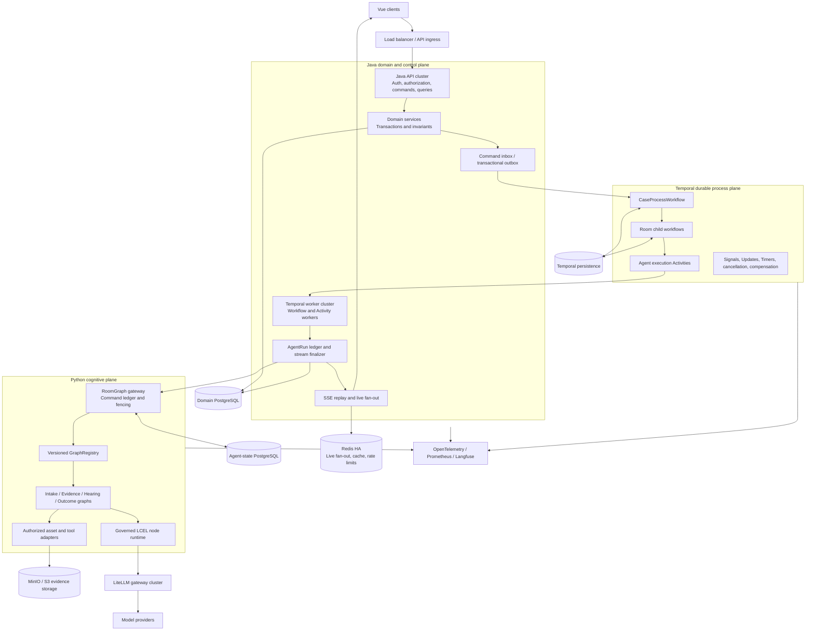
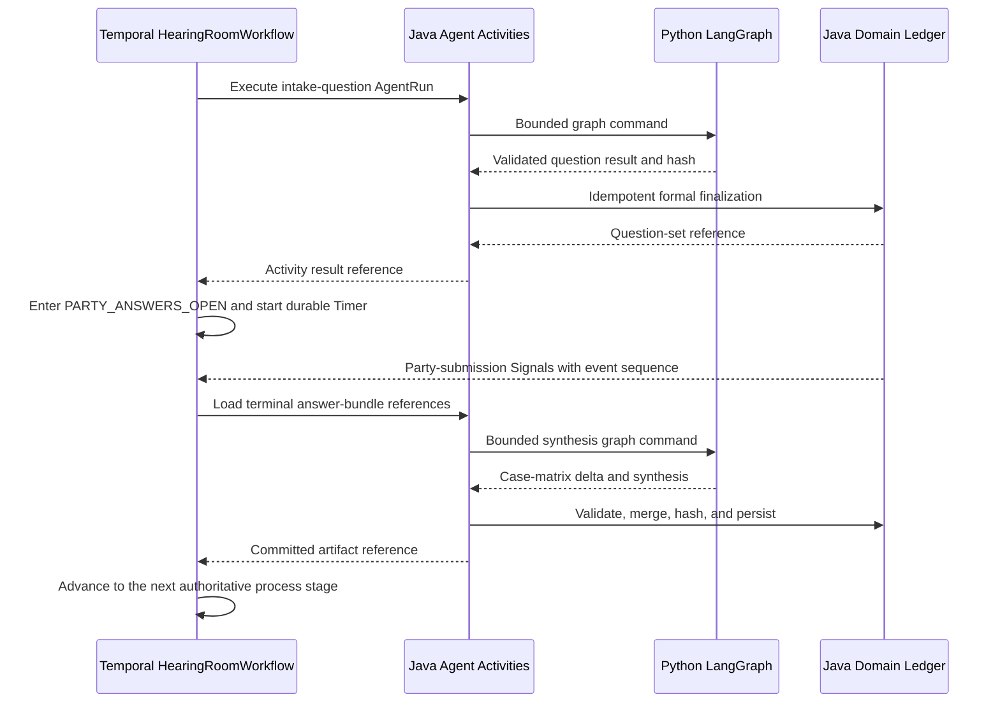
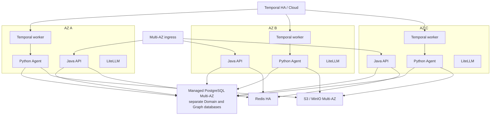

# Temporal-first Agent Platform Architecture

Status: Current production architecture baseline
Updated: 2026-09-04
Scope: 1,000 concurrently active dispute rooms with production-grade availability,
recovery, auditability, and controlled model concurrency.

Current behavior is defined by the running code, versioned contracts and
[`canonical-full-chain-uat-fixture.md`](../acceptance/canonical-full-chain-uat-fixture.md).
The currently verified browser candidate is recorded separately in
[`current-uat-baseline.md`](../release/current-uat-baseline.md).
No architecture change may regress those business, authorization, idempotency or replay
invariants.

## 1. Executive decision

The platform is built as four cooperating runtimes with one authority per class of
state:

1. **Temporal is the authoritative process runtime.** It owns macro phase, room
   phase, durable waits, deadlines, cancellation, retries, compensation, and the
   ordering of external commands.
2. **Java and PostgreSQL are the authoritative domain ledger.** They own identities,
   permissions, formal messages, evidence, submissions, immutable artifacts,
   decisions, execution records, and query projections.
3. **Python and LangGraph are the authoritative cognitive runtime.** They own bounded
   Agent computation, graph checkpoints, intermediate validated outputs, context
   summaries, routing, fan-out, and deterministic reducer state.
4. **LangChain Core is the model execution protocol.** Prompt, Message, ChatModel,
   structured parsing, callbacks, streaming, retries, and tracing flow through a
   governed Runnable pipeline.

Java remains the only public API and security boundary. Python cannot mutate formal
case data. Temporal cannot contain large domain payloads. LangGraph cannot advance the
case macro process. No state field has two authoritative writers.

```text
Temporal Event History   = process truth
Java PostgreSQL          = domain fact and audit truth
LangGraph PostgreSQL     = cognitive execution truth
MinIO / S3               = evidence binary truth
Elasticsearch            = disposable search projection
Redis                    = disposable live-delivery and rate-limit state
```

## 2. Design principles

### 2.1 Non-negotiable invariants

- Every external command is handled with at-least-once delivery and explicit
  idempotency. The system never claims network-level exactly-once execution.
- Temporal owns all waits that can outlive a single Agent computation. LangGraph does
  not wait for the same party action or deadline.
- Workflow code is deterministic. Database, HTTP, model, clock, random, and file I/O
  occur only in Activities.
- Agent output is a proposal until a Java finalizer validates and commits it.
- Streaming text is provisional. Only the validated final object becomes a formal
  message or artifact.
- Formal domain transactions never depend on Redis, an in-memory lock, or a live SSE
  connection.
- Large text, evidence files, complete matrices, model deltas, and PII are not stored
  in Temporal history.
- Python receives server-created scope identifiers. A browser cannot choose a graph
  thread, actor scope, prompt profile, tool capability, or model profile.
- Model retries, Activity retries, and workflow retries share one propagated retry
  budget. They cannot multiply independently.
- Every running workflow, graph, prompt, schema, policy, and model profile is version
  pinned.

### 2.2 Why this split is intentional

Temporal is strongest at durable time, ordering, retry, cancellation, and recovery.
PostgreSQL is strongest at transactions, constraints, joins, reporting, retention,
and formal audit. LangGraph is strongest at stateful cognitive DAGs, conditional
routing, parallel Agent work, reducers, and checkpoints. LangChain is strongest at
composable model object flow. Each technology is used where its guarantees are
native rather than simulated.

## 3. Capacity model and SLOs

"1,000 concurrent rooms" means 1,000 active room workflows, most of which are waiting
for people or deadlines. It does not imply 1,000 simultaneous provider calls.

### 3.1 Initial production envelope

| Dimension | Design target |
| --- | ---: |
| Concurrent active room workflows | 1,000 |
| Concurrent connected SSE clients | 2,500 |
| Concurrent AgentRuns, burst | 250 |
| Concurrent model calls, sustained | 100 |
| Concurrent model calls, burst | 200 |
| Incoming room commands, sustained | 20/s |
| Incoming room commands, burst | 50/s |
| Agent-triggering commands, sustained | 5/s at a 20-second mean model latency |
| Agent-triggering commands, short burst | 20/s for no more than 30 seconds |
| Evidence files in one terminal batch | 100 |
| Parallel evidence assessments per room | 8 |
| Initial horizontal growth target | 10x active workflows |

Provider quota is a separate capacity boundary. Admission control must queue work
rather than create unbounded Python tasks or provider requests.

Model capacity is sized with Little's Law:

```text
required model concurrency = Agent-triggering arrival rate * mean model service time
```

At five Agent-triggering commands per second and a 20-second mean service time, 100
sustained model slots are fully occupied. If measurements show that 20 room commands
per second all invoke a model, the sustained model limit must rise to at least 400,
provider token throughput must rise with it, or the product must accept queueing. HPA
cannot manufacture provider quota. Production normally operates below 70% of the
approved provider request and token limits so retry traffic has headroom.

### 3.2 Service objectives

| Objective | Target |
| --- | --- |
| Java command/query availability | 99.95% monthly |
| Temporal control-plane availability | 99.95% monthly |
| Agent execution availability, excluding provider-wide outage | 99.9% monthly |
| Formal domain data RPO inside one region | 0 committed transactions |
| Temporal workflow RPO inside one region | 0 acknowledged events |
| Multi-AZ recovery time | less than 5 minutes |
| Regional disaster recovery RPO / RTO | 5 minutes / 30 minutes |
| Command durable acceptance p95 | less than 300 ms |
| Temporal dispatch after durable acceptance p95 | less than 1 second |
| SSE reconnect and replay p95 | less than 2 seconds |
| Model first-token p95 | measured separately by provider/model profile |

The model completion latency is reported separately from platform queue and execution
latency so a provider regression cannot be hidden inside an aggregate API metric.

## 4. Logical architecture



## 5. State ownership

| State | Authoritative owner | Other copies |
| --- | --- | --- |
| Case macro phase and room epoch | Temporal CaseProcessWorkflow | Versioned Java query projection |
| Room external phase, waits, deadlines | Temporal room child workflow | Versioned Java UI projection |
| Workflow retry, cancellation, compensation | Temporal | AgentRun audit summary |
| Participant identity and permission | Java domain ledger | Minimal signed Python invocation scope |
| Formal room messages | Java domain ledger | Prompt-window references in graph state |
| Evidence metadata and submission batches | Java domain ledger | Immutable snapshot references in graph state |
| Evidence binaries | Object storage | Hash and authorized temporary access only |
| Fact/evidence matrices and formal artifacts | Java append-only domain ledger | Hash-bound graph inputs and outputs |
| AgentRun logical status and attempts | Java AgentRun ledger | Temporal Activity result references |
| Graph cognitive state and checkpoints | LangGraph PostgreSQL | Commit manifest hash in AgentRun |
| Prompt/model intermediate Messages | Current Runnable invocation | Redacted trace metadata only |
| Search and dashboard views | Elasticsearch / read replicas | Rebuildable from domain ledger |

Temporal Search Attributes contain only non-sensitive operational dimensions such as
tenant surrogate, case surrogate, workflow type, macro phase, room type, version, and
terminal status. They are not used as the application query database.

## 6. Temporal workflow topology

### 6.1 CaseProcessWorkflow

One stable workflow represents one case journey:

```text
workflow_id = case-process:{tenant-surrogate}:{case-id}
```

Its state is intentionally small:

```text
process_version
process_revision
case_id reference
macro_phase
active_room_type
room_epoch
active_child_workflow_id
pending_command_ids (bounded)
cancellation / terminal status
```

It coordinates room child workflows and owns only macro transitions:

```text
INTAKE -> EVIDENCE -> HEARING -> OUTCOME -> CLOSED
```

Every transition is decided after an idempotent Java Activity validates the formal
domain facts. Temporal orders the decision; Java constraints validate the facts.

### 6.2 Room child workflows

Each room epoch receives a child workflow. Reopening a room creates a new epoch rather
than mutating an old closed instance.

```text
room-workflow:{case-id}:{room-type}:{room-epoch}
```

Room workflows own external interaction phases:

- Intake: `OPEN`, `WAITING_PARTY`, `AGENT_RUNNING`, `READY_TO_CONFIRM`, `COMPLETED`.
- Evidence: `OPEN`, `COLLECTING`, `AGENT_RUNNING`, `WAITING_MORE`, `SEALED`.
- Hearing: the explicit `hearing_flow.v2` stage sequence, party waits, deadlines,
  AgentRun scheduling, human-review handoff, and closure.
- Outcome: reviewer wait, explanation generation, approved action handoff, and closure.

Formal party waits and deadlines live here. A LangGraph run returns a bounded result
and completes; it does not remain interrupted for the same external wait.

### 6.2.1 Hearing control boundary example



Temporal sees references, hashes, stage decisions, Signals, and Timer state. LangGraph
sees the minimum authorized snapshot needed for one cognitive transition. Java commits
the formal question set, answer bundles, matrix version, and artifacts.

### 6.3 Commands

Use a Workflow Update when the caller needs synchronous validation and a result. Use a
Signal for a previously committed asynchronous fact. Use an Activity for every side
effect.

Examples:

- Updates: cancel case, confirm room completion, submit reviewer decision.
- Signals: party message committed, evidence batch committed, AgentRun finalized,
  external callback received.
- Timers: warning, party deadline, reviewer SLA, retry backoff, compensation timeout.

Commands carry references and hashes, not full business payloads. Large or sensitive
payloads are staged transactionally in Java PostgreSQL before a Temporal Update or
Signal is sent.

Update and Signal handlers do not execute domain transitions directly. They validate
the envelope, deduplicate it, and append it to a deterministic in-workflow command
queue. The main Workflow loop processes that queue serially and completes the Update's
durable promise after the command reaches its requested acceptance or application
level. This prevents concurrent Update handlers from creating an implicit second
scheduler inside one Workflow.

### 6.4 History control and upgrades

- Continue-As-New at every macro room transition.
- Continue-As-New when history exceeds an operational threshold, initially 2,000
  events or 24 hours of chatty activity.
- Child workflows isolate room history and allow independent room-version evolution.
- Temporal Worker Versioning pins active executions to compatible Java builds.
- Replay tests run against captured production-like histories before deployment.
- Workflow code never branches on a mutable feature flag without a recorded version.

## 7. Command path and transaction boundaries

### 7.1 Durable command intake

1. Java authenticates the caller and authorizes the case and room scope.
2. One PostgreSQL transaction inserts a `case_command` row and an outbox row using the
   caller-provided or server-generated `command_id`.
3. The command stores a payload reference, canonical SHA-256 hash, expected process
   revision, actor identity, and trace context.
4. The API returns an accepted command view. Repeating the same ID and hash returns
   the existing view; the same ID with a different hash is a conflict.
5. The outbox dispatcher delivers an Update or Signal to the stable workflow ID.
6. Temporal serializes workflow handling and calls an idempotent Activity to apply the
   domain mutation.

The outbox makes acceptance independent of Temporal availability. Temporal remains the
process authority because no macro projection changes until its Activity applies the
ordered decision.

The normal low-latency path invokes Update-With-Start after the staging transaction,
using `command_id` as the Temporal Update ID, and waits for the requested acceptance or
application level. The outbox is the recovery path if that call fails or the API pod
dies after commit. If Temporal is unavailable, the API returns `202 PENDING_ORCHESTRATION`
instead of falsely reporting that the business transition completed. The command query
endpoint provides read-your-command status until the projection reaches the accepted
process revision.

Temporal Update ID deduplication is useful within a Workflow run, but it is not the
cross-run source of truth after Continue-As-New. Java allocates a monotonic
`case_command_sequence` under the case command-stream lock and keeps `command_id`
globally unique. The Workflow records a bounded recent-ID cache and the last applied
sequence. Any retry crossing a Workflow run is reconciled against the Java command
ledger before side effects execute.

Committed asynchronous domain events carry a monotonic `case_event_sequence`.
Out-of-order delivery does not change process state: the Workflow buffers a bounded
gap or invokes `LoadDomainEventsActivity` to fetch the missing range from the domain
ledger. It never assumes that multiple outbox dispatchers preserve network order.

### 7.2 Projection write

Every process transition increments `process_revision`. Projection Activities update
Java PostgreSQL with a fencing condition:

```sql
update case_process_projection
   set macro_phase = :phase,
       room_phase = :room_phase,
       process_revision = :new_revision,
       temporal_run_id = :run_id
 where case_id = :case_id
   and process_revision < :new_revision;
```

An old Activity, delayed retry, or old worker build cannot overwrite a newer
projection. The UI reads this projection; it never queries Temporal for case lists.

### 7.3 No distributed transaction

The system deliberately avoids XA/2PC. It uses:

- local ACID transactions;
- Temporal durable retry;
- idempotency keys and request hashes;
- monotonic revisions and fencing tokens;
- transactional outbox/inbox;
- reconciliation jobs;
- compensating commands for externally visible side effects.

Every side-effecting Activity uses an operation key and a Java `domain_operation`
ledger. If the database commit succeeds but the Activity completion response is lost,
the Temporal retry loads and returns the committed operation result. It does not repeat
the mutation, regenerate an Agent result, or issue the external action again.

## 8. AgentRun as the durable execution ledger

AgentRun is retained but separated from scheduling responsibility.

### 8.1 Logical run and attempts

Refactor the current attempt-suffix model into:

```text
agent_run
  logical run, idempotency key, command hash, final status/result

agent_run_attempt
  attempt number, provider/model, checkpoint, timing, usage, error, reset status

agent_run_stream_event
  coalesced public stream chunks and terminal protocol events
```

Uniqueness rules:

- `(case_id, logical_idempotency_key)` is unique.
- `(agent_run_id, attempt_no)` is unique.
- `(agent_run_attempt_id, sequence_no)` is unique.
- A final formal artifact can reference only one completed logical AgentRun.

### 8.2 Temporal Activity execution

`ExecuteAgentRunActivity` runs in a dedicated Java worker task queue:

1. Claim or load the logical AgentRun idempotently.
2. Open the versioned Python stream with a stable logical graph command ID.
3. Persist coalesced visible chunks and publish live delivery events.
4. Heartbeat Temporal at least every five seconds and after meaningful progress.
5. Validate the terminal protocol and result schema.
6. Return only a final result reference and hash to the room workflow.
7. Apply the formal output in a separate idempotent finalization Activity.

Temporal cancellation is propagated through the Activity to the internal stream. Java
closes the Python request, Python cancels outstanding async model/tool tasks where
supported, and the attempt becomes `ABORTED`. Every finalizer checks the current room
epoch and fencing token, so a late provider response from a cancelled attempt cannot
become formal output.

Suggested initial Activity policy:

```text
StartToCloseTimeout: 10 minutes
HeartbeatTimeout: 15 seconds
MaximumAttempts: 3 for infrastructure failures
Backoff: exponential with jitter, bounded by the command deadline
```

Business rejection, stale revision, authorization failure, unsupported contract,
guardrail failure, and deterministic schema incompatibility are non-retryable.

### 8.3 Cutover from the polling scheduler

During migration, the existing recovery scheduler is a safety net. After all AgentRun
dispatches are Temporal Activities and load tests prove recovery, the scheduler must be
disabled or restricted to detecting and alerting on orphaned legacy records. Two
independent components cannot automatically execute the same pending run.

## 9. Streaming protocol

### 9.1 Provisional and committed output

Model text streamed before terminal schema validation is explicitly provisional. The
current target Graph uses two deliberately separate stream contracts:

| Lane | Protocol | Shape |
| --- | --- | --- |
| Intake `PARALLEL_FRAMES_V1` | `agent-stream.v4` | Three typed Frame lanes, per-Frame generation/reset/seal and one exact final |
| Evidence, Hearing, Review and Outcome | `agent-stream.v3` | One attempt-scoped ordered stream and one exact final |

V3 remains a single-frame protocol and is not widened with V4 payloads. Historical
`agent_stream.v1`/V2 data is replay-only compatibility material. New Intake epochs pin
their execution profile; a running epoch never switches between monolithic V3 and
parallel V4.

The common lifecycle includes:

```text
attempt_started
visible_delta
usage
attempt_aborted
attempt_reset
final
error
```

For V4, `public_frame_start`, `public_frame_projection_item`,
`active_frame_snapshot`, `frame_generation_reset`, `public_frame_sealed` and
`public_frame_interrupted` bind each provisional item to one Frame and generation. If
an attempt or Frame fails after visible text was emitted, the client discards only the
superseded provisional authority. Only the exact durable `final` can create the formal
Java room message.

### 9.2 Efficient delivery

- Python deltas are coalesced by field for 50-100 ms or until 1-4 KiB is available.
- Java batch-inserts stream events instead of committing one row per token.
- PostgreSQL is the replay source. Redis Pub/Sub is only the low-latency fan-out path.
- If Redis is unavailable, live delivery degrades, while reconnect and replay remain
  correct from PostgreSQL.
- Connected SSE nodes periodically compare the durable high-watermark with the last
  delivered sequence, so a missed Redis publication is repaired without requiring the
  browser to guess that it should reconnect.
- SSE clients resume with `(agent_run_id, attempt_id, sequence_no)`.
- Per-client buffers are bounded. Slow clients reconnect and replay instead of
  consuming unbounded Java heap.

At 100 sustained model calls, four coalesced events per second per call produces about
400 durable stream events per second, which is a controlled PostgreSQL workload and
far below a per-token design.

The stream table is time partitioned and has a short hot retention period. On logical
run completion, provisional chunks are compacted into a compressed attempt transcript
and optionally archived to object storage. Hot chunks remain in PostgreSQL until the
run is compacted and for at least 24 hours afterward; compressed transcripts can use a
longer incident-analysis retention. A partition is dropped only after compaction or
archive verification. The immutable AgentRun manifest, terminal event, formal room
message, usage, and output hash follow the longer audit retention policy. This prevents
a continuously busy deployment from accumulating tens of millions of small stream rows
per day forever.

## 10. Python LangGraph cognitive runtime

### 10.1 Bounded cognitive transactions

Each Temporal room stage invokes a bounded LangGraph command. The graph may checkpoint
and recover internal work, but returns at a stable boundary:

```text
COMPLETED
NEEDS_INPUT
NEEDS_REVIEW
FAILED
```

`NEEDS_INPUT` is a result consumed by Temporal; Temporal owns the actual wait. This
prevents one party deadline from existing simultaneously as a Temporal Timer and a
LangGraph interrupt.

### 10.2 Graph kernel

All room graphs share a small execution kernel:

```text
validate_command
  -> acquire_thread_lease
  -> reconcile_authoritative_snapshot
  -> dispatch_explicit_room_graph
  -> execute_capabilities
  -> validate_state_patch
  -> persist_checkpoint
  -> project_graph_result
```

The room topology remains explicit Python `StateGraph` code. Do not create a dynamic
JSON workflow DSL that hides edges, types, or reducers.

### 10.3 Graph state

Common state contains only serializable, bounded data:

```text
graph_key / graph_version
thread_id / room_epoch / actor_scope
cognitive_revision
last_domain_snapshot_version and hash
current_command reference
room-specific validated artifacts
bounded message window and memory summary
pending capability work
validated outputs
terminal graph result
```

Model clients, database pools, prompt repositories, tool implementations, tracing
clients, and secrets belong to LangGraph Runtime Context, not checkpoint state.

### 10.4 Thread scope

```text
intake:{tenant}:{case}:{room-epoch}:{actor}:{agent-session}
evidence:{tenant}:{case}:{room-epoch}:{actor}:{agent-session}
hearing:{tenant}:{case}:{room-epoch}:shared
outcome:{tenant}:{case}:{room-epoch}:{reviewer-session}
```

Private intake and evidence memories never share a thread. A shared hearing graph can
consume only formal, visibility-filtered artifacts, never private room transcripts.

### 10.5 Parallelism and reducers

- Intake V4 is a special exact-three topology: `dialogue_frame`, `dossier_frame`, and
  `quality_frame` are sibling parent nodes with independent child checkpoints. Python
  has no semantic join; Java is the first convergence point and sole assembler of the
  formal `IntakeTurnProposal`.
- A failed Intake Frame may advance only its own bounded generation. An already sealed
  sibling cannot be called again or replaced by last-write-wins output.
- Use `Send` only for naturally independent work such as evidence-file assessment or
  critic review.
- Set per-room and global concurrency limits. Never allocate one unbounded thread per
  evidence file.
- Parallel results use keyed dictionaries, not append-only lists.
- Reducers used at fan-in must be associative and deterministic; where possible they
  are commutative. Final ordering uses stable IDs.
- A reducer conflict is a protocol error, not last-write-wins.

Example state channel:

```python
assessments: Annotated[
    dict[str, EvidenceAssessment],
    merge_assessments_by_evidence_id,
]
```

### 10.6 Command ledger and fencing

Python owns an `agent_graph_command` ledger with unique `(thread_id, command_id)`:

- Same command ID and request hash after completion returns the cached result.
- Same command ID with another hash fails closed.
- A lease with monotonic fencing token prevents overlapping retries from committing.
- Checkpoint state records the last committed command and result hash.
- A crash between checkpoint commit and ledger completion is reconciled from that
  checkpoint without re-running a completed model node.

The lease is persisted. Redis is not the only lock protecting graph correctness.

## 11. LangChain unified model protocol

### 11.1 Object flow

```text
Typed Graph State
  -> State Lens
  -> typed prompt input
  -> ChatPromptTemplate
  -> ChatPromptValue
  -> SystemMessage / HumanMessage
  -> GovernedChatModel
  -> AIMessage
  -> structured parser
  -> Pydantic output
  -> deterministic business guardrail
  -> typed state patch
```

Each Agent node is compiled from an explicit specification:

```text
node name
state lens
prompt reference and version
model profile and version
output schema and version
retry budget
visibility policy
business validator
state reducer
```

### 11.2 GovernedChatModel

The existing structured LiteLLM client is adapted to LangChain Runnable semantics. It
must preserve:

- trusted system and untrusted human-message separation;
- strict provider JSON Schema with bounded compatibility fallback;
- Pydantic terminal validation;
- context token budgeting and source provenance;
- multimodal authorization and manifest binding;
- hidden-reasoning suppression;
- visible-field streaming allowlists;
- usage, latency, model, provider, prompt, and policy metadata;
- `invoke`, `ainvoke`, `batch`, `stream`, and callback behavior.

Wrapping the old `invoke_structured` in a `RunnableLambda` is only a compatibility
step. The target separates context selection, prompt construction, model invocation,
parsing, and business policy so each layer can be tested and traced independently.

### 11.3 Retry budget

One command carries an absolute deadline and remaining attempt budget:

- LangChain may retry a transient provider failure at most twice within the same
  Activity attempt.
- Temporal retries infrastructure-level Activity failure at most three times.
- A schema repair node runs at most once for the same raw model result.
- A business or guardrail failure is not converted into an infrastructure retry.
- Provider circuit breakers and tenant bulkheads can reject or queue before the model
  call starts.

## 12. Versioned cross-service contracts

### 12.1 CaseCommandRef recorded for Temporal

```text
schema_version
command_id
tenant_surrogate / case_id
command_type
actor_ref
payload_ref / payload_hash
expected_process_revision
occurred_at
traceparent
```

### 12.2 RoomGraphCommand sent to Python

```text
schema_version
logical_command_id / attempt_id
graph_key / graph_version
thread_id / room_epoch / actor_scope
process_revision / stage_code / stage_sequence
domain_snapshot_ref / version / canonical hash
event_ref / event_hash
agent invocation context
deadline / retry budget
trace context
```

### 12.3 RoomGraphResult returned to Java

```text
schema_version
logical_command_id
graph_key / graph_version / checkpoint_id
cognitive_revision
status
public event proposals
artifact operations
needs-input or needs-review specification
output hash
usage and execution metadata
```

Contracts are schema-first. JSON Schema is the canonical contract, with generated or
validated Java and Pydantic types. Canonical hashes use RFC 8785 JSON canonicalization
and SHA-256. Every receiver validates the schema, ID bindings, version, scope, and hash
before use.

## 13. Java domain architecture

Java remains responsible for:

- authentication and room/participant authorization;
- command staging, inbox/outbox, and idempotency;
- formal domain aggregates and PostgreSQL constraints;
- append-only room messages, evidence actions, hearing actions, and artifacts;
- immutable input snapshots provided to Agents;
- AgentRun ledger, stream replay, and finalization;
- Temporal Workflow and Activity implementations;
- query projections and frontend APIs;
- approved deterministic Tool Executor operations;
- compensation and reconciliation Activities.

The existing hearing V2 action and artifact tables remain valuable formal ledgers.
Their current-stage fields become Temporal projections; application services cannot
advance them independently.

## 14. Availability and deployment topology

Production uses multi-AZ deployment. Temporal Cloud is preferred unless the team owns
the operational capacity to run a supported HA Temporal cluster.



### 14.1 Initial deployment sizing

These are load-test starting points, not permanent reservations:

| Deployment | Minimum replicas | Initial pod size | Scaling signal |
| --- | ---: | --- | --- |
| Java API | 3 | 2 vCPU / 4 GiB | request latency, SSE connections |
| Java Temporal control workers | 3 | 2 vCPU / 4 GiB | Temporal task queue latency |
| Java Agent execution workers | 3 | 4 vCPU / 8 GiB | in-flight Activities, heartbeat delay |
| Python Agent service | 4 | 4 vCPU / 8 GiB | in-flight graphs, queue delay, memory |
| LiteLLM gateway | 3 | 2 vCPU / 4 GiB | provider latency and open connections |
| OTel collectors | 2 | 2 vCPU / 4 GiB | dropped spans and export queue |

Java 21 virtual threads are appropriate for bounded long-lived internal model streams,
but a semaphore still caps in-flight Agent Activities. Python uses async HTTP/model
clients and one process per pod initially; scale is achieved with pods, not hundreds of
threads.

Use separate Temporal task queues for:

```text
case-control
room-control
agent-execution
notification-and-tools
```

A provider slowdown therefore cannot starve deadline or cancellation workflows.

### 14.2 Database isolation

- Temporal persistence uses Temporal-owned databases and credentials.
- Java domain data and Python graph state use separate logical databases or at least
  separate schemas, roles, pools, migrations, and resource limits.
- PgBouncer protects PostgreSQL from replica and Activity burst connections.
- Read replicas serve reporting and large case-list queries.
- Java cannot write graph checkpoint tables; Python cannot write domain tables.

## 15. Admission control and efficiency

### 15.1 Hierarchical bulkheads

Limit concurrency at four layers:

1. Global model/profile limit.
2. Tenant limit.
3. Room limit.
4. Node fan-out limit.

The scheduler queues excess work with a visible position or processing state. It does
not start more tasks and rely on provider 429 responses for flow control.

When queue age exceeds the Agent execution SLO, admission control stops accepting
non-critical background Agents, preserves deadline/cancellation/review control queues,
and returns an explicit delayed-processing state. Already accepted commands are never
dropped. Tenant-weighted quotas prevent one large case or tenant from consuming all
provider capacity.

### 15.2 Cost and context control

- State Lenses select only fields required by a node.
- Graph state stores hashes and references instead of repeated full snapshots.
- Message windows are bounded and summarized with provenance.
- Stable prompt prefixes and model caching are used only where tenant isolation and
  provider guarantees permit it.
- Evidence work is deduplicated by content hash and assessment policy version.
- No model call is used for deterministic validation, hashing, ID generation, merge,
  permission, deadline, or transition logic.

## 16. Failure semantics

| Failure | Recovery behavior |
| --- | --- |
| Java API pod loss | Load balancer retries another pod; accepted commands remain in PostgreSQL |
| Temporal transient outage | Commands remain in outbox; reads continue from Java projections |
| Java Activity worker loss | Temporal retries from the last recorded Activity boundary |
| Python pod loss before checkpoint | Same command is retried under a fencing token |
| Python pod loss after checkpoint | Command ledger reconstructs or returns committed result |
| Model provider 429/5xx | Bounded local retry, circuit breaker, then Temporal retry or alternate profile |
| Model returns invalid schema | One repair path, then explicit failure or human review |
| Java finalization DB outage | Temporal retries finalization using cached Python result; model is not called again |
| Duplicate or reordered command | Hash and expected revision reject or return the existing result |
| Redis outage | Live fan-out degrades; PostgreSQL replay remains correct |
| SSE disconnect | Client resumes by attempt and sequence number |
| Deployment during active case | Temporal and Graph versions remain pinned; compatible workers stay available |
| Region loss | Warm-region restore from replicated object store, PostgreSQL backup/replica, and Temporal DR plan |

No error path fabricates a successful Agent result. Failures either retry within the
budget, remain visibly pending, or enter human review.

## 17. Security and privacy

- External authentication and authorization occur in Java before command staging.
- Internal Java-Python traffic uses mTLS plus a short-lived signed invocation envelope.
- The envelope binds tenant, case, room epoch, actor scope, graph version, command ID,
  request hash, expiry, and allowed capabilities.
- Python validates all bindings again and rejects caller-selected model or tool data.
- Tool access uses explicit capability declarations and allowlisted Java endpoints.
- Evidence content is always untrusted Prompt input, never system instruction.
- Temporal Workflow IDs and Search Attributes do not contain PII.
- Sensitive Temporal payload references use an encryption codec where required.
- Domain, graph, and object-store credentials are independent and least privilege.
- Prompt injection, cross-party leakage, asset substitution, and stale-snapshot attacks
  have dedicated tests and audit events.
- Hidden chain-of-thought is never requested, persisted, streamed, or exposed.

## 18. Audit model

Every completed AgentRun produces an immutable execution manifest:

```text
case / room / actor scope
workflow / room epoch / process revision
logical run and attempt IDs
graph key / graph version / checkpoint ID
prompt reference / version / content hash
model profile / provider / model version
input snapshot references and hashes
output schema / policy / guardrail versions
validated output hash
public stream attempt history
token usage / latency / cost
terminal status and failure classification
trace ID
```

The manifest is sufficient to prove what governed inputs and versions produced the
formal output without persisting private model reasoning. Formal action and artifact
tables remain append-only and can be archived to immutable object storage according to
the retention policy.

## 19. Observability

OpenTelemetry context propagates through:

```text
browser request
-> Java command
-> outbox
-> Temporal Workflow and Activity
-> AgentRun
-> Python LangGraph
-> LangChain Runnable
-> LiteLLM and provider
```

Required metrics include:

- command acceptance, outbox age, and duplicate/conflict rate;
- Temporal task queue latency, Workflow task failures, Activity retries, and history
  size;
- AgentRun queue, execution, first-token, completion, retry, reset, and finalization
  latency;
- Graph checkpoint latency, lease contention, node duration, fan-out width, and state
  size;
- model tokens, cost, provider latency, 429/5xx, schema failure, and guardrail failure;
- SSE connections, replay lag, slow consumers, and Redis delivery misses;
- domain projection lag and reconciliation drift.

Alerts are based on SLO burn rate and stuck-age thresholds, not only process uptime.
Runbooks cover stuck Workflow, stale Activity heartbeat, graph lease recovery, provider
outage, projection drift, and region failover.

## 20. Versioning and deployment

The current UAT-aligned source identity is `all-rooms.target-e2e.v2` /
`target-e2e-graph.2026-08-18.3` / `target-e2e-checkpoint.v2`. Intake V4 uses
`PARALLEL_FRAMES_V1` and `agent-stream.v4`; the other target rooms use
`agent-stream.v3`. All model lanes currently resolve through `qwen3.8-flash` with
thinking disabled and strict JSON Schema enabled.

Every formal run pins:

```text
process contract version
Temporal worker build/version
room workflow version
graph key and version
checkpoint schema version
prompt version and hash
model profile version
output schema version
policy and guardrail versions
tool capability version
```

Deployment policy:

- additive contracts first;
- dual readers before writer migration;
- canary new Workflow and Graph versions on new room epochs;
- keep compatible Temporal workers and graph implementations for active versions;
- migrate checkpoints only at explicit safe boundaries;
- compare old/new outputs in shadow mode without writing two formal results;
- remove old code only after no active workflow or graph thread references it.

The repository's default Compose image and a separately authorized UAT platform are
not interchangeable release identities. A successful UAT on Temporal 1.29.7 does not
authorize the repository to upgrade, recreate, or repoint a Temporal cluster. Core
component changes require a separate operator decision, schema-safe migration, backup
and rollback evidence.

## 21. Verification strategy

The executable production checklist is maintained in
[`temporal-first-agent-platform-verification-checklist.md`](../acceptance/temporal-first-agent-platform-verification-checklist.md).

### 21.1 Focused verification during development

- Pure Java transition-decider unit tests.
- Temporal Workflow time-skipping and replay tests.
- Activity idempotency and fencing tests with PostgreSQL.
- Python node, router, state-lens, and guardrail unit tests.
- Reducer property tests for determinism, associativity, conflict, and ordering.
- Java/Python generated-contract compatibility tests.
- Cross-actor and cross-tenant isolation tests.

### 21.2 Unified production-readiness checkpoint

The release gate runs:

1. 1,000 active room workflows.
2. 250 simultaneous AgentRuns using a realistic streaming model stub.
3. 100 sustained and 200 burst model-call concurrency.
4. 2,500 reconnecting SSE clients.
5. Duplicate, delayed, and reordered command injection.
6. Java, Python, Temporal worker, Redis, and LiteLLM pod termination during execution.
7. PostgreSQL failover and connection-pool saturation.
8. Temporal Worker version rollout with live workflows.
9. Python graph rollout with pinned old threads.
10. Provider 429, timeout, malformed JSON, truncated stream, and schema drift.

Release fails on any duplicated formal message/artifact, lost accepted command,
cross-scope data exposure, stale projection overwrite, unrecoverable checkpoint, or SLO
breach beyond the agreed error budget.

## 22. Current implementation and compatibility state

The former Phase 0-8 migration plan has been implemented into the current source
baseline and is no longer an open work plan. The production repository now contains:

- typed Case/Room Temporal workflows, inbox/outbox delivery, fencing, projection
  reconciliation, Continue-As-New and replay tests;
- logical AgentRun/attempt separation, durable V3/V4 streams and idempotent Java
  finalizers;
- PostgreSQL LangGraph checkpointing, command ledger, leases, GraphRegistry and
  version-pinned target execution;
- Intake exact-three parallel Frames, Evidence source-bound frames, the fixed
  `hearing_flow.v2` path, Review and Outcome proposal-only graphs;
- append-only formal Java ledgers, human review, policy-gated Tool Executor and the
  active recovery/observability runbooks.

Current compatibility boundaries remain deliberate:

1. Existing workflow histories keep the worker and protocol versions recorded when
   they were created. They are not rewritten to the latest profile.
2. New target Intake epochs use `PARALLEL_FRAMES_V1`; historical monolithic Intake
   epochs continue through `MONOLITHIC_V3` readers and replay paths.
3. V3/V4 stream contracts, Graph migration history, Flyway migration history and
   Temporal history fixtures remain in the repository while any persisted data can
   reference them.
4. Target E2E execution remains an explicit, fail-closed lane. Browser UAT proves the
   candidate path, not automatic production enablement.
5. The Compose default remains a repository configuration decision. The separately
   authorized Temporal 1.29.7 UAT environment is platform evidence, not permission for
   an application launch script to upgrade core infrastructure.

Future changes are ordinary versioned releases, not continuations of the deleted phase
plan. They require additive contracts, focused replay/compatibility tests, a fresh-case
UAT checkpoint and explicit authorization for any core component or schema upgrade.

## 23. Explicitly rejected designs

- One universal LangGraph containing all rooms and long-term business waits.
- One Temporal event for every model token or room message delta.
- Full domain entities, evidence text, or matrices stored in Workflow state.
- Java and Temporal independently calculating the same next room or stage.
- Temporal and LangGraph both waiting for the same external party event.
- Python writing formal Java domain tables directly.
- Redis distributed locks as the only concurrency guarantee.
- Unbounded `ThreadPoolExecutor`, unbounded `Send`, or provider-driven backpressure.
- Blind retries for schema, authorization, stale revision, or guardrail failures.
- A dynamic JSON workflow DSL that hides typed LangGraph topology.
- Multiple automatic schedulers executing the same AgentRun queue.
- Treating streamed model text as a committed formal message before final validation.

## 24. Framework decision record

Temporal is selected over Restate, Camunda, LangGraph-only orchestration, and a custom
PostgreSQL scheduler for the durable process plane.

| Candidate | Decision |
| --- | --- |
| Temporal | Selected for mature Java support, durable Timer/Signal/Update semantics, Activity heartbeat and retry, Worker Versioning, replay testing, visibility, cancellation, and HA operations |
| Restate | Strong durable-actor fit, but lower ecosystem and operational maturity for this project's high-stakes, long-running adjudication path |
| Camunda 8 | Appropriate if non-engineers must author BPMN and operate human-task queues; otherwise adds a second process language and heavier integration |
| LangGraph only | Retained for cognitive execution, but not used as the cross-service, multi-day business control plane |
| PostgreSQL plus custom scheduler | Rejected because leases, durable timers, retries, cancellation, history, versioning, and operator tooling would all become custom critical infrastructure |

Temporal is not selected because it is fashionable or already present. It is selected
because the required failure semantics are its native abstraction. If the product later
requires business-authored BPMN rather than code-owned process logic, this decision must
be revisited explicitly rather than layering Camunda beside Temporal.

## 25. Success criteria

This architecture is successful when:

- a committed command cannot be lost even if Temporal is temporarily unavailable;
- a duplicate Activity, command, callback, or model response cannot create a duplicate
  formal result;
- any Java or Python pod can terminate at any instruction boundary and work resumes
  from a defined durable boundary;
- an old retry cannot overwrite a newer process or graph revision;
- a party can never observe another party's private Agent memory;
- Workflow history remains bounded and replay-compatible across releases;
- the platform remains responsive with 1,000 active rooms and the defined Agent/model
  concurrency;
- operators can determine the exact workflow, graph, prompt, model, input hashes,
  policies, cost, and final output for every formal Agent artifact;
- a model or Agent outage delays or escalates work but never corrupts business truth.
