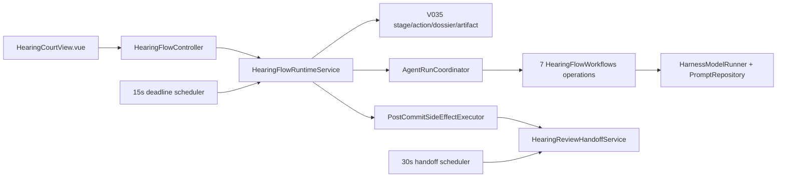

# Phase 6 P6.0 Hearing Baseline Inventory

## Inventory Status

```text
inventory_status: BASELINE_ONLY
observed_commit: d3ea271188be57adac49592879aaf3417e90c5c0
contract_gate: P6.0 PASS
engineering_execution: ALLOWED_UNDER_ADR_0015
phase_5_engineering_checkpoint: PASS
phase_6_engineering_exception: ADR_0015_ACCEPTED_FOR_ENGINEERING_ONLY
next_phase_permission: PHASE_6_ENGINEERING_ONLY
MIG-004: PENDING_PROMOTION
MIG-005: PENDING_PROMOTION
MIG-006: PENDING_PROMOTION
implementation_authorization: ALLOWED_DISABLED_OR_JAVA_SIGNED_SYNTHETIC_SHADOW_ONLY
```

This inventory records the Hearing behavior and code shape present at the accepted Phase 5
checkpoint commit. It is not a target implementation, P6.0 entry-evidence bundle, Phase 6 review
approval, migration authorization, or claim that Phase 6 passed. The P6.0 gate and all runtime restrictions in
`plans/phase-6-hearing-pilot-execution.md` remain unchanged.

The inventory was produced by reading the checked-in Java, Python, frontend, migration, and test
sources. Counts below are exact for the observed commit and are enforced by
`tests/static/test_phase6_hearing_pilot_plan.py` so implementation work must explain intentional
baseline changes instead of drifting silently.

## Counted Snapshot

```text
java_hearing_main_files: 39
java_hearing_entities: 7
java_hearing_repositories: 7
java_hearing_test_classes: 5
java_hearing_test_methods: 21
java_hearing_controller_mappings: 8
java_temporal_hearing_workflow_classes: 0
v035_tables: 5
v035_triggers: 7
python_hearing_external_operations: 7
python_hearing_http_routes: 14
python_hearing_prompt_templates: 8
python_hearing_flow_tests: 23
frontend_hearing_stages: 15
frontend_hearing_groups: 6
frontend_hearing_view_tests: 63
frontend_hearing_utility_tests: 4
frontend_hearing_api_tests: 3
opt_in_live_hearing_e2e_tests: 1
```

## Current Runtime Shape



This is a Java-owned state machine. The string stored as `hearing_state.workflow_id` identifies the
current Hearing flow, but no `workflow/temporal/room/hearing` package, `HearingRoomWorkflow`,
Hearing Signal contract, Hearing Temporal worker registration, or Hearing History replay test
exists. `TemporalWorkerConfiguration` currently registers `RoomControlWorkflowImpl`,
`IntakeRoomWorkflowImpl`, and the legacy `EvidenceWindowWorkflowImpl`; it does not register a
15-stage Hearing Workflow.

## Java Inventory

### Authoritative Runtime Paths

- `java-api-service/src/main/java/com/example/dispute/hearing/api/HearingFlowController.java`
- `java-api-service/src/main/java/com/example/dispute/hearing/application/HearingFlowRuntimeService.java`
- `java-api-service/src/main/java/com/example/dispute/hearing/application/HearingFlowDeadlineScheduler.java`
- `java-api-service/src/main/java/com/example/dispute/hearing/application/HearingTrialDossierService.java`
- `java-api-service/src/main/java/com/example/dispute/hearing/application/HearingReviewHandoffService.java`
- `java-api-service/src/main/java/com/example/dispute/hearing/application/HearingReviewHandoffRecoveryScheduler.java`
- `python-agent-service/app/agents/hearing_flow.py`
- `python-agent-service/app/schemas/hearing_flow.py`
- `python-agent-service/app/main.py`
- `frontend/src/views/disputes/HearingCourtView.vue`
- `frontend/src/utils/hearingFlow.js`
- `frontend/src/stores/hearing.js`
- `frontend/src/api/hearing.js`
- `java-api-service/src/main/resources/db/migration/V035__hearing_flow_v2.sql`
- `java-api-service/src/main/resources/db/migration/V037__key_hearing_party_actions_by_participant_id.sql`

### Package And Persistence Counts

The 39 Java files under `java-api-service/src/main/java/com/example/dispute/hearing` break down into:

- API requests/controller: `api/HearingFlowController.java`, `HearingAnswerBundleRequest.java`,
  `HearingPartyStatementRequest.java`, `HearingEvidenceBatchRequest.java`, and
  `SettlementProposalRequest.java`;
- application runtime/projection: `application/HearingFlowRuntimeService.java`,
  `HearingFlowView.java`, and `HearingPartyActionView.java`;
- dossier/handoff: `application/HearingTrialDossierService.java`,
  `HearingReviewHandoffService.java`, and `HearingReviewHandoffRecoveryScheduler.java`;
- deadline execution: `application/HearingFlowDeadlineScheduler.java`;
- retained settlement compatibility: `SettlementService.java`, command/view/conflict types;
- eight domain enums/types plus `package-info.java`;
- seven JPA entities and seven Spring Data repositories under
  `infrastructure/persistence/{entity,repository}`.

The runtime service is a single transaction boundary with repositories for the case, Hearing state,
flow instance/stage/action/Artifact, adjudication draft, trial dossier, intake/evidence dossiers,
Evidence items, room messages, AgentRun, remedy plan, and review task. It also coordinates
AgentRuns, case events, dossier freeze, review handoff, and post-commit work.

### HTTP Surface

`java-api-service/src/main/java/com/example/dispute/hearing/api/HearingFlowController.java` declares
eight mappings under `/api/disputes/{caseId}/hearing`:

| Method/path | Current delegate | Current fact |
| --- | --- | --- |
| `GET /hearing` | `HearingFlowRuntimeService.get` plus `SettlementService.list` | returns status, question/issue set, evidence request set, dossier, decision chain, settlements |
| `POST /answers` | `submitAnswers` | accepts legacy answer bundle and redirects statement-shaped input to the statement path |
| `POST /statements` | `submitStatement` | accepts one natural-language party statement |
| `POST /evidence-batches` | `submitEvidenceBatch` | accepts one terminal supplement batch |
| `POST /complete` | `completeGate` | documented as read/redirect, but delegates to the same side-effecting `get` method |
| `GET /settlements` | `SettlementService.list` | compatibility surface remains present |
| `POST /settlements` | `SettlementService.propose` | compatibility surface remains present |
| `POST /settlements/{version}/confirm` | `SettlementService.confirm` | requires `Idempotency-Key`; compatibility surface remains present |

The current main UI hides settlement proposal and confirmation, but the backend and frontend API
client retain the compatibility methods. Their presence is not permission to expose settlement in
the Phase 6 mainline.

### Runtime Entry Points And Side Effects

`HearingFlowRuntimeService` exposes these public business methods:

| Method | Current side effects |
| --- | --- |
| `get` | locks the case, authorizes actor, calls `ensureStarted`, reconciles failed AgentRun, calls `expireIfDue`, then projects |
| `completeGate` | calls `get`; therefore currently inherits start/reconcile/expiry side effects |
| `startAfterEvidenceSealed` | creates and advances the Hearing if absent |
| `submitAnswers` / `submitStatement` | validates actor/deadline/request replay, appends one party action/message/event, may start synthesis |
| `submitEvidenceBatch` | validates 0-50 Evidence refs and request IDs, appends one terminal batch/message/event, may start synthesis |
| `expireDuePartyStages` | scans all active/failed instances, takes row locks, reconciles failed AgentRuns and materializes missing timeout actions |
| `supports` | returns true for exactly seven Hearing operations |
| `finalizeResult` | locks current stage, validates AgentRun/envelope, dispatches one of seven formal Finalizers, and advances |

The current GET behavior is a P6 cutover gap, not a hidden query optimization: refresh can start an
unstarted flow, reconcile an Agent failure, create `AUTO_TIMEOUT` actions, start a synthesis
AgentRun, and advance the stage.

### Exact Current 15-Stage Path

| Seq | Stage | Current Java entry/exit behavior |
| ---: | --- | --- |
| 1 | `COURT_PREPARING` | `ensureStarted` creates V035 instance/stage, loads initial case/evidence matrices, emits preparation message, completes stage |
| 2 | `CASE_INTRODUCTION` | `ensureStarted` advances, emits intake-officer deterministic introduction, completes immediately |
| 3 | `EVIDENCE_INTRODUCTION` | `ensureStarted` advances, emits evidence-clerk deterministic introduction, completes immediately |
| 4 | `INTAKE_QUESTIONS_GENERATING` | `ensureStarted` builds request and starts `HEARING_INTAKE_QUESTIONS`; Finalizer persists question set and opens stage 5 |
| 5 | `PARTY_ANSWERS_OPEN` | Java waits through action rows plus scheduler/refresh checks; both terminals or timeout start intake synthesis |
| 6 | `INTAKE_SYNTHESIZING` | `HEARING_INTAKE_SYNTHESIS` Finalizer atomically persists matrix/message output and starts stage 7 |
| 7 | `EVIDENCE_REQUESTS_GENERATING` | `HEARING_EVIDENCE_REQUESTS` Finalizer persists request set and opens stage 8 |
| 8 | `PARTY_EVIDENCE_OPEN` | Java waits through action rows plus scheduler/refresh checks; both terminals or timeout start evidence synthesis |
| 9 | `EVIDENCE_SYNTHESIZING` | `HEARING_EVIDENCE_SYNTHESIS` Finalizer validates/versions the matrix, advances to stage 10 and calls dossier freeze |
| 10 | `DOSSIER_FREEZING` | created, frozen, and completed inside the evidence-synthesis Finalizer transaction; then stage 11 starts |
| 11 | `JUDGE_V1_GENERATING` | starts `HEARING_JUDGE_V1`; Finalizer persists proposal Artifact and starts Jury |
| 12 | `JURY_REVIEWING` | starts `HEARING_JURY_REVIEW`; Finalizer validates V1 parent, persists report, starts V2 |
| 13 | `JUDGE_V2_GENERATING` | starts `HEARING_JUDGE_V2`; Finalizer validates all parents, persists V2/draft/remedy, opens stage 14 |
| 14 | `HUMAN_REVIEW_OPEN` | V2 Finalizer schedules post-commit handoff; handoff service creates/reuses review task and directly completes this stage |
| 15 | `CLOSED` | handoff service directly advances the instance, creates/completes CLOSED stage, and returns the review task ID |

`HearingFlowRuntimeService.advance` checks that `nextStage(current)` equals the requested next stage,
increments sequence by one, mutates `HearingFlowInstanceEntity`, and creates a stage row. Both
`advance` and `nextStage` are private Java methods; there is no Temporal decision/receipt boundary.

### Deadline And Party Terminal Behavior

- `DisputeProperties` defaults the overall Hearing window to `PT3H` and each party stage window to
  `PT20M`.
- `partyDeadline` selects the earlier of stage open plus 20 minutes and the case deadline.
- `effectivePartyDeadline` can shorten the stored shared deadline if the case deadline moved
  earlier; it never extends it.
- `HearingFlowDeadlineScheduler.expireDueStages` invokes the runtime every `PT15S` by default.
- `get`, both party submission paths, and the scheduler call `expireIfDue`.
- At expiry, Java creates one missing `AUTO_TIMEOUT` action per stable participant ID and calls the
  same `afterPartyActionsIfComplete` path used by submissions.
- V037 keys party terminal actions by `(stage_id, action_type, participant_id)`. Repeated requests
  are compared with the stored payload; they cannot replace a different terminal action.
- The case and flow rows are locked during runtime operations, but there is no Hearing epoch,
  process revision, fencing token, or writer-mode guard at this baseline.

### Dossier, Decision Chain, And Handoff

`HearingTrialDossierService` validates the current `DOSSIER_FREEZING` stage, matrix hashes,
question/answer/request/batch bindings, both participant identities/terminal statuses, and one to
100 active policy rules. It returns an existing identical dossier and rejects a conflicting second
freeze.

`HearingArtifactType` has exactly `JUDGE_PROPOSAL`, `JURY_REVIEW_REPORT`, and
`ADJUDICATION_DRAFT`. V035 constraints and Java Finalizers bind the dossier, V1, Jury report, V2,
AgentRun, business ID, content hash, and parent IDs/hashes.

After V2 finalization, `PostCommitSideEffectExecutor` invokes
`HearingReviewHandoffService.handoff`. The handoff verifies the stored V2/draft/AgentRun/remedy and
the full dossier/V1/Jury parent chain. It reuses an existing review task for the same plan or creates
one, then directly completes `HUMAN_REVIEW_OPEN` and advances to `CLOSED`.

`HearingReviewHandoffRecoveryScheduler` scans the 50 most recent V2 Artifacts every `PT30S` and
replays the same idempotent handoff. There is no scheduler `EXECUTOR/DETECTOR/OFF` mode and no
Temporal handoff Activity/receipt at this baseline.

## Python Inventory

### Files And Construction

- `python-agent-service/app/agents/hearing_flow.py` contains `HearingFlowWorkflows` and deterministic
  hash/merge validation helpers. It has no LangGraph or LangChain Runnable import.
- `python-agent-service/app/schemas/hearing_flow.py` contains strict Pydantic request/result,
  matrix, dossier, proposal, review, and V2 schemas. Every operation envelope includes
  `flow_schema_version`, `case_id`, `workflow_id`, `stage_code`, positive `stage_sequence`, optional
  `stage_deadline_at`, and bounded `source_refs`.
- `python-agent-service/app/main.py::_build_hearing_flow_workflows` creates one
  `HarnessModelRunner` from the custom LLM client and `PromptRepository`, then injects it into
  `HearingFlowWorkflows`.
- `python-agent-service/app/harness/model_runner.py` supplies `invoke_structured`; the Hearing
  methods call it directly rather than using the Phase 3 Graph executor/registry/checkpointer.
- `python-agent-service/app/llm.py` implements the underlying bounded HTTP model adapter with
  `httpx`; Hearing does not yet use `prompt | model | parser` LCEL object flow.

### Seven External Operations And Eight Prompts

| Java operation / route suffix | Python method | Stage schema | Prompt node(s) |
| --- | --- | --- | --- |
| `HEARING_INTAKE_QUESTIONS` / `intake/questions` | `intake_questions` | intake questions | `hearing_intake_questions` |
| `HEARING_INTAKE_SYNTHESIS` / `intake/synthesis` | `intake_synthesis` | intake synthesis | `hearing_intake_synthesis` |
| `HEARING_EVIDENCE_REQUESTS` / `evidence/requests` | `evidence_requests` | evidence requests | `hearing_evidence_requests` |
| `HEARING_EVIDENCE_SYNTHESIS` / `evidence/synthesis` | `evidence_synthesis` | evidence synthesis | `hearing_evidence_file_assessment`, then `hearing_evidence_synthesis` |
| `HEARING_JUDGE_V1` / `judge/v1` | `judge_v1` | Judge V1 | `hearing_judge_v1` |
| `HEARING_JURY_REVIEW` / `jury/review` | `jury_review` | Jury review | `hearing_jury_review` |
| `HEARING_JUDGE_V2` / `judge/v2` | `judge_v2` | Judge V2 | `hearing_judge_v2` |

`PromptRepository` therefore maps eight `hearing_*.md` templates. `app/main.py` exposes all seven
operations twice: seven authenticated request/response routes and seven authenticated `/stream`
routes wrapped as NDJSON AgentRun events, for 14 Hearing HTTP route decorators.

### Current Execution And State Gaps

Each public method validates one request, calls the model runner, validates one typed output, and
returns. There is no compiled Hearing `StateGraph`, Graph registry identity, PostgreSQL Hearing
checkpoint, Graph command ledger, lease/fence, router, State Lens, or resumable node boundary.

Evidence synthesis flattens both party batches and uses
`ThreadPoolExecutor(max_workers=len(pending))`; schemas allow two batches of up to 50 Evidence files,
so the current shape can request up to 100 worker threads. It waits on all futures before merging
and refuses partial assessment sets, but has no room/tenant/global bulkhead or durable per-item
checkpoint.

The Python service does not advance Java stages or write Domain tables. IDs and hashes for question,
request, proposal, review, and V2 outputs are computed in-process and revalidated by Java before
formal persistence.

## Frontend Inventory

### Primary Paths

- `frontend/src/views/disputes/HearingCourtView.vue`: Hearing room data loading, SSE/AgentRun stream,
  projection refresh, party statement/supplement actions, transcript, evidence rails/drawers,
  ledger, Draft navigation, and history mode;
- `frontend/src/utils/hearingFlow.js`: exact 15-stage definitions, six group projection, server stage
  normalization, party-input and Judge-stage predicates;
- `frontend/src/stores/hearing.js`: one resource state plus `loadHearing`; it states that local state
  cannot replace server facts;
- `frontend/src/api/hearing.js`: eight HTTP client methods matching the controller, including three
  retained settlement methods and `agentRuns`;
- focused tests plus `frontend/tests/browser/hearing-court.layout.spec.js` and its deterministic
  fixture.

### Observable Behavior

- Stage comes from explicit server status fields and never from message text. Unknown/missing stage
  normalizes to `COURT_PREPARING`.
- Fifteen stages render as six groups: case handoff, clarification, evidence verification, dossier
  freeze, adjudication review, and human review.
- Only `PARTY_ANSWERS_OPEN` and `PARTY_EVIDENCE_OPEN` enable party input; Judge UI state is limited to
  V1/V2 generation.
- `route.query.view === "history"` disables active-run discovery/streams, clears mutation state,
  blocks statement/evidence/settlement/Draft completion controls, and presents a sealed room.
- The page extrapolates countdown display from server time and `stage_deadline_at`; it does not own
  server expiry.
- At 1220px and above, two evidence rails remain visible; below it, they become mutually exclusive
  accessible drawers. The current party is left; authorized counterparty Evidence is read-only on
  the right; reviewer mode has no party submission control.
- Raw counterparty statements remain withheld until both parties are terminal. Internal audit aide
  and raw A2A data are suppressed.
- Transcript text reaches abnormal-report folding at exactly 1500 Unicode characters. The layout
  tests cover 50 messages, a 2000-character statement, and 100 Evidence cards.
- Settlement client/controller compatibility remains, but the normal Hearing mainline hides
  settlement proposal and confirmation.
- `completeHearing` currently uses `hearingApi.hearing` (GET) as a status refresh unless a test/action
  prop is injected; it opens Draft only after server projection says the review task is ready.
- A persisted `CASE_CLOSED` event, not model text, routes to Outcome.

## Database Inventory

### Hearing Migrations

| Migration | Current role |
| --- | --- |
| `V003__init_hearing_tables.sql` | original `hearing_state`, `hearing_record`, and adjudication draft links |
| `V008__final_agent_hearing_governance.sql` | historical Agent/Hearing governance additions |
| `V011__evidence_verification_and_hearing_settlement.sql` | retained legacy round and settlement tables |
| `V014__hearing_round_party_submission.sql` | historical round-party submission ledger |
| `V015__full_hearing_route_and_round_limits.sql` | historical route/round limits |
| `V035__hearing_flow_v2.sql` | current V2 instance, stage, action, dossier, and Artifact model |
| `V037__key_hearing_party_actions_by_participant_id.sql` | stable participant identity and unique terminal-action key |

V035 creates five tables: `hearing_flow_instance`, `hearing_flow_stage`,
`hearing_flow_action`, `hearing_trial_dossier`, and `hearing_flow_artifact`. It creates seven
triggers: one AgentRun purge trigger plus update/truncate and delete guards for action, dossier, and
Artifact. Stage sequence/code uniqueness, party action uniqueness, Artifact type uniqueness,
schemas, deadline shape, payload shape, hashes, and parent chains are constrained in SQL.

The matching current JPA set is seven entities and seven repositories because settlement proposal
and confirmation remain alongside the five V2 tables. There is no
`V044__hearing_temporal_projection.sql`, Hearing epoch, writer mode, process revision, fencing token,
Temporal workflow/run/build identity, or domain-operation receipt table at this baseline.

Historical round tables still exist in migrations. The current V2 controller/runtime does not
expose the removed round endpoints; their presence is compatibility/history data, not authority for
the 15-stage cursor.

## Test Inventory

### Java Focused Tests

| Class | `@Test` count | Current coverage |
| --- | ---: | --- |
| `HearingFlowPersistenceContractTest` | 3 | independent stage cursor/deadline shape, timeout provenance, canonical decision parent chain |
| `HearingFlowRuntimeServiceTest` | 6 | startup/no early Judge, three-hour cap, statement privacy/participant terminal, AgentRun recovery/failure |
| `HearingPartyStatementRequestTest` | 3 | natural-language contract and legacy answer/issue identifiers |
| `HearingReviewHandoffServiceTest` | 4 | single idempotent review task/close, hash and parent rejection, recovery scheduler |
| `HearingTrialDossierServiceTest` | 5 | single freeze, policy snapshot, answer/matrix binding rejection, statement/legacy compatibility |

These are 21 focused Java tests. There is no `HearingRoomWorkflowTest`,
`HearingRoomWorkflowReplayTest`, `HearingTemporalLedgerIntegrationTest`, deadline time-skipping
suite, Hearing writer-mode/fence test, or captured Temporal History fixture.

### Python And Frontend Tests

- `python-agent-service/tests/agents/test_hearing_flow_v2.py`: 23 tests for schema/matrix/dossier,
  statement compatibility, deterministic merge, Evidence assessment completeness/parallel start,
  V1/Jury/V2 hashes, and explicit routes.
- `python-agent-service/tests/agents/test_final_agent_api.py`: broader authentication and strict
  non-final output checks also enumerate the seven Hearing routes.
- `frontend/src/views/disputes/HearingCourtView.test.js`: 63 tests across history, privacy, 15-stage
  UI, deadlines, Agent streams, evidence rails/drawers, long content, handoff, closure, and hidden
  settlement mainline.
- `frontend/src/utils/hearingFlow.test.js`: 4 tests for authoritative stage, fallback, six-group
  progress, and stage predicates.
- `frontend/src/api/hearing.test.js`: 3 tests for statement, legacy answers, and one batch after
  parallel uploads.
- `frontend/tests/browser/hearing-court.layout.spec.js`: 14 declared `test(...)` sites, with
  parameterized loops expanding viewport scenarios.
- `tests/e2e/test_hearing_flow_v2_live.py`: one opt-in live full-chain test, skipped unless
  `RUN_LIVE_HEARING_V2_E2E=1`; it requires real Java, Python, and model services and is not ordinary
  static/unit evidence.

## Baseline Traceability

| Baseline | Current factual anchor | Existing focused evidence |
| --- | --- | --- |
| `HRG-001` | Java enum, V035 cursor, private `advance/nextStage`; Python cannot directly advance | persistence/runtime tests, Python V2 tests |
| `HRG-002` | `PT3H`, `PT20M`, earlier-deadline selection | runtime deadline test, view deadline tests |
| `HRG-003` | 15-second Spring scheduler plus refresh expiry | runtime test; no Temporal parity yet |
| `HRG-004` | V037 participant unique key and terminal request replay | runtime privacy/terminal test, persistence test |
| `HRG-005` | statement request and compatible answers endpoint | request tests, API/view tests |
| `HRG-006` | private party message then shared terminal synthesis | runtime and view withholding tests |
| `HRG-007` | 0-50 per party supplement batch, note cap 1000 | schemas, view/API/Python tests |
| `HRG-008` | actor-relative left rail, counterparty read-only right, reviewer no input | view tests and browser layout |
| `HRG-009` | 15 stages mapped to six groups and typed message/event presentation | utility/view tests |
| `HRG-010` | four public roles; audit aide/raw A2A hidden | view tests |
| `HRG-011` | dossier freeze precedes Judge request; Java/Python validate dossier hash | dossier/runtime/Python tests |
| `HRG-012` | private Java transition chain forces V1 then Jury then V2 | persistence/runtime/Python tests |
| `HRG-013` | V035 constraints plus Java/Python parent/hash validation; one Artifact type per case | persistence/handoff/Python tests |
| `HRG-014` | post-commit handoff plus 30-second recent-V2 recovery scan | handoff tests |
| `HRG-015` | runtime reconciles audited retries or marks stage/flow failed | runtime failure tests |
| `HRG-016` | complete endpoint delegates to `completeGate`; view uses GET refresh | baseline tests assert navigation; GET remains side-effecting gap |
| `HRG-017` | ledger builds supplement/matrix/dossier/V1/Jury/V2/handoff entries; explicit Draft click | view tests |
| `HRG-018` | Outcome route waits for persisted `CASE_CLOSED` | view tests |
| `HRG-019` | settlement API compatibility retained but normal mainline hidden | view test |

## Current P0 Gaps Before Phase 6 Implementation

These are observed gaps, not implementation tasks authorized by this inventory:

| Gap | Current evidence | Gate effect |
| --- | --- | --- |
| `P6-G0` | accepted Phase 5 `C/E/A` and ADR 0015 are present | closed for candidate assembly; any pin substitution reopens it |
| `P6-G1` | this is a baseline inventory, not exact-SHA Batch 0 entry evidence | no owner may implement |
| `P6-G2` | no Hearing Temporal package, Workflow, Signals, Activities, worker registration, or History replay | Temporal cannot own the 15-stage process |
| `P6-G3` | runtime service combines query, start, expiry, action, AgentRun, Finalizer, transition, projection | no enforceable Java query/ledger/Finalizer split |
| `P6-G4` | V044/epoch/revision/fence/mode/domain receipts absent | old/stale writer cannot yet be fenced by Phase 6 contract |
| `P6-G5` | seven direct Python calls, no Hearing StateGraph/checkpointer; Evidence pool scales to pending count | no resumable/bounded Hearing Graph runtime |
| `P6-G6` | current Java/UI privacy exists, but no signed shared-Hearing Artifact capability for Graph | `GRAPH-009` future boundary unproven |
| `P6-G7` | current Java idempotency is object-specific; no Workflow stage/domain receipt protocol | Activity completion-loss replay contract absent |
| `P6-G8` | GET/complete can mutate; both schedulers are unconditional executors | Temporal epoch would risk dual progression without guards |
| `P6-G9` | current component tests and opt-in live E2E do not provide synthetic parity, time-skipping, kill windows, or captured History | no Phase 6 engineering or promotion claim |

## Non-Authorization Statement

This inventory adds no product source code, schema, fixture, migration, configuration, runtime
selector, formal sink, UI behavior, real-data permission, canary, or promotion evidence. It records
the upstream closure of `P6-G0` but closes no Phase 6 implementation gap. The separate P6.0
checkpoint authenticates the accepted candidate/evidence pair; any replacement candidate remains
subject to a fresh exact-SHA Batch 0 and separate evidence commit.
