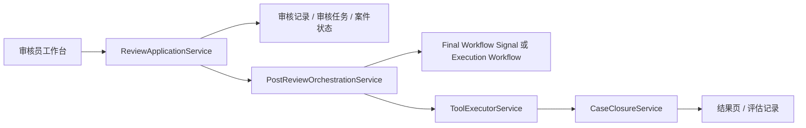

# 审核后编排链路重构设计

日期：2026-07-04  
范围：Java API 后端审核、执行、结案与前端端到端联调链路

## 背景

当前系统已经从早期“一体化履约争端 workflow”演进为房间式流程：

`总览 -> 接待室 -> 证据室 -> 小法庭 -> 平台审核 -> 执行/结果`

房间式庭审由 `DisputeHearingWorkflow` 驱动，workflow id 为 `hearing-window-{caseId}`。但审核服务 `ReviewApplicationService` 在审核通过后仍然直接 signal 旧的 `FulfillmentDisputeWorkflow`，workflow id 为 `CASEWORKFLOW_{caseId}`。当案件来自房间式 UI 链路时，这个旧 workflow 可能不存在或已不再拥有后续阶段，于是出现“审核记录已持久化，但 workflow signal 失败”的半成功状态。

这不是前端问题，也不应该用捕获异常后直接返回成功的最小补丁解决。根因是审核服务承担了流程编排职责，导致审核、Temporal 编排、执行、结案之间边界混乱。

## 目标

把“平台审核”从“流程控制者”重构为“审核事实记录者”，把审核后的执行/结案链路交给明确的后置编排服务负责，形成可测试、可恢复、可观测的最终链路。

目标状态：

1. `ReviewApplicationService` 只负责审核权限、冻结审核包校验、幂等、审批记录、审核任务状态、案件审核状态和通知。
2. 审核提交成功后，统一调用 `PostReviewOrchestrationService` 处理后续链路。
3. 编排服务按案件实际上下文选择后续动作，而不是在审核服务里硬编码 workflow id。
4. 审核通过/修改通过后进入执行 workflow 或执行服务，再结案并触发评估。
5. 审核补证、驳回、转人工进入对应案件状态和通知，不制造前端“半失败”。
6. 所有后续链路必须保留冻结审核包版本、action hash、审批记录 id 的治理校验。

## 非目标

本次不重构前端视觉、不改动 Figma 设计源、不引入真实短信供应商、不替换现有 Temporal 基础设施。

## 推荐架构

新增 `PostReviewOrchestrationService`，作为审核完成后的唯一编排入口。

### 服务边界

#### ReviewApplicationService

保留：

- 审核权限校验。
- 审核任务锁定和幂等判断。
- 冻结审核包 action hash 校验。
- 写入 `ApprovalRecordEntity`。
- 更新 `ReviewTaskEntity` 和 `FulfillmentCaseEntity` 审核结果状态。
- 发送平台内通知。

移除：

- 直接构造 `FulfillmentDisputeWorkflow` stub。
- 直接 signal `CASEWORKFLOW_{caseId}`。
- 直接决定后续执行/结案细节。

#### PostReviewOrchestrationService

新增：

- 根据 `ApprovalRecordEntity` 和案件状态编排审核后链路。
- 审核通过/修改通过：
  - 如果最终 workflow 仍存在且拥有审核子流程，优先 signal workflow。
  - 如果案件来自房间式链路且已处于 `APPROVED_FOR_EXECUTION`，启动受治理的执行链路。
  - 执行成功后调用结案评估。
- 审核补证：
  - 保持 `WAITING_EVIDENCE`，由房间入口重新开放补证/通知。
- 审核驳回或转人工：
  - 保持 `MANUAL_HANDOFF`，不进入执行。
- 编排动作必须可幂等重试：重复审核请求不得重复执行已成功动作。

#### ExecutionWorkflow / ToolExecutorService

短期最佳实践是复用已经具备治理校验的 `ToolExecutorService.executeApprovedActions(...)`，由编排服务以系统身份调用。它已经具备：

- 审批记录校验。
- 冻结审核包校验。
- action hash 校验。
- 幂等 action record。
- 执行状态推进。

中期保留 `ExecutionWorkflow` 作为独立 Temporal workflow，但不在审核服务中直接耦合。后续可以把 `PostReviewOrchestrationService` 的“同步执行”替换成“启动 ExecutionWorkflow”，服务边界不变。

#### CaseClosureService

执行成功后由编排服务调用 `CaseClosureService.close(...)`。结案服务继续负责：

- 校验所有 approved actions 成功。
- 案件状态从 `EXECUTING` 变为 `CLOSED`。
- 创建评估 trace。
- 触发评估 agent。
- 发执行完成通知。

如果评估 agent 不可用，保留现有失败记录能力，不回滚已经完成的执行和结案事实。

## 状态流

通过类决策：

`WAITING_HUMAN_REVIEW -> APPROVED_FOR_EXECUTION -> EXECUTING -> CLOSED`

补证类决策：

`WAITING_HUMAN_REVIEW -> WAITING_EVIDENCE`

驳回/转人工：

`WAITING_HUMAN_REVIEW -> MANUAL_HANDOFF`

错误处理：

- 审核持久化失败：审核接口失败，不产生审批记录。
- 后置编排失败：审核接口返回审核已完成，同时记录编排失败状态和日志；前端不再显示“review persisted but workflow signal failed”这种内部实现错误。
- 后置编排可由幂等接口或后台重试重新执行。

## API 与前端影响

审核接口仍返回 `ReviewDecisionView`，但语义调整为“审核提交已被系统接收并持久化”。如果后置编排同步完成，可以在返回结构中体现执行允许状态；如果后置编排进入后台或失败重试，前端应通过案件状态、结果页和通知流观察后续状态。

本次后端重构不要求前端改大交互。验收时需要确认：

- 审核员点击同意后不再出现 workflow signal 失败。
- 订单状态可以从审核中推进到执行/结果。
- 用户和商家通过订单总览能进入结果页查看最终方案和执行记录。

## 测试策略

1. 单元/集成测试覆盖 `ReviewApplicationService`：
   - 审核通过后只负责持久化并调用后置编排服务。
   - 冻结审核包 hash 不匹配仍然拒绝。
   - 幂等重复请求不创建重复审批记录。

2. 新增 `PostReviewOrchestrationService` 测试：
   - 通过类决策会执行 approved actions 并触发结案评估。
   - 补证类决策不执行动作。
   - 驳回/转人工不执行动作。
   - 已执行过的案件重复编排不重复生成 action record。

3. 端到端浏览器验收：
   - 总览创建争议。
   - 接待官受理。
   - 双方证据提交。
   - 小法庭达成一致/形成裁决草案。
   - 审核员同意。
   - 结果页展示最终方案、执行记录和关闭状态。

## 成功标准

- 本地热开发拓扑下，Docker 仅运行基础设施，本机运行 Java API、Python Agent、Vite 前端。
- 审核通过后不再依赖不存在的旧 workflow。
- 审核、执行、结案职责边界清晰。
- 后端测试覆盖新增编排服务和审核服务改造。
- 浏览器端完整流程可走通，不需要 API 人工补状态。
