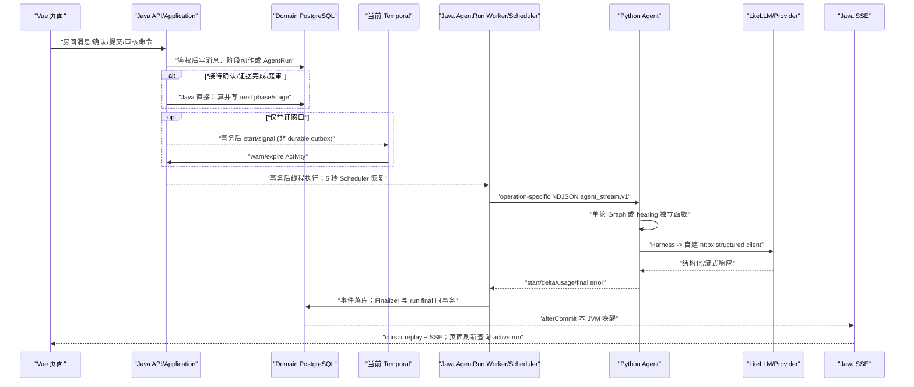
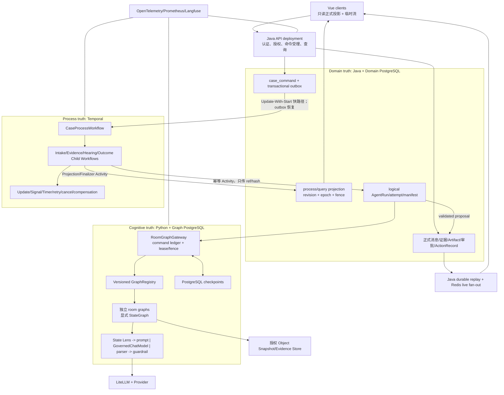
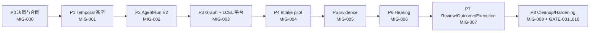

# Temporal + LangGraph 房间重构可执行计划

> 状态：`PLAN_REVIEW_REQUIRED`
> 计划日期：2026-07-17
> 工作分支：`codex/temporal-langgraph-room-refactor`
> 盘点基线：`f69c17f32090303a82c3c4662a0e244d0c4e5f04`
> 实施状态：尚未开始。本文中的测试、Trace、History、SQL、负载和灾备结果全部为 `TODO`，不得视为已通过。

## 1. 执行摘要

### 1.1 当前状态

当前系统已经有较强的 Java 领域约束、房间权限、不可变消息、证据版本、`hearing_flow.v2`
15 阶段账本、V1-Jury-V2 hash 链、人工审批、Tool Executor、AgentRun Finalizer 和可重放 SSE。
但是流程控制仍分散在 Java Application Service、三个 Spring Scheduler、进程内后台 Worker 和一个
仅覆盖举证窗口的 Temporal Workflow 中。Python 侧接待和证据虽然使用 `StateGraph`，但只是无
checkpointer 的单次 `invoke`；庭审仍是七个独立函数；模型执行最终仍走自建 `httpx` 客户端，尚未形成
真实的 `State Lens -> prompt | model | parser -> guardrail` Runnable 协议。

### 1.2 目标

在不损失现有 99 项房间行为的前提下，按可独立部署、可观测、可回滚的 Phase 0-8 迁移到：

- Temporal Event History：唯一 process truth，负责宏观/房间阶段、顺序、等待、Timer、重试、取消和补偿。
- Java + Domain PostgreSQL：唯一 domain truth，负责身份、权限、正式消息、证据、Artifact、人工决定、
  ActionRecord、审计和查询投影。
- Python + LangGraph PostgreSQL：唯一 cognitive truth，负责有边界的认知事务、checkpoint、Router、
  有界 `Send`、Reducer 和认知恢复。
- LangChain Core / LCEL：唯一模型对象流与执行协议，负责 Prompt、Message、ChatModel、Parser、回调、
  流式、用量和 Trace。
- Vue：只消费 Java 权限过滤后的投影和正式/临时流，不推断正式状态。

### 1.3 范围

- 接待、证据、庭审、人工终审/结果/执行四类房间或查询投影工作流。
- Case/Room Temporal Workflow、命令 inbox/outbox、projection fencing、AgentRun V2、Graph 平台、LCEL、
  SSE V2、对象快照、可观测性、安全、部署和灾备。
- `MIG-000..008`、`GATE-001..010`、生产验证清单全部 Check ID 和 99 项现状基线的证据链。

### 1.4 非目标

- 不进行 big-bang 重写，不在同一 PR 同时切换全部房间。
- 不把 Java 正式领域表迁入 Temporal 或 Python，不把大正文写入 Temporal History。
- 不构建跨所有房间、包含长期外部等待的万能 LangGraph。
- 不引入动态 JSON workflow DSL；图拓扑继续使用显式、类型化的 Python `StateGraph`。
- 不把 `DRAFT`、`OUTCOME` 伪造为 Java `RoomType`；它们继续是前端/查询投影。
- 不借框架重构改变和解、视频证据、结果页模拟动画等产品行为，除非先取得行为变更审批。
- 开发阶段不反复运行完整 E2E、Docker、负载和故障注入；统一放到 Phase 8 生产检查点。

### 1.5 关键假设

- Java 21、Spring Boot 3.5.15、Temporal Java SDK 1.35.0、LangGraph 1.2.6 是起始版本；升级必须单独
  通过 replay/compatibility PR。
- 当前 V001-V038 Flyway 历史不可改写，新 Domain DB migration 从 V039 追加。
- 旧 room epoch 在退出前保持旧版本 worker/reader；新实现只对创建时已持久化选择的 epoch 生效。
- 所有 shadow 结果只能进入隔离的比较账本，不能调用正式 Finalizer、发送用户消息或执行工具。
- 本计划以六份权威资料为准：目标架构、生产验证清单、当前房间基线、庭审 V2 合同、`AGENTS.md`
  和本次主任务提示词。

## 2. 发现的问题

### 2.1 P0 阻断项

| 编号 | 发现 | 代码证据 | 风险 | 计划处置 |
| --- | --- | --- | --- | --- |
| F-P0-01 | Java 与 Temporal 的目标 writer 边界尚未建立 | `IntakeRoomService.confirm`、`EvidenceCompletionService.complete/expire`、`HearingFlowRuntimeService.nextStage/advance` 直接推进阶段 | 切换时双推进、重复 Artifact 或旧状态覆盖 | Phase 0 固化所有权；Phase 1 增加 epoch/fence；各房间仅在 parity 后撤销旧 writer |
| F-P0-02 | 已接受命令没有 durable transactional outbox | `EvidenceWindowCoordinator`、`AgentRunCoordinator`、V2 handoff 使用 `PostCommitSideEffectExecutor` | API 在 commit 后副作用前崩溃会依赖扫描或永久漏投 | V039 增加 command ledger/outbox；Update-With-Start 是快路径，outbox 是恢复路径 |
| F-P0-03 | 当前只有举证窗口由 Temporal 管理 | `EvidenceWindowWorkflowImpl` 只等待双方完成和两小时 Timer；Worker 单 task queue、与 API 同进程 | 其他房间的时间/失败仍由 Spring/Java 拥有 | Phase 1 建 Case/Room Workflow；Phase 4-7 分房间切换 |
| F-P0-04 | AgentRun 把 logical run 与 attempt 混在不同 run 行 | `AgentRunCoordinator.retryInfrastructureFailure` 追加 `:attempt-N`；V030 无 attempt 表和 reset | 多 attempt 文本串接、重跑模型、正式 final 不唯一 | Phase 2 建 logical run/attempt、stream v2、Finalizer 幂等和 Activity heartbeat |
| F-P0-05 | Graph 没有 durable command/checkpoint/fence | intake/evidence `compile()` 后单次 `invoke()`；无 checkpointer；hearing 非 Graph | Python 崩溃后可能重跑模型，无法证明认知状态来源 | Phase 3 独立 Graph DB、PostgresSaver、command ledger、lease/fencing、GraphRegistry |
| F-P0-06 | LCEL 只是 Prompt 格式工具，不是执行协议 | `HarnessModelRunner` 用 `ChatPromptTemplate.format_messages` 后调用 `StructuredLlmClient`; `LiteLlmProxyClient` 直接 `httpx` | callbacks/retry/trace/stream 分散，各 Agent 可形成新旁路 | Phase 3 建 `GovernedChatModel` 和真实 Runnable 链，禁止业务节点直接模型 HTTP |
| F-P0-07 | 跨服务合同不是 schema-first | Java records、Pydantic 和流事件各自维护；没有共同 JSON Schema/canonicalization fixtures | 单边发布导致字段漂移、hash 不一致或失败开放 | Phase 0 建 canonical JSON Schema、RFC 8785/SHA-256、正反合同 fixtures |
| F-P0-08 | process revision、room epoch 和 fencing token 缺失 | `case_room` 只有 JPA `@Version`；`hearing_flow_instance` 只有 stage sequence；无 process projection | 迟到 Activity/旧 worker 可覆盖新状态 | V039 建 `case_process_projection`、`case_room_epoch`、`domain_operation` |
| F-P0-09 | 生产安全身份模型不完整 | Java 依赖可信请求头；Python 只校验静态 `X-Service-Secret`；当前无 tenant authority | 跨 tenant/scope 伪造、密钥轮换和重放风险 | Phase 0 决定 tenant/IAM；Phase 1/3 引入 mTLS + 短期签名 envelope |
| F-P0-10 | Tool 执行正确性仍部分依赖 Redis 锁 | `RedisActionExecutionLock` 包围外部调用，虽有 ActionRecord 但缺 Temporal operation/补偿协议 | Redis/进程故障窗口可造成不确定外部效果 | Phase 7 以 DB operation key + 外部幂等键为真相，Temporal 管重试/补偿，Redis 只优化争用 |

### 2.2 P1 风险与能力缺口

| 编号 | 发现 | 影响 | 计划处置 |
| --- | --- | --- | --- |
| F-P1-01 | Case/Agent SSE 活跃订阅只在本 JVM `ConcurrentHashMap` | 多副本实时通知不一致；当前靠心跳查询补洞 | Phase 2/8 增 Redis fan-out 和 durable high-watermark，PostgreSQL replay 始终兜底 |
| F-P1-02 | stream v1 逐事件事务且无分区/压缩 | 100 持续模型调用时写放大 | Phase 2 合并 50-100ms/1-4KiB；Phase 8 在线迁移到分区表和 24h hot retention |
| F-P1-03 | Java API 与 Temporal Worker 同容器、同 task queue | Provider 拥塞可能影响 Timer/cancel | Phase 1 拆为 API、control worker、agent worker 部署和四条 task queue |
| F-P1-04 | Graph DB/schema/凭据不存在 | checkpoint 与 Domain DB 无隔离 | Phase 3 增独立数据库/schema、角色、池、migration job 和 readiness |
| F-P1-05 | MinIO 只管理证据原件，没有通用不可变 snapshot manifest | 大矩阵/Prompt 输入要么内联，要么无法 hash 绑定 | Phase 1/3 增 content-addressed snapshot manifest，Temporal 只存 ref/hash |
| F-P1-06 | 可观测性为 Micrometer + Langfuse +局部 trace ID，未贯穿 Outbox/Temporal/Graph/LCEL | 无法复核一次正式结果的完整执行链 | Phase 1-3 引入 OTel context/interceptor/callback；Phase 8 建 dashboard/runbook |
| F-P1-07 | 没有生产级 replay、Graph crash-point、乱序 outbox、SSE 慢消费者和 DR 测试设施 | 可靠性只能靠推断 | 每阶段补聚焦 harness；Phase 8 在同一 release commit 统一运行 |
| F-P1-08 | 当前证据室公开批次是 1-50，目标清单要求单批 100 | 合同与 `ENV-014`/`ROOM-EVIDENCE-002` 有冲突 | Phase 0 取得“增量放宽至 100”审批；未批准前 `MIG-005` 不得通过 |

### 2.3 文档与代码易误判点

| 项目 | 实际结论 |
| --- | --- |
| 举证提醒 | `EvidenceWindowWorkflowImpl.WARNING_LEAD` 是 30 分钟；“15 分钟”只存在旧注释。迁移保持 30 分钟。 |
| 接待/证据 Graph | 已有 `StateGraph`，但无 checkpointer、command ledger、version pinning，跨回合 memory 由 Java 往返。 |
| 庭审 Graph | `app/agents/hearing_flow.py` 是七个独立操作，不是一个可恢复 LangGraph。 |
| 庭审状态机 | Java `HearingFlowRuntimeService` 和 V035 表当前持有 15 阶段 cursor、deadline 和失败恢复。 |
| 审核后执行 | `PostReviewOrchestrationService` 当前只生成 execution-assistant handoff；真实执行仍由受限 `ExecutionController/ToolExecutorService` 触发。 |
| DRAFT/OUTCOME | 不属于 `RoomType`；`RoomType` 只有 INTAKE、EVIDENCE、HEARING、REVIEW。 |
| SSE | PostgreSQL 事件可 replay；实时唤醒仍是单 JVM 内存，不是 Redis HA fan-out。 |
| LangChain | 当前真正使用的是 Prompt/Message 类型；ChatModel、Parser、RunnableConfig 还没有接管模型调用。 |

## 3. 现状调用链



### 3.1 接待和证据

1. `RoomController.post` 调用 `RoomMessageService.post/create`，先持久化 party-private 消息与 sequence。
2. 接待消息调用 `IntakeAgentTurnService.continueFromParticipantMessage`；证据消息调用
   `EvidenceAgentTurnService.continueFromParticipantMessage`，二者把 Java memory/session/context 固化进
   `AgentRunStartCommand`。
3. `AgentRunCoordinator.start` 以 `(case_id, stream_idempotency_key)` 去重，commit 后调用
   `AgentRunWorker.execute`；`AgentRunRecoveryScheduler` 每 5 秒恢复 PENDING/超时 RUNNING。
4. Python 接待/证据图执行单次 `invoke`，Harness 调模型；Java Finalizer 原子写 `room_turn_memory`、
   dossier/verification、正式 Agent 消息、run final 和 SSE terminal event。
5. `IntakeRoomService.confirm` 直接完成受理/拒绝/相对方接待及证据室开放；证据室开放后才启动
   `EvidenceWindowWorkflow`。
6. `EvidenceCompletionService.complete/expire` 直接冻结卷宗、封证据室、开庭审室并调用
   `HearingFlowRuntimeService.startAfterEvidenceSealed`。

### 3.2 庭审、审核、执行和结案

1. `HearingFlowRuntimeService.ensureStarted/advance/nextStage` 维护 V035 的 15 阶段 cursor；七个模型阶段均
   启动 AgentRun，Finalizer 校验 stage/run/dossier/hash 后再进入下一阶段。
2. `HearingFlowDeadlineScheduler` 每 15 秒扫描两个 party wait；读取庭审页面也会调用 `expireIfDue`。
3. Judge V2 Finalizer 持久化 `adjudication_draft.v2`，事务后调用
   `HearingReviewHandoffService.handoff`；30 秒 recovery scheduler 重试并关闭庭审 flow。
4. `ReviewApplicationService` 冻结 ReviewPacket、创建 ReviewTask、核验授权审核员与 action hash，并在
   `decide` 中写人工决定和案件状态；之后仅产生 execution-assistant handoff 事件。
5. `ToolExecutorService` 由 SYSTEM/ADMIN 入口读取冻结审批快照，使用 Redis 锁、ActionRecord 和工具
   allowlist 执行；`CaseClosureService` 只在所有批准动作成功后结案并调用只读 Evaluation Agent。

### 3.3 前端和 SSE

- `CaseEventService` 与 `AgentRunStreamEventService` 从 PostgreSQL 按 sequence replay，并按 actor/audience
  重新授权；活跃连接在 JVM 内存中，15 秒 heartbeat 做 catch-up。
- `agentStreamStore` 按 run/sequence 去重、断线重连、页面刷新查询 active run；当前没有 attempt/reset，
  页面离开会中止网络读取并把本地卡片标为 ABORTED，但不会删除已持久化 Java run。
- `App.vue` 仍每 3 秒同步案件、每 15 秒刷新通知；这些轮询是投影刷新，不应成为流程正确性依赖。

## 4. 目标架构图和依赖方向



### 4.1 目标模块

| 边界 | 目标目录/类或模块 | 依赖规则 |
| --- | --- | --- |
| Java 合同 | `contracts/agent-platform/v1/*.schema.json`；`workflow/contract/v1/*` | JSON Schema 权威；Java/Pydantic 只实现并通过同一 fixture |
| 命令控制面 | `workflow/application/command/*`、`workflow/infrastructure/outbox/*` | API 只能受理命令/读状态，不直接算下一阶段 |
| Temporal Case | `workflow/temporal/caseprocess/CaseProcessWorkflow*` | 只依赖 workflow contract；禁止 Repository/HTTP/Clock/随机数 |
| Temporal Rooms | `workflow/temporal/room/{intake,evidence,hearing,outcome}/*Workflow*` | 每个 room 独立 child；外部等待只在 Temporal |
| Activities | `workflow/activity/{domain,agent,projection,tool}/*` | I/O 全在 Activity；每个副作用有 operation key、deadline 和 fence |
| Projection | `workflow/application/projection/*` | 只接受更高 process revision 和当前 epoch/fence |
| Worker | 同一 Java artifact 的 `api`、`temporal-control-worker`、`temporal-agent-worker` profile | 生产必须拆部署/凭据/连接池；本地可用三个 Compose service |
| Python kernel | `app/graph_runtime/{gateway,registry,checkpoint,ledger,lease,state_lens,reducers}.py` | 不导入 Domain DB adapter；无本地粘性状态 |
| LCEL | `app/model_runtime/{governed_chat_model,runnable_factory,callbacks,parsers,profiles}.py` | 业务 graph node 不得导入 `httpx`/LiteLLM 客户端 |
| Room graphs | `app/graphs/intake`、`evidence`、`hearing`、`outcome` | 独立显式拓扑和版本；不建通用动态 DSL |
| Graph 合同 | `python-agent-service/app/contracts/v1/*` | 入口只接受 Java 签名的 scope/thread/version/capability |
| 前端 | `frontend/src/api/agentStream.js`、`stores/agentStream.js`、各 room view | v1/v2 dual reader；不参与 writer 选择和阶段判断 |

### 4.2 禁止依赖

- `workflow/temporal/**` 不得依赖 Spring、JPA Repository、HTTP client、`System.*`、`Clock`、随机 UUID 或模型包。
- `app/graphs/**` 不得导入 `httpx`、Domain DB driver、FastAPI request、secret 或 Tool Executor。
- Python Graph DB 账户不得访问 Domain schema；Java 账户不得写 Graph checkpoint/ledger schema。
- 前端不得提交 thread ID、graph/model/prompt/profile/tool capability、process revision 的可信值。
- `Redis`、`Elasticsearch`、SSE 连接、Langfuse 和本地缓存不得出现在正式事务成功判定中。
- 以 ArchUnit `TemporalWorkflowDependencyTest`、Python `tests/static/test_graph_import_boundaries.py` 和前端
  contract tests 阻止回归。

## 5. 状态所有权矩阵

| 状态/对象 | 当前 writer | 目标 writer | reader | 持久化位置 | revision/epoch/fencing | 幂等键 | 迁移 | 切流条件 | 回滚条件 |
| --- | --- | --- | --- | --- | --- | --- | --- | --- | --- | --- |
| Case macro phase/current room | 多个 Java service/entity 方法 | `CaseProcessWorkflow`；Java 只写 fenced projection | Java queries、UI | Temporal History + `case_process_projection` | `process_revision`, `room_epoch`, Temporal run/build | `command_id` + sequence | P1 后逐房间 P4-P7 | 新 epoch 已选 TEMPORAL，投影 parity 通过 | 停止新 canary；活跃 epoch 仅在安全边界新建回滚 epoch |
| Room external phase | Java `CaseRoomEntity`、Hearing runtime | 对应 Room Child Workflow | Java policy/UI | Temporal History + `case_room_epoch`/projection | epoch + room revision + fence | command/event ID | P4-P7 | 该 room 全部等待/终态测试通过 | 旧 writer 仅允许 LEGACY epoch；不得原地双开 |
| Party wait/terminal state | Intake/Evidence/Hearing Java 表与 scheduler | Temporal 等待/Timer；Java terminal action 仍是正式事实 | Workflow Activity、UI | Temporal wait + Java append-only action | event sequence + epoch/fence | case/stage/participant/action/request | P4-P6 | duplicate/race/time-skipping 通过 | 关闭入口或新 epoch 回滚，不能删已提交 action |
| Evidence/hearing/reviewer deadline | Evidence Temporal；hearing Spring scheduler；review Java due time | Temporal Room Workflow | Java projection/UI | Temporal Timer + projected deadline | process revision + epoch | timer purpose + epoch | P5-P7 | Timer 与 Signal 竞态 parity | 暂停命令并保留 Workflow；不恢复并发 scheduler |
| Logical AgentRun | `agent_run` 每 attempt 一行 | Java AgentRun ledger | Temporal、Java API/UI | Domain PostgreSQL | room epoch + process/stage revision | `(case_id, logical_idempotency_key)` | P2 | V2 reader、Finalizer、Activity fault tests | V1 仅服务旧 epoch；V2 数据保留 |
| AgentRun attempt | idempotency suffix 隐式表示 | Java attempt ledger，Temporal Activity 驱动 | SSE、manifest、ops | `agent_run_attempt` | attempt no + Activity heartbeat/fence | `(run_id, attempt_no)` | P2 | reset/abort/retry tests | 停止新 V2 run；已建 attempt 只读收敛 |
| Graph checkpoint | 无持久 owner | Python/LangGraph | Graph runtime、审计 manifest | Graph PostgreSQL | cognitive revision + checkpoint schema + lease fence | thread/checkpoint namespace | P3 | crash-point + failover + restore 通过 | pin 旧 Graph 版本；只在安全 checkpoint 回滚 |
| Graph command/result | 无 ledger | Python Graph command ledger | Java Agent Activity | Graph DB；Java 保存 result ref/hash | room epoch + command hash + fence | `(thread_id, command_id)` | P3 | same hash replay/different hash conflict | 禁止新命令；缓存结果仍可 Finalize |
| 正式房间消息 | Java room message/finalizers | Java domain ledger | Java SSE/query、Graph snapshot builder | Domain PostgreSQL append-only | message sequence + epoch/stage binding | case idempotency key | 全程 | 新 Finalizer parity、audience tests | 永不回滚/删除；reader dual-compatible |
| Evidence metadata/submission | Java evidence services | Java domain ledger | UI、snapshot Activity、Graph | Domain PostgreSQL | dossier/version + participant + hash | evidence/batch idempotency | P5 保持 | Graph 不写 evidence 表 | 保留旧 API reader；正式记录不回滚 |
| Evidence binary | MinIO original bucket | Object store | Java authorized loader、Python capability adapter | versioned MinIO/S3 | object version + SHA-256 | content hash/evidence ID | P3/P5 | hash/owner/manifest checks | 保留对象和旧 key，禁破坏性迁移 |
| Case fact matrix | Java intake dossier + Finalizer | Java versioned Artifact ledger；Graph 只提 proposal | Hearing snapshot builder/UI | Domain PostgreSQL/immutable snapshot | matrix version + canonical hash + epoch | matrix ID/version/hash | P4/P6 | old/new normalized patch parity | 旧版本永久可读，禁止覆盖 |
| Fact-evidence matrix | Java evidence/hearing Finalizer | Java versioned Artifact ledger | dossier freezer/Graph/UI | Domain PostgreSQL/immutable snapshot | matrix version/hash | fact+evidence+policy version | P5/P6 | keyed reducer determinism + Java merge parity | 正式矩阵不回滚，恢复旧 reader |
| Trial dossier | Java `HearingTrialDossierService` | Java append-only ledger，经 Temporal Activity 单次触发 | Judge/Jury Graph、review | V035 + object snapshot ref | room epoch/stage sequence/hash | case+hearing epoch | P6 | single-shot/hash-chain tests | 冻结对象不变；流程可进入人工恢复 |
| Judge V1 | Java hearing Finalizer | Java append-only Artifact ledger | Jury/V2/review | V035 `hearing_flow_artifact` | epoch/stage/run/input hash | case+artifact type+epoch | P6 | dossier binding/parity | 不删除；旧 Graph 保持可加载 |
| Jury report | Java hearing Finalizer | Java append-only Artifact ledger | Judge V2/review | V035 artifact | V1 ID/hash + run/fence | case+artifact type+epoch | P6 | parent chain tests | 同上 |
| Judge V2/draft | Java hearing Finalizer | Java append-only Artifact + projection | review/draft/outcome UI | V035 + adjudication projection | V1/Jury/dossier hashes + epoch | case+artifact type+epoch | P6/P7 | exact displayed V2 handoff | 不重跑 Judge；只重试 handoff/finalizer |
| ReviewPacket | Java handoff/review service | Java immutable review ledger | reviewer/Copilot Graph | Domain PostgreSQL | packet/plan/draft versions + expiry | case+plan+packet version | P7 | exact hash/authorization tests | Packet 永不改写；旧 reader 保留 |
| Human approval | Java `ReviewApplicationService` | Java append-only approval ledger；Temporal 只等待/排序 | Tool Activity/outcome | Domain PostgreSQL | packet version/action hash/epoch | approval idempotency key/hash | P7 | reviewer Update/Signal race tests | 决定不可回滚；流程转人工补偿 |
| Execution action | Java ToolExecutor + Redis lock | Java ActionRecord/domain operation；Temporal 管 retry/compensation | outcome/closure/audit | Domain PostgreSQL + external receipt | operation fence + action snapshot hash | approved action key | P7 | duplicate external effect/compensation tests | 已发生外部效果只补偿，不删除记录 |
| Closure/evaluation | Java closure service | Temporal Outcome Workflow 排序；Java 写 closed/evaluation ledger | outcome/admin metrics | Domain PostgreSQL | process revision + approval/action refs | closure command/evaluation version | P7 | all-actions-succeeded gate | closed 不回开；失败转人工/重试 evaluation |
| SSE cursor | 浏览器本地 + DB sequence | Java durable event high-watermark；客户端 cursor | UI/SSE nodes | PostgreSQL + client memory；Redis 仅唤醒 | run/attempt/sequence 或 case sequence | event unique key | P2/P8 | reconnect/slow consumer/Redis loss | 退回 PostgreSQL polling/replay，正式流程不受影响 |
| Query projection | 多个 Java entity/current fields | Java projection Activity，受 Temporal revision fence | 所有 API/UI | Domain PostgreSQL/read replica | `process_revision < new_revision`, epoch, fence | operation key+revision | P1-P7 | drift=0、旧 revision 注入失败 | 保留新字段；旧 reader 忽略，reconcile 修复 |

### 5.1 Graph State 字段治理

| 字段 | owner/生命周期 | 上限 | checkpoint 策略 | Reducer/冲突语义 |
| --- | --- | ---: | --- | --- |
| `graph_key`, `graph_version` | GraphRegistry；room epoch 不可变 | 各 128 B | 每 checkpoint | 只允许相同值；不同值失败 |
| `thread_id`, `room_epoch`, `actor_scope` | Java 签发；thread 生命周期不可变 | 512 B/整数/4 KiB | 每 checkpoint | 不可合并；不匹配失败 |
| `cognitive_revision` | Graph kernel；每 commit +1 | bigint | 每 checkpoint | 只接受前一 revision 的 CAS |
| `domain_snapshot_ref/version/hash` | Java snapshot manifest；每命令可替换 | ref 512 B，hash 64 | 保存引用，不保存大正文 | 新版本必须单调；hash 不同且版本相同冲突 |
| `current_command` | Graph ledger；一次命令生命周期 | 16 KiB | node 前后 | command/hash 相同复用，不同 hash 冲突 |
| `message_window` | room graph；命令内/跨回合有界 | 接待沿用 6 条；其他最多 12 条且 32 KiB | 仅净化后的 Message/ref | 按稳定 message ID 去重并排序；重复 ID 内容不同失败 |
| `memory_summary` | graph summarizer；room epoch | 16 KiB | 带 source refs/hash | replace-with-version；来源缺失失败 |
| `pending_capability_work` | Graph kernel；一次命令 | 最多 100 key，单 room 并发 8 | 每 fan-out 边界 | keyed map；重复 key 不同 payload 失败 |
| `validated_outputs` | deterministic validator；一次命令 | 最多 100 key/总 512 KiB | model 后、fan-in 后 | keyed reducer，稳定排序；禁止 last-write-wins |
| `artifact_refs` | Java正式账本引用；epoch | 100 refs/64 KiB | refs/hash only | set union by ID；同 ID hash 不同失败 |
| `terminal_result` | Graph result projector；命令终态 | 64 KiB | ledger/result 同事务 | 只能写一次；终态枚举严格四值 |

## 6. 合同和数据迁移

### 6.1 Schema-first 合同

| 合同 | 版本/关键字段 | 约束和大小 | writer -> reader |
| --- | --- | --- | --- |
| `CaseCommandRef` | `case-command-ref.v1`: schema、command/tenant/case/type、actor ref/scope、payload ref/hash、expected revision、occurred/deadline、traceparent | RFC 8785 + SHA-256；Temporal payload 目标 <=16 KiB；不含正文 | Java command service -> Temporal Update/Signal |
| `RoomGraphCommand` | `room-graph-command.v1`: logical command/attempt、graph/version/thread/epoch/scope、process/stage revision、snapshot/event refs+hash、trusted invocation、deadline/retry budget/trace | <=64 KiB；浏览器不可提供可信字段；未知版本/字段失败关闭 | Java Agent Activity -> Python gateway |
| `RoomGraphResult` | `room-graph-result.v1`: logical command、graph/version/checkpoint、cognitive revision、四值 status、public proposals、artifact ops、needs spec、output hash、usage/metadata | <=64 KiB；proposal 不等于正式事实；接收端重算 hash | Python gateway -> Java Activity/Finalizer |
| `ArtifactRef` | `artifact-ref.v1`: artifact/type/schema/version/storage ref/content hash/parent refs/visibility/created by run | 大正文只经授权 ref；parent/hash 形成 DAG | Java ledger/snapshot service -> Temporal/Graph |
| Process projection | `process-projection.v1`: workflow/run/build、macro/room phase、epoch、revision、fence、pending state | 旧 revision/fence 不能更新 | Temporal Projection Activity -> Java DB/UI |
| Agent stream | `agent-stream.v2`: logical run/attempt IDs、attempt sequence、`attempt_started/visible_delta/usage/attempt_aborted/attempt_reset/final/error` | delta 1-4KiB/50-100ms coalesce；terminal 每 logical run 唯一；公开字段 allowlist | Python/Java Activity -> Java stream ledger -> Vue |
| Execution manifest | `agent-execution-manifest.v1`: workflow/epoch/revision、run/attempt、graph/checkpoint、prompt/model/schema/policy/tool versions和全部 input/output hash | append-only；不保存 hidden reasoning | Java Finalizer -> audit/query |

权威文件放在：

```text
contracts/agent-platform/v1/case-command-ref.schema.json
contracts/agent-platform/v1/room-graph-command.schema.json
contracts/agent-platform/v1/room-graph-result.schema.json
contracts/agent-platform/v1/artifact-ref.schema.json
contracts/agent-platform/v1/process-projection.schema.json
contracts/agent-platform/v1/agent-stream-event.schema.json
contracts/agent-platform/v1/agent-execution-manifest.schema.json
contracts/agent-platform/v1/compatibility-matrix.yaml
contracts/agent-platform/v1/fixtures/{valid,invalid,canonical-hash}/
```

Java 类型放在 `workflow/contract/v1`，Pydantic 类型放在 `app/contracts/v1`。Phase 0 先采用共同 fixture
合同测试，不允许两边各自复制测试数据；代码生成是否启用由 ADR 决定。Java 使用成熟 RFC 8785
canonicalizer，Python 使用固定版本 `rfc8785`，禁止继续使用两个自写递归排序器作为正式 hash 协议。

### 6.2 Domain DB additive migration 顺序

| Migration | Phase | 新增/演进 | 索引和约束 | 回填/回滚 |
| --- | --- | --- | --- | --- |
| `V039__temporal_command_control_plane.sql` | P1 | `case_command`, `case_command_outbox`, `case_process_projection`, `case_room_epoch`, `domain_operation`, `process_reconciliation_issue` | tenant+command unique；case+sequence unique；workflow ID unique；revision/fence checks；outbox pending index | 为现有 case 建 `LEGACY` epoch/projection，不启动 Workflow；回滚只停 writer，表保留 |
| `V040__immutable_snapshot_and_manifest.sql` | P1 | `immutable_payload_snapshot`, `agent_execution_manifest` | content hash unique+regex；case/visibility/index；manifest logical run unique | 从 V035 Artifact 和 evidence ref 回填 manifest 引用，不复制原文；旧 reader 忽略 |
| `V041__agent_run_logical_attempt_v2.sql` | P2 | 现有 `agent_run` 扩 logical/version/epoch/revision；新 `agent_run_attempt`；stream event 加 attempt/protocol/visibility | logical key unique；run+attempt unique；attempt+sequence unique；one committed final | 现有 stream run 回填 attempt 1/v1；先 nullable、校验、再 NOT NULL；回滚保留 V2 行只读 |
| `V042__graph_command_result_reference.sql` | P3 | Java 侧保存 graph command/result/checkpoint refs 和 hash | logical command/result unique；hash checks | 仅新增字段/表；Graph 正文不进 Domain DB |
| `V043__room_epoch_ownership.sql` | P4-P5 | intake/evidence ledger 增 epoch/revision/fence/reference；证据室批次上限经审批放宽到 100 | 当前 epoch/fence FK；批次/参与方唯一约束 | 旧行绑定 epoch 0 LEGACY；不改历史 payload |
| `V044__hearing_temporal_projection.sql` | P6 | V035 instance/stage 墙上投影字段、Temporal workflow/run/build、epoch/revision/fence、writer mode | stage/action/artifact 继续 append-only；projection CAS；旧 Java advance 在 TEMPORAL mode 失败 | V035 数据绑定 LEGACY epoch；旧 reader兼容新列 |
| `V045__outcome_execution_compensation.sql` | P7 | reviewer command refs、execution operation/receipt/compensation links、Outcome projection | approval/action/operation key/hash 唯一；补偿链 FK | 已有 Approval/ActionRecord 回填引用；外部效果从不反向删除 |
| `V046__stream_partition_and_retention.sql` | P8 | 在线建立分区 stream 表/归档 manifest/high-watermark 后切 view/repository | 月/日分区、hot replay index、terminal retention check | 双读校验计数/hash；旧表只读保留至少一个发布周期 |

所有 migration 使用 expand -> backfill -> validate -> switch reader -> switch writer -> contract 的顺序；任何 drop、rename、
NOT NULL、check 收紧和旧表清理只允许在 Phase 8 且活跃引用查询为零后执行。

### 6.3 Graph DB migration

Graph DB 使用独立 database/schema/role/pool。`langgraph-checkpoint-postgres` 内部表由受控 migration job 在 advisory
lock 下 setup；自有表由 `python-agent-service/migrations/graph` 管理：

| Migration | 内容 | 关键约束 |
| --- | --- | --- |
| `G001_graph_runtime.sql` | `agent_graph_command`, `agent_graph_result`, `agent_graph_lease`, `graph_thread_registry` | `(thread_id, command_id)` unique；request hash conflict；lease monotonic fence；result hash unique |
| `G002_graph_version_registry.sql` | graph/checkpoint schema version、active/retired、prompt/model/policy bindings | 活跃 thread 引用的版本不可删除 |
| `G003_shadow_comparison.sql` | shadow input/output ref、normalized diff、invariant result、TTL | 无 Domain FK 写权限；不能被正式 Finalizer 消费 |

启动流程为 migration job -> schema version probe -> Python readiness。多副本应用本身不争抢 DDL；本地开发可在 advisory
lock 下执行同一幂等 setup。备份恢复后必须先校验 checkpoint/ledger/fence 一致性再恢复 ready。

### 6.4 兼容 reader/writer 顺序

1. 发布 JSON Schema、fixture 和 v1/v2 dual reader，不发送新字段。
2. 发布 additive DB schema、旧数据回填和一致性查询。
3. 发布新 Temporal/Python worker，但不分配新 epoch，只跑 replay/shadow。
4. 新 room epoch 记录固定 `writer_mode=TEMPORAL`、Workflow build、Graph version、stream version 后才启用 writer。
5. 前端同时理解 `agent_stream.v1` 和 v2；v2 收到 reset 时只清理对应 attempt 临时文本。
6. parity 稳定后，把 legacy scheduler 从 `EXECUTOR` 改为 `DETECTOR`，再改为 `OFF`。
7. 最后清理旧 writer；回滚只改变新 epoch 的选择，绝不通过全局 flag 让旧 writer接管仍活跃的 Temporal epoch。

## 7. Phase 0-8 依赖图与详细任务



共同实施纪律：每个 PR 先补失败测试/合同 fixture，再实现最小闭环；一个 PR 不同时切两个 room writer；
每阶段只做聚焦验证。每次切 writer 都必须有 server-side persisted epoch choice、shadow/parity 报告、
单一 writer SQL 检查和明确回滚命令。下面的证据路径在实施前均为 `TODO`。

Phase 2-8 开始前必须阅读
[`Phase 1 Temporal 控制面实施复盘`](../docs/runbooks/temporal-first/phase-1-retrospective.md)，
执行其中的入口预检、纵向 slice、故障分类、复跑和证据归档规则；若与本计划门禁冲突，以本计划和正式 ADR 为准。

### 7.1 Phase 0: Decisions and contracts (`MIG-000`)

**目标**：在写 runtime 代码前冻结状态所有权、SLO、重试分类、版本策略、合同和行为变更；建立自动检查
99 项基线与全部 Check ID 未漏映射。
**非目标**：不创建 Workflow、不改数据库、不改任何业务入口。
**进入条件**：本计划获批；未决问题的 owner 和截止时间被确认。

| 顺序 | PR/提交级任务 | 精确文件/模块 |
| --- | --- | --- |
| P0.1 | ADR：权威 writer、命令交付、AgentRun/stream、Graph checkpoint/lease、部署安全/DR | `docs/architecture/adr/0001-process-domain-cognitive-authority.md` 至 `0006-production-topology-security-dr.md` |
| P0.2 | 固化 SLO、retry taxonomy、non-retryable 分类、绝对 deadline 与预算传播 | `docs/architecture/temporal-first-slo.md`, `docs/contracts/retry-taxonomy.md` |
| P0.3 | 增 canonical JSON Schema、compatibility matrix、valid/invalid fixtures | `contracts/agent-platform/**`（见 §6.1） |
| P0.4 | Java/Pydantic 合同类型与双向 fixture 测试；拒绝未来版本、额外危险字段、超限、hash 冲突 | `workflow/contract/v1/**`, `app/contracts/v1/**`, `CrossServiceContractTest.java`, `tests/contracts/test_agent_platform_contracts.py` |
| P0.5 | 建 99 项baseline、279项Check manifest和coverage linter | `tests/baseline/current-room-baseline.yaml`, `tests/acceptance/temporal-first-check-manifest.yaml`, `tests/static/test_temporal_refactor_traceability.py` |
| P0.6 | 对 100 文件、tenant、Temporal 托管方式、安全 envelope、retention 作正式决策 | ADR decision records + §14 决策结论 |

**数据库/合同**：只发布合同文件，不发 migration；Schema `additionalProperties=false`，长度、枚举和 pattern
完整。canonical hash fixture 必须在 Java/Python 得到相同字节和 SHA-256。
**feature flag/版本**：无运行时 flag；先定义 `process.v1`、各 `room-workflow.v1`、`agent_stream.v2`、
`graph-command.v1` 的版本命名。
**shadow/parity**：不调用模型；对当前 Java/Python DTO 运行离线 encode/decode 和 canonical hash parity。
**聚焦测试**：合同正反测试、baseline 99 ID 唯一/完整测试、checklist ID linter、ADR 链接检查。
**故障注入**：fixture 覆盖同 command 不同 hash、过期 deadline、未知版本、跨 actor/thread、超大 ref、非法
Graph 终态。
**指标/告警**：定义指标名、label cardinality、SLO/告警阈值，不声明已有数据。
**回滚**：本阶段无 runtime；若合同设计被否决，修改未发布 v1 文件，不发布兼容性承诺。
**退出门禁**：六类 ADR 审批；所有 P0 合同 fixture 通过；writer 矩阵无重叠；99 IDs 和全部 Check IDs
被 linter 识别；`MIG-000=PASS` 才进入 P1。
**Check ID**：`ARCH-001..011`, `CONTRACT-001..013`, `REL-001..004`, `MIG-000`。
**基线 ID**：全部 99 项仅建立 trace，行为仍由旧实现承载；`GAP-001..012` disposition 见 §10.2。
**证据**：`test-reports/temporal-first/{release-id}/phase-0/`。

### 7.2 Phase 1: Temporal control-plane foundation (`MIG-001`)

**目标**：建立 durable command intake、Update-With-Start、outbox recovery、Case/Room Workflow 骨架、
projection fencing、reconciliation、Worker Versioning 和独立 task queue；先运行影子控制面，不接管房间。

**非目标**：不迁移 AgentRun，不撤销任何房间旧 writer。
**进入条件**：`MIG-000=PASS`；tenant/Temporal 生产拓扑和 contract v1 已审批。

| 顺序 | PR/提交级任务 | 精确影响 |
| --- | --- | --- |
| P1.1 | 添加 V039/V040、实体、repository、回填/一致性 SQL | `db/migration/V039*`, `V040*`, `workflow/infrastructure/persistence/**`, `MigrationIntegrationTest` |
| P1.2 | 命令本地事务：鉴权后写 `case_command+outbox`，同 ID/hash 幂等、不同 hash 审计冲突 | `workflow/application/command/CaseCommandService.java`, `CaseCommandController.java`, `CaseCommandRepository.java` |
| P1.3 | commit 后 Update-With-Start 快路径；`SKIP LOCKED` outbox relay 是恢复投递，不做业务决策 | `workflow/infrastructure/outbox/TemporalCommandDispatcher.java`, `TemporalUpdateGateway.java` |
| P1.4 | 实现小状态 `CaseProcessWorkflow`、串行 handler queue、Child stub、Continue-As-New、事件缺口补齐 | `workflow/temporal/caseprocess/**`, `workflow/temporal/room/common/**` |
| P1.5 | 幂等 Domain/Projection Activity、operation ledger、revision/epoch/fence CAS、drift reconciler | `workflow/activity/domain/**`, `workflow/application/projection/**`, `ProcessProjectionReconciler.java` |
| P1.6 | 拆 API/control/agent worker profile，四 task queue；注册 Worker Deployment/Build version | `workflow/config/**`, `application-*.yml`, `Dockerfile`, `docker-compose.yml`, `docs/deployment/README.md` |
| P1.7 | OTel HTTP/outbox/Temporal interceptors和低基数 search attributes；PII codec contract | `common/trace/**`, `workflow/observability/**`, `AppProperties.java` |
| P1.8 | ArchUnit、time-skipping、replay、outbox kill-window、projection stale write 集成测试 | `TemporalWorkflowDependencyTest`, `CaseProcessWorkflowTest`, `CommandOutboxIntegrationTest`, `ProcessProjectionFencingTest` |

**数据库/合同**：V039/V040；现有 case 只回填 `writer_mode=LEGACY`/epoch 0，不自动启动 Case Workflow。
`CaseCommandRef` 只传 ref/hash。
**feature flag/版本**：`app.orchestration.command-v1-enabled`; `app.orchestration.new-epoch-mode=LEGACY|SHADOW|TEMPORAL`；
selector 只在创建 epoch 时读取并持久化，Workflow replay 不读动态 flag。初始全 `SHADOW` 或 `LEGACY`。
**shadow/parity**：以生产形状合成命令启动影子 Case Workflow，比较命令序列、预计 projection 和 Java 当前
projection；影子 Activity 只能写 `process_reconciliation_issue/shadow`，不能写业务状态。
**聚焦测试**：Temporal time-skipping/replay；Testcontainers PostgreSQL command/outbox；同 case 并发 sequence；
commit 后 kill API；Update 与 outbox 双投；Continue-As-New 跨 run 去重；ArchUnit。
**故障注入**：Temporal 停 5 分钟、dispatcher 双副本乱序、Activity commit 后丢 completion、旧 build/旧 fence、
缺失 event sequence。
**指标/告警**：command acceptance、outbox oldest age、Update latency/conflict、task queue latency、history size、
projection lag/drift；pending >60s 和 drift >0 告警。
**回滚**：把新 epoch selector 设 `LEGACY`；停止新 worker/dispatcher；已写 command/outbox/projection 表保留；
影子 Workflow terminate 只针对无正式 writer 的影子实例。
**退出门禁**：故障恢复后 accepted command 不丢不重；旧 revision 写入失败；四 queue 隔离；replay 通过；
`MIG-001=PASS`，但所有业务 epoch 仍可保持 LEGACY。
**Check ID**：`TEMP-001..005`, `TEMP-010..018`, `TEMP-020..036`, `JAVA-001..006`, `JAVA-012..015`,
`E2E-001..003`, `E2E-007`, `E2E-010..011`, `OBS-001`, `REL-002..010`, `MIG-001`。
**基线 ID**：`OVR-*`, `CORE-001..003`, `CORE-010..012`, `SEC-001..003` 继续由旧 reader/writer承载并做 parity。
**证据**：`test-reports/temporal-first/{release-id}/phase-1/`。

### 7.3 Phase 2: AgentRun V2 (`MIG-002`)

**目标**：把 AgentRun 变为 logical run + attempts 的正式执行账本，由 Temporal `ExecuteAgentRunActivity` 驱动；
加入 heartbeat、retry budget、attempt reset、Finalizer fence 和 v1/v2 双读。
**非目标**：Graph 仍可调用旧 Python operation endpoint；本阶段不迁移认知状态。
**进入条件**：`MIG-001=PASS`；agent-execution task queue 独立；V041 可回滚演练通过。

| 顺序 | PR/提交级任务 | 精确影响 |
| --- | --- | --- |
| P2.1 | V041 expand/backfill，logical/attempt entity/repository/manifest | `V041*`, `AgentRunEntity`, 新 `AgentRunAttemptEntity`, `AgentExecutionManifestEntity` |
| P2.2 | 重构 Coordinator/Lifecycle：同 logical run 复用，attempt 单调，Finalizer 以 epoch/revision/fence 幂等 | `AgentRunCoordinator`, `AgentRunLifecycleService`, `AgentRunFinalizationContext`, `AgentRunFinalizerRegistry` |
| P2.3 | 新 `ExecuteAgentRunActivity`：10m StartToClose、15s heartbeat、至少每 5s 报进度、基础设施最多 3 attempt | `workflow/activity/agent/**`, `TemporalAgentWorkerConfiguration` |
| P2.4 | Java/Python `agent_stream.v2` 协议和 v1 compatibility adapter；delta coalescer | `AgentNdjsonStreamClient`, `AgentRunStreamEventService`, `app/streaming.py`, contract fixtures |
| P2.5 | 前端 v2 dual reader、attempt cards/reset/abort/reconnect；浏览器 abort 只停投影连接 | `frontend/src/api/agentStream.js`, `stores/agentStream.js`, `AgentStreamingMessage.vue` |
| P2.6 | Redis live wake-up + durable high-watermark；SSE node 无消息时仍从 DB catch-up | `agentstream/infrastructure/delivery/**`, `room/application/CaseEventService` |
| P2.7 | legacy scheduler 三态：V1 `EXECUTOR`、V2 `DETECTOR`、最终 `OFF`；同 logical queue 不得两个 executor | `AgentRunRecoveryScheduler`, properties/config |
| P2.8 | attempt/reset/cancel/finalizer/crash/slow consumer 聚焦测试 | AgentRun Java tests、`frontend/src/api/agentStream.test.js`, `stores/agentStream.test.js`, Python stream tests |

**数据库/合同**：V041；同一 logical run 只允许一个 committed final；attempt event unique；v1 行回填 attempt 1，
不把历史多行 attempt 猜测合并成一个 logical result。
**feature flag/版本**：`app.agent-run.protocol-default=v1|v2`; `app.agent-run.scheduler-mode`; protocol 和 executor
mode 固化到 run/epoch。新 Temporal shadow runs 用 v2，旧业务 epoch 继续 v1。
**shadow/parity**：对相同已持久化 Python final fixture比较 v1/v2 public projection、Finalizer result hash、audience；
实时 shadow 不调用第二次正式 Finalizer。
**聚焦测试**：unique/lock 集成测试；Activity heartbeat/cancel；Python final 后断链；Java Finalizer DB 失败；
reset 后旧文本清除；cursor `(run,attempt,sequence)`；非白名单/内部错误泄露失败。
**故障注入**：Java agent worker kill、Python disconnect、provider truncated stream、Redis 全停、慢消费者、
Activity completion 丢失、迟到 previous attempt final。
**指标/告警**：logical queue/attempt count/reset、heartbeat lag、first token/completion/finalization、stream batch
size、replay lag、slow consumer、Redis miss；heartbeat >10s、attempt >3、finalization stuck >60s 告警。
**回滚**：停止为新 epoch 选择 v2；v2 reader继续；已启动 Temporal Activity 由兼容 worker完成或取消；不得重启
V1 scheduler消费 V2 run。
**退出门禁**：logical final 唯一；所有四个 crash window 不重跑已完成模型/不重复 Finalizer；reset UX 正确；
同一队列只有一个 executor；`MIG-002=PASS`。
**Check ID**：`RUN-001..009`, `STREAM-001..013`, `JAVA-007..010`, `E2E-004..006`, `HA-001..002`,
`HA-007`, `MIG-002`。
**基线 ID**：`CORE-004..009`, `SEC-001..002`, `SEC-004`, `UI-004`。
**证据**：`test-reports/temporal-first/{release-id}/phase-2/`。

### 7.4 Phase 3: Python Graph and governed LCEL platform (`MIG-003`)

**目标**：建立可复用但不隐藏拓扑的 Graph kernel、PostgreSQL checkpoint、command ledger、lease/fencing、
GraphRegistry、State Lens、Reducer 库和真实 LCEL 模型协议。
**非目标**：不切换任何正式房间 graph writer；旧 operation endpoint 暂作 adapter。
**进入条件**：`MIG-002=PASS`；Graph DB/凭据/备份方案可用；contract v1 已在 Java 部署。

| 顺序 | PR/提交级任务 | 精确影响 |
| --- | --- | --- |
| P3.1 | 固定直接依赖：`langchain-core`、`langgraph-checkpoint-postgres`、`psycopg` pool、`rfc8785`、JSON Schema、Hypothesis、OTel | `python-agent-service/requirements*.txt`, `pyproject.toml` |
| P3.2 | G001-G003、migration job、readiness 和独立 pool/role | `migrations/graph/**`, `app/graph_runtime/checkpoint.py`, `config.py`, Compose/init scripts |
| P3.3 | Gateway/ledger/lease：validate -> acquire fence -> reconcile snapshot -> dispatch -> checkpoint -> result | `app/graph_runtime/gateway.py`, `ledger.py`, `lease.py`, `registry.py` |
| P3.4 | 公共 typed state、State Lens、keyed reducer、四值 terminal projector、size monitor | `state.py`, `state_lens.py`, `reducers.py`, `result.py` |
| P3.5 | `GovernedChatModel` 实现 BaseChatModel/Runnable 的 invoke/ainvoke/batch/stream 和 RunnableConfig callbacks | `app/model_runtime/governed_chat_model.py`, `runnable_factory.py`, `callbacks.py` |
| P3.6 | 拆 `Prompt -> ChatPromptValue -> Messages -> ChatModel -> Parser -> Guardrail`；将旧 `LiteLlmProxyClient` 降为 provider transport adapter | `HarnessModelRunner`, `app/llm.py`, `app/model_runtime/**` |
| P3.7 | 新统一 `/internal/graphs/commands/stream`；验证 mTLS/JWS envelope、expiry、nonce、capability | `app/api/graph_commands.py`, `app/security/invocation_envelope.py`, `main.py` |
| P3.8 | 属性/崩溃/合同/并发测试和 import boundary static test | `tests/graph_runtime/**`, `tests/model_runtime/**`, `tests/static/test_graph_import_boundaries.py` |

**数据库/合同**：Graph G001-G003；Domain V042 只保存 command/result/checkpoint ref/hash。State 不存 client、pool、
secret、tool 或完整大 snapshot。
**feature flag/版本**：`GRAPH_REGISTRY[intake.v2/evidence.v2/hearing.*.v1/outcome.v1]`；版本只在新 epoch
固定；`app.graph.gateway-enabled` 初始只接受 shadow command。
**shadow/parity**：用已脱敏的旧请求/响应 fixture 执行新 gateway/LCEL，比较 schema、guardrail、公开字段和
hash；模型 contract 抽样不能写 Domain DB。
**聚焦测试**：model 前、model 后 checkpoint 前、checkpoint 后 response 前 kill；same command same/different
hash；lease takeover；Graph DB failover；Reducer 结合律/确定性/顺序/重复/冲突；LCEL object-flow/callback/async
100 并发的组件级 stub 测试。
**故障注入**：旧 lease late commit、checkpoint DB unavailable、provider 429/5xx/invalid JSON、schema repair 超预算、
签名过期/nonce replay、跨 thread/epoch。
**指标/告警**：graph queue/checkpoint latency/state bytes/lease contention/node/fan-out；model queue/first token/tokens/
schema/guardrail/cost；lease >2x deadline、checkpoint p95 超预算、state >80% 上限告警。
**回滚**：GraphRegistry 停止分配新版本，保留旧版本代码和 schema；已完成 command 从 ledger 返回；只有在
显式 safe checkpoint 才降版本，不删除 G 表。
**退出门禁**：Graph crash matrix、lease fence、Reducer property、LCEL 真 Runnable、security envelope 全通过；
Python 任意副本可恢复；`MIG-003=PASS`。
**Check ID**：`GRAPH-001..022`, `LCEL-001..014`, `CONTRACT-001..013`, `SEC-002..010`, `OBS-001..004`,
`MIG-003`。
**基线 ID**：`SEC-004..006`, `CORE-007..009`，其余只做 shadow。
**证据**：`test-reports/temporal-first/{release-id}/phase-3/`。

### 7.5 Phase 4: Intake pilot (`MIG-004`)

**目标**：以接待室作为第一个正式 canary，把双方私有 cognitive thread 迁到 `intake.v2`，外部 party wait 和
受理后的房间推进交给 Temporal；Java 继续唯一写消息、接待完成和矩阵 Artifact。
**非目标**：不迁移证据/庭审；不把 Java 历史 `memory_frame` 当成新 Graph 的权威 checkpoint。
**进入条件**：`MIG-003=PASS`；所有 `INT-*` 自动化基线在 legacy 路径通过；影子隐私扫描为零。

| 顺序 | PR/提交级任务 | 精确影响 |
| --- | --- | --- |
| P4.1 | 显式 `intake.v2` 图：load snapshot、route、LCEL node、dossier patch、readiness、terminal result | `app/graphs/intake/{state,nodes,graph,validators}.py`；旧 workflow 作为 adapter |
| P4.2 | 私有 thread ID 由 Java 生成，绑定 tenant/case/epoch/actor/session；安全边界 snapshot 初始化 | `IntakeAgentTurnService`, `AgentSessionResolver`, `RoomGraphCommandFactory` |
| P4.3 | `IntakeRoomWorkflow` 等待正式 party action，调用 Agent Activity/Finalizer，决定受理/拒绝/取消/相对方等待 | `workflow/temporal/room/intake/**` |
| P4.4 | `IntakeRoomService.confirm/cancel` 对 TEMPORAL epoch 变为 command/action validator，不再直接开放下一 room | 该 service、controller、`IntakeProgressService`、projection adapter |
| P4.5 | Java Finalizer 仅消费 typed patch，原子写 matrix/message/run/audit/outbox并校验 epoch/revision/fence | `IntakeAgentTurnService.finalizeResult`, dossier/matrix services |
| P4.6 | 前端只读新 process projection；保留 active run、私有消息、历史模式和原 URL | `IntakeRoomView.vue`, room/agent API compatibility readers |
| P4.7 | legacy vs graph shadow/parity、canary 1% -> 5% -> 25% -> 100% 新 epoch | comparison service/dashboard/runbook |

**数据库/合同**：V043 中 intake epoch/ref；旧 memory rows 只作为正式历史/初始化 snapshot 来源，经可见性裁剪和
hash 固化后一次性导入，不再双向回写为 cognitive truth。
**feature flag/版本**：`new-epoch-mode` 按 case surrogate stable cohort；`intake.v2`、prompt/schema/policy 版本固化
到 epoch。旧活跃 intake 保持 `LEGACY`。
**shadow/parity**：相同授权 snapshot 分别运行旧/新认知路径；只比较 dossier schema、stable facts、readiness、
privacy/guardrail和 normalized patch，不要求自然语言逐字相同；正式 Finalizer只消费当前 writer结果。
**聚焦测试**：现有 intake Java/Python/Vue tests；新增 `IntakeRoomWorkflowTest`, `IntakeTemporalCutoverIntegrationTest`,
`tests/graphs/intake/**`；发起方受理/拒绝/取消、相对方锁定/超时/独立确认、刷新/重放、跨 actor失败。
**故障注入**：双方同时确认、相对方 timeout 与提交同刻、Java commit 后 Signal 丢失、Python 四个 crash point、
旧 epoch late final。
**指标/告警**：intake command age、private-thread leakage counter、shadow invariant diff、readiness diff、Finalizer
conflict、room transition latency；任何 leakage/duplicate transition 立即回滚 canary。
**回滚**：停止分配 TEMPORAL intake；已有 Temporal epoch在安全 wait边界完成，或显式 cancel后创建更高 epoch/fence
的 LEGACY recovery room；旧 service检查 epoch mode，不能直接接管原 epoch。
**退出门禁**：全部 `INT-001..010`、privacy/crash/race、100% 新 epoch观察窗通过；Java不再往返 `memory_frame`
作为认知真相；`MIG-004=PASS`。
**Check ID**：`ROOM-INTAKE-001..004`, `GRAPH-007..008`, `GRAPH-020..022`, `TEMP-020..023`, `JAVA-007..011`,
`MIG-004`。
**基线 ID**：`INT-001..010`, `OVR-003`, `CORE-004..010`, `SEC-001..006`, `UI-001`, `UI-003..004`。
**证据**：`test-reports/temporal-first/{release-id}/phase-4/`。

### 7.6 Phase 5: Evidence (`MIG-005`)

**目标**：迁移证据室 wait/timer/phase，使用有界 `Send` 和 keyed reducer 处理最多 100 文件，Java 证据、核验、
批次、卷宗账本保持唯一正式 writer。
**非目标**：不让 Graph 判定正式真伪或直接封卷；庭审补证仍在 Phase 6。
**进入条件**：`MIG-004=PASS`；100 文件合同变更已审批；对象快照授权和 Graph fan-out bulkhead 已通过。

| 顺序 | PR/提交级任务 | 精确影响 |
| --- | --- | --- |
| P5.1 | `evidence.v2` 图，按 evidence ID `Send`，单 room 8 并发、tenant/global bulkhead、keyed reducer | `app/graphs/evidence/**`, `app/graph_runtime/reducers.py` |
| P5.2 | 授权 AssetLoader 只按 manifest/hash/owner 加载；未实际加载不得声称视觉检查 | `app/harness/evidence_asset_loader.py`, capability adapter |
| P5.3 | `EvidenceRoomWorkflow` 管两小时 Timer、30 分钟提醒、双方完成、到期缺席、封卷和转 Hearing | `workflow/temporal/room/evidence/**`；吸收旧 `EvidenceWindowWorkflow` 语义 |
| P5.4 | Evidence API/Completion 对 TEMPORAL epoch只写正式 submission/completion event，不直接开 Hearing | `EvidenceCompletionService`, `EvidenceSubmissionService`, `EvidenceWindowCoordinator` adapter |
| P5.5 | Finalizer校验所有 terminal assessments后只做一次 Java merge/freeze；低相关性不等于伪造 | `EvidenceAgentTurnService`, `EvidenceDossierFreezer`, verification policy |
| P5.6 | 前端 100 卡、双方私有视图、人工复核、Timer/历史模式和 active run v2 | `EvidenceRoomView.vue`, stores/api |
| P5.7 | 100 文件、顺序随机、重复/hashes、双方提前/timeout shadow 和 canary | Java/Python/frontend focused suites |

**数据库/合同**：V043 evidence epoch/fence；证据室公开 submission batch 上限从 50 增到 100 的 schema/API/UI
变更必须有审批，1-50 原行为保持；hearing supplement batch 仍按 `hearing-flow-v2.md` 每方最多 50。
**feature flag/版本**：`evidence.v2` 和 `EvidenceRoomWorkflow.v1` 仅分配给新 epoch；旧
`evidence-window-{caseId}` 继续服务 LEGACY case，禁止同 case启动新旧两只 Timer。
**shadow/parity**：对同一 frozen manifest 比较 assessment key coverage、fact references、scores/reasons类别、
matrix canonical hash和单次 merge invariant；shadow 不写 verification/dossier。
**聚焦测试**：现有 evidence/Temporal/Vue/Python tests；新增 `EvidenceRoomWorkflowTest`,
`EvidenceReducerPropertyTest`, `test_evidence_graph_recovery.py`, 100-file integration；双方完成/Timer race、
initiator zero evidence gate、respondent zero evidence、人工复核隐私。
**故障注入**：第 1/8/100 文件节点 crash、乱序完成、重复 key不同 payload、对象 hash substitution、Temporal/Python/
Graph DB kill、第一方完成后 Timer 不重置。
**指标/告警**：fan-out width/queue/lease、assessment terminal gap、merge count、object/hash rejects、Timer lag、
manual review count；merge count !=1 或 unauthorized asset >0 立即停止 canary。
**回滚**：停止新 evidence epoch；旧 EvidenceWindow只处理 LEGACY epoch；TEMPORAL epoch不恢复 Spring/Java phase
writer，需在安全 wait边界用更高 epoch/fence回滚。
**退出门禁**：100 文件在 8 并发全部 terminal后恰好 merge一次；Reducer顺序确定；Java证据账本唯一；全部
`EVD-*` 通过；`MIG-005=PASS`。
**Check ID**：`ROOM-EVIDENCE-001..006`, `GRAPH-009`, `GRAPH-016..019`, `TEMP-020..024`, `LCEL-009`,
`MIG-005`。
**基线 ID**：`EVD-001..015`, `UI-001`, `UI-003..005`, `CORE-001..010`, `SEC-001..006`。
**证据**：`test-reports/temporal-first/{release-id}/phase-5/`。

### 7.7 Phase 6: Hearing (`MIG-006`)

**目标**：Temporal Hearing Child Workflow 成为 `hearing_flow.v2` 15 阶段、两个 party wait、deadline、AgentRun
顺序和 handoff 的唯一 writer；V035 stage/action/dossier/artifact 继续是 Java 正式账本。
**非目标**：不改变阶段、评审团必经、hash chain、消息 provenance、party privacy、和解隐藏或 UI 六组进度。
**进入条件**：`MIG-005=PASS`；完整 V2 legacy baseline通过；活跃案件 shadow/parity 和 captured History replay通过。

| 顺序 | PR/提交级任务 | 精确影响 |
| --- | --- | --- |
| P6.1 | `HearingRoomWorkflow` 显式 15 stage enum/transition，两个共享 Timer、Agent Activity、dossier/handoff Activity | `workflow/temporal/room/hearing/**` |
| P6.2 | 将 `HearingFlowRuntimeService` 拆为 query、party action ledger、Finalizer/Activity projection；TEMPORAL mode删除 `nextStage/advance/expireIfDue` 权力 | `hearing/application/**`, `HearingFlowController` |
| P6.3 | V044 epoch/revision/fence/writer mode；V035 append-only constraints继续，stage current变 fenced projection | `V044*`, hearing entities/repositories |
| P6.4 | Python拆为 intake officer、evidence clerk、judge、jury 独立子图；共享 graph只读正式可见 Artifact | `app/graphs/hearing/{intake,evidence,judge,jury,graph}.py` |
| P6.5 | 保持问题/回答/请求/批次/矩阵/dossier/V1/Jury/V2 exact ID/hash parent chain和 Finalizer transaction | `HearingTrialDossierService`, hearing finalizers, V2 contract tests |
| P6.6 | 30 秒 handoff scheduler改 DETECTOR；Temporal重试 idempotent handoff，完成后投影 CLOSED | `HearingReviewHandoffService`, `HearingReviewHandoffRecoveryScheduler` |
| P6.7 | 15 秒 deadline scheduler先 DETECTOR 后 OFF；GET不再产生阶段推进副作用 | `HearingFlowDeadlineScheduler`, query service |
| P6.8 | 前端只读 authoritative stage projection，保持证据左右栏、抽屉、数字人和历史恢复 | `HearingCourtView.vue`, `utils/hearingFlow.js` |
| P6.9 | 15-stage transition trace、hash parity、deadline/Signal race、failure recovery canary | hearing Java/Python/Vue/Temporal tests |

**数据库/合同**：V044；`HearingFlowStage` 值和 `hearing-flow-v2.md` 不变；Temporal只保存 stage/ref/hash/revision，
不保存 dossier/matrix/prompt/token delta。
**feature flag/版本**：`HearingRoomWorkflow.v1`, `hearing.intake.v1`, `hearing.evidence.v1`, `hearing.judge.v1`,
`hearing.jury.v1` 固定到新 hearing epoch；旧活跃 V035 flow 保持 LEGACY直到结束，不做中段自动迁移。
**shadow/parity**：旧 Java transitions转为“预期轨迹”与影子 Temporal轨迹比较；模型节点比较 schema/hash binding和
guardrail，不要求自然语言相同；shadow V1/Jury/V2只进隔离对象，不能创建 draft/review task。
**聚焦测试**：现有 `HearingFlowRuntimeServiceTest`, persistence/dossier/handoff, Python V2, Vue；新增
`HearingRoomWorkflowTest`, `HearingTemporalLedgerIntegrationTest`, captured History replay；逐一覆盖 15 edges、非法
edge、双方 submit/timeout same tick、Agent failure/cancel、handoff idempotency。
**故障注入**：每个模型 stage前后 kill；dossier commit后 completion丢失；V1/Jury/V2 parent substitution；Signal乱序/
重复/缺口；deadline边界；old worker late final；Java/Python/Temporal重启。
**指标/告警**：stage age/transition、Timer lag、Agent retry/reset、hash conflict、handoff age、legacy detector mismatch、
History event count；任何非法/重复 transition、hash break、judge pre-dossier run立即回滚。
**回滚**：停止新 hearing TEMPORAL epoch；已启动 hearing不可原地交还 Java，保留兼容 worker直到完成；只有在尚未
进入首阶段或正式批准的 safe boundary 创建更高 recovery epoch。
**退出门禁**：Temporal唯一维护全部 15 stage；旧 `nextStage` 和 scheduler无法推进 TEMPORAL epoch；V1-Jury-V2/
handoff完整；全部 `HRG-*` 通过；`MIG-006=PASS`。
**Check ID**：`ROOM-HEARING-001..007`, `TEMP-013..029`, `RUN-*`, `GRAPH-009`, `JAVA-004..010`, `E2E-008..009`,
`MIG-006`。
**基线 ID**：`HRG-001..019`, `DRF-001..004`, `UI-002..005`, `CORE-001..010`, `SEC-001..006`。
**证据**：`test-reports/temporal-first/{release-id}/phase-6/`。

### 7.8 Phase 7: Review, outcome, execution and closure (`MIG-007`)

**目标**：Temporal Outcome Workflow 持久等待 reviewer、编排 SLA/升级、确定性执行/补偿和结案；Java 保持
ReviewPacket、人工决定、ActionRecord、外部回执和 evaluation 的唯一正式 ledger。
**非目标**：不允许 Agent审批/执行；不把 DRAFT/OUTCOME 加入 RoomType；不把高风险 timeout 自动批准。
**进入条件**：`MIG-006=PASS`；审批/执行快照 hash和补偿合同审批；外部工具支持 operation/idempotency key。

| 顺序 | PR/提交级任务 | 精确影响 |
| --- | --- | --- |
| P7.1 | `OutcomeRoomWorkflow`：V2 handoff、review wait/SLA、decision Update/Signal、执行、补偿、close | `workflow/temporal/room/outcome/**` |
| P7.2 | Review API对 TEMPORAL epoch staged command/Update；Java Activity原子写决定/案件状态/outbox | `ReviewApplicationService`, `ReviewController`, command activities |
| P7.3 | Review Copilot迁到私有 `outcome/review.v1` graph，只读 frozen Packet、无 tool capability | `ReviewCopilotStreamService`, `app/graphs/outcome/**` |
| P7.4 | V045 operation/receipt/compensation；Tool Executor以 DB ledger和外部 key保证幂等，Redis降为优化 | `ToolExecutorService`, locks, tools, execution entities |
| P7.5 | 每个 side effect/compensation Activity显式 retry taxonomy和不可逆人工恢复 | `workflow/activity/tool/**`, compensation tests/runbook |
| P7.6 | CaseClosure/Evaluation改由 Workflow排序；Evaluation只读 CLOSED snapshot且不能回写流程 | `CaseClosureService`, evaluation client/graph adapter |
| P7.7 | Draft/Review/Outcome前端保持历史兼容、审批控件权限、真实 action状态和模拟动画标识 | corresponding Vue views/APIs |
| P7.8 | approval hash/duplicate action/compensation/reviewer race/历史 reader canary | review/executor/outcome/closure focused suites |

**数据库/合同**：V045；人工决定不可变；执行 operation/receipt/compensation形成 parent chain；无真实 ActionRecord时
前端模拟动画保持明确“非真实执行”标记。
**feature flag/版本**：新 Outcome epoch固定 `OutcomeRoomWorkflow.v1`、review graph、tool capability版本；ADMIN
执行入口在新 epoch只提交命令，不直接调用工具；旧 epoch保留现有受限入口。
**shadow/parity**：对 frozen Packet/decision fixture比较 policy、action hash、允许/禁止执行、Outcome projection；
shadow永远使用 no-op tool stub，不能产生外部效果。
**聚焦测试**：现有 review/remedy/executor/outcome/closure tests；新增 `OutcomeRoomWorkflowTest`,
`ReviewTemporalCommandIntegrationTest`, `ToolActivityIdempotencyTest`, `CompensationWorkflowTest`；五类决定、另一审核员
只读、过期/hash错、执行 response丢失、补偿、结案门槛。
**故障注入**：review提交与 SLA timer同刻；Activity commit后断链；工具 timeout但外部成功；重复100次；补偿失败；
DB/Redis/worker故障；evaluation provider失败。
**指标/告警**：review SLA/age、decision conflict、execution/receipt/compensation age、manual recovery、closure/evaluation；
未批准执行、重复外部效果、action hash drift任何一个都 P0 回滚。
**回滚**：停止新 Outcome epoch；已人工决定和外部效果不回滚记录，只由 Temporal执行补偿/人工恢复；旧 inline入口
不能接管已有 operation key。
**退出门禁**：review wait、五决定、Tool幂等/补偿、closure gate全通过；Agent无执行权；全部 DRF/REV/OUT通过；
`MIG-007=PASS`。
**Check ID**：`ROOM-OUTCOME-001..005`, `ARCH-008..009`, `JAVA-004..012`, `TEMP-030..036`, `E2E-001..011`,
`MIG-007`。
**基线 ID**：`DRF-001..006`, `REV-001..012`, `OUT-001..007`, `OVR-007`, `CORE-010`, `SEC-006`。
**证据**：`test-reports/temporal-first/{release-id}/phase-7/`。

### 7.9 Phase 8: Cleanup and production hardening (`MIG-008`)

**目标**：在无活跃引用后关闭/删除旧 writer、scheduler、memory ownership和 endpoint；完成同一 release commit
上的全量回归、负载、chaos、replay、安全、PITR/DR和 `GATE-001..010`。
**非目标**：不在本阶段补业务功能或降低未通过门禁。
**进入条件**：`MIG-000..007=PASS`；99 baseline 当前阶段证据齐全；无 P0 未决。

| 顺序 | PR/提交级任务 | 精确影响 |
| --- | --- | --- |
| P8.1 | 活跃引用审计：Workflow/Child/build、Graph thread/version、room epoch、v1 run、outbox/lease全为安全状态 | SQL/Temporal visibility/Graph registry audit scripts |
| P8.2 | scheduler EXECUTOR->DETECTOR->OFF；删除旧 Java阶段推进、AgentRun worker执行权、memory_frame往返和旧 hearing函数入口 | current schedulers/services/`hearing_flow.py` adapters |
| P8.3 | V046 stream在线分区/压缩/归档；slow consumer和Redis fan-out HA | DB migration, SSE services, retention jobs |
| P8.4 | 生产 deployment：3 AZ、API/worker/Python/LiteLLM/OTel副本、HPA/PDB/PgBouncer/read replica | Compose production overlay/Kubernetes/Terraform equivalent, deployment docs |
| P8.5 | Dashboard/alerts/runbooks、PITR/DR、secret/cert/codec rotation | `docs/runbooks/temporal-first/**`, observability configs |
| P8.6 | 完整 build/test、Docker、多角色 E2E、99 baseline、综合 load/chaos/security/replay/DR | release pipeline and `test-reports/temporal-first/{release-id}` |
| P8.7 | 架构/Java/Python/SRE/Security/Business签字后才 contract/drop旧 schema/code | release evidence table, V047 cleanup only if approved |

**数据库/合同**：V046 expand/swap；可选 `V047__remove_legacy_orchestration.sql` 只有活跃引用为零且旧 reader结束
支持后才创建，不能预先提交 destructive SQL。
**feature flag/版本**：全新 epoch `TEMPORAL`; legacy selector移除前先验证零引用；旧 Worker/Graph versions标记
retired但保留到 retention门槛。
**shadow/parity**：结束 shadow前保留至少一个完整业务周期、零 P0 diff；cleanup后 reconciliation继续一周期。
**聚焦和统一测试**：先逐模块完整 suite/build，再一次 Docker/E2E/load/chaos/DR统一检查点；原始报告来自同一 commit
和同一部署，不拼接不同版本结果。
**故障注入**：验证清单全部 `HA-*`, `GATE-*`, DB failover、region failover、version rollout/rollback、provider
错误、Redis全停、跨 scope fuzz。
**指标/告警**：§12 全部 SLI/SLO和 burn-rate；24h soak无泄漏/队列漂移/History或stream异常增长。
**回滚**：应用/worker按版本 pin回滚；DB只使用兼容 reader，禁止手工删表；新字段保留；外部效果只补偿；恢复后
运行 reconciliation 和 baseline smoke。
**退出门禁**：P0 100%；P1通过或三方签字；P2有 owner/date；99项通过或正式批准变更；`MIG-008` 和
`GATE-001..010` 在同一 release commit通过；无旧活跃引用。
**Check ID**：全部 `ENV-*`, `PERF-*`, `HA-*`, `SEC-*`, `OBS-*`, `REL-*`, `DR-*`, `GATE-*`, `MIG-008`，
并复核所有前阶段 Check。
**基线 ID**：全部 99 项。
**证据**：`test-reports/temporal-first/{release-id}/`。

## 8. Feature flag、shadow、cutover、rollback 与退出门禁

### 8.1 持久化切流模型

`feature flag` 只决定“新 epoch 采用哪个固定版本”，不在 Workflow replay 时动态读取。创建 epoch 时必须原子写：

```text
writer_mode = LEGACY | SHADOW | TEMPORAL
process_contract_version
workflow_type/version/build_id
graph_key/version/checkpoint_schema_version
stream_protocol_version
prompt/model/schema/policy/guardrail/tool versions
fencing_token
```

旧/新 reader可以并存，writer 在一个 epoch 内只能有一个。`SHADOW` 的正式 writer仍是 LEGACY，Temporal/Graph输出
只进入 shadow ledger。`TEMPORAL` 的 Java旧入口必须在数据库 guard处失败关闭，不能靠 UI隐藏。

### 8.2 分阶段切流表

| Phase | 初始状态 | Shadow | Cutover | 回滚 | 退出硬门禁 |
| --- | --- | --- | --- | --- | --- |
| P0 | 无 runtime | 合同 fixture | 无 | 修改未发布合同 | MIG-000 |
| P1 | 所有 epoch LEGACY | Case command/transition projection | 仅控制面 synthetic canary | 停新 Workflow/dispatcher | MIG-001 |
| P2 | v1 reader/writer | 同 final fixture双协议 | 新 Temporal AgentRun用v2 | 停新v2，不恢复双 executor | MIG-002 |
| P3 | 旧 Python endpoints | Graph/LCEL离线与受控实时 shadow | gateway仅供后续新 epoch | pin旧 Graph/保留 ledger | MIG-003 |
| P4 | Intake LEGACY | invariant/privacy diff | 新 intake epoch cohort 1/5/25/100% | 停新 cohort；安全边界新 epoch | MIG-004 + INT-* |
| P5 | Evidence LEGACY | assessment/matrix/timer diff | 新 evidence epoch cohort | 旧 Timer只管 LEGACY | MIG-005 + EVD-* |
| P6 | Hearing LEGACY | 15-stage/hash/deadline trace | 新 hearing epoch cohort | 活跃 flow不原地降级 | MIG-006 + HRG-* |
| P7 | Outcome LEGACY | no-op tool/policy projection | 新 outcome epoch cohort | 已决定/执行只补偿 | MIG-007 + DRF/REV/OUT |
| P8 | TEMPORAL default | 完整周期零 P0 diff | 关旧 writer/版本 | 兼容 image + reconcile | MIG-008 + GATE-* + 99 IDs |

### 8.3 deadline、Signal 和不可用场景

- Deadline 与 party Signal 同一个 Temporal timestamp边界时，以 Workflow command queue中的 deterministic event order
  为准；Java terminal action先 commit且有 `case_event_sequence`，重复/迟到 Signal只返回既有状态。
- Temporal不可用：Java仍可 durable accept并返回 `202 PENDING_ORCHESTRATION`，不改变 process projection；outbox
  恢复后投递。不能偷偷回退 Java next-stage。
- Provider不可用：命令保持 AGENT_RUNNING/PENDING，按总 retry budget重试或进入显式人工 review；绝不生成伪 final。
- Java/Python重启：Java从 command/run/event ledger恢复；Python从 command/checkpoint/lease恢复；浏览器从 DB cursor恢复。
- Redis不可用：实时唤醒退化为 heartbeat/DB catch-up，正式事务、Timer和Finalizer不受影响。
- 回滚后防双写：先冻结新命令，确认 Workflow/Activity无 in-flight side effect，reconcile Domain/Process revision，递增
  epoch/fence并原子切 ownership；之后才允许旧 writer处理新 recovery epoch。

### 8.4 清理前活跃引用查询

清理必须同时证明以下结果为零并保存原始输出：

```text
Temporal: open Workflow/Child by workflow type, build ID, room epoch
Domain DB: nonterminal case_room_epoch by writer/build/graph/stream version
Domain DB: pending case_command/outbox/domain_operation/finalizer
AgentRun: nonterminal v1 logical/attempt and hot stream readers
Graph DB: active thread/lease by graph/checkpoint version
Object store: manifests referencing legacy schema/prompt/artifact codecs
Frontend/API telemetry: legacy endpoint and agent_stream.v1 usage in retention window
```

## 9. 架构 Check ID 追踪矩阵

验证清单当前共有 **279 个** Check ID。下表的范围按闭区间展开；仅列出清单实际存在的编号，
例如 `TEMP-001..005` 后直接进入 `TEMP-010..018`，不虚构缺号。Phase 0 的
`tests/static/test_temporal_refactor_traceability.py` 必须从权威验证清单抽取 ID，并断言每个 ID 在
`tests/acceptance/temporal-first-check-manifest.yaml` 中恰好出现一次；发布证据表由该 manifest 生成，
不得人工抽样。

| Check ID | 设计/实现控制 | 主阶段 | 自动化或演练 | 计划证据路径 |
| --- | --- | --- | --- | --- |
| `ENV-001..017` | 环境拓扑、版本、隔离凭据、脱敏数据和基准负载 manifest | P0, P8 | deployment lint、Provider Stub、统一负载 | `test-reports/temporal-first/{release-id}/environment/` |
| `ARCH-001..011` | writer ADR、依赖禁令、proposal/final边界、Tool授权 | P0-P8 | ArchUnit、Python import boundary、writer SQL | `test-reports/temporal-first/{release-id}/architecture/` |
| `CONTRACT-001..013` | schema-first、canonical hash、scope/deadline/ref/终态合同 | P0, P3 | Java/Pydantic双向正反 fixture | `test-reports/temporal-first/{release-id}/contracts/` |
| `TEMP-001..005` | Workflow ID、小状态、room epoch、Search Attributes、DB query projection | P1 | time-skipping、visibility/PII扫描 | `test-reports/temporal-first/{release-id}/temporal/identity-state/` |
| `TEMP-010..018` | Update-With-Start、inbox/outbox、序列、去重、缺口补齐 | P1 | kill-window、乱序/重复、Continue-As-New | `test-reports/temporal-first/{release-id}/temporal/command-ordering/` |
| `TEMP-020..029` | Timer、Signal、取消、恢复、History/replay/versioning | P1, P4-P7 | time-skipping、worker kill、captured History replay | `test-reports/temporal-first/{release-id}/temporal/recovery/` |
| `TEMP-030..036` | operation key、retry taxonomy、预算、四队列和Agent Activity基线 | P1, P2, P7 | Activity fault tests、队列隔离负载 | `test-reports/temporal-first/{release-id}/temporal/activities/` |
| `JAVA-001..015` | ACID command/outbox、append-only ledger、fenced projection、Finalizer、reconcile/retention | P1-P8 | PostgreSQL集成、并发、stale writer和drift测试 | `test-reports/temporal-first/{release-id}/java-domain/` |
| `RUN-001..009` | logical run/attempt、唯一 final、heartbeat、scheduler ownership | P2 | crash-window、retry/reset、唯一约束测试 | `test-reports/temporal-first/{release-id}/agent-run/` |
| `STREAM-001..013` | v2事件、reset、公开字段、cursor、batch、HA和retention | P2, P8 | Java/Python/Vue合同、慢消费者、Redis故障 | `test-reports/temporal-first/{release-id}/stream/` |
| `GRAPH-001..010` | PostgreSQL checkpoint、command ledger、lease、crash恢复、thread隔离 | P3-P7 | 四崩溃点、hash冲突、failover、跨scope测试 | `test-reports/temporal-first/{release-id}/graph/runtime/` |
| `GRAPH-011..022` | 有界State、State Lens、显式拓扑、Router、Send/Reducer、NEEDS_INPUT、版本pin | P3-P7 | property tests、state size、registry migration tests | `test-reports/temporal-first/{release-id}/graph/state-topology/` |
| `LCEL-001..014` | 真实Runnable对象流、GovernedChatModel、schema/guardrail、预算和安全 | P3-P7 | object-flow、async/stream、Provider兼容、injection测试 | `test-reports/temporal-first/{release-id}/lcel/` |
| `E2E-001..011` | 端到端幂等、故障窗口、fencing、provenance、reconcile、无2PC | P1-P8 | Testcontainers/Compose fault matrix | `test-reports/temporal-first/{release-id}/e2e-consistency/` |
| `ROOM-INTAKE-001..004` | 私有thread、重复消息、proposal/Finalizer、正式准入 | P4 | Intake baseline + Temporal cutover integration | `test-reports/temporal-first/{release-id}/rooms/intake/` |
| `ROOM-EVIDENCE-001..006` | actor授权、100文件/8并发、确定Reducer、资产真实性、Timer和准入 | P5 | 100文件属性/恢复/权限测试 | `test-reports/temporal-first/{release-id}/rooms/evidence/` |
| `ROOM-HEARING-001..007` | 15阶段、party wait、Artifact链、独立节点、review gate、关闭旧入口 | P6 | transition trace、hash、deadline race、replay | `test-reports/temporal-first/{release-id}/rooms/hearing/` |
| `ROOM-OUTCOME-001..005` | 非最终草案、冻结hash、review SLA、Tool幂等、只读evaluation | P7 | 审批/执行/补偿/closure测试 | `test-reports/temporal-first/{release-id}/rooms/outcome/` |
| `PERF-001..019` | 1,000房间、模型/SSE容量、背压、bulkhead、SLO和10倍模型 | P8 | 统一负载、burst、soak、Little's Law报告 | `test-reports/temporal-first/{release-id}/performance/` |
| `HA-001..016` | pod/依赖/DB/区域故障、自动收敛和Temporal acknowledged-event RPO | P1-P8 | 聚焦kill tests +统一chaos/区域演练 | `test-reports/temporal-first/{release-id}/ha/` |
| `SEC-001..016` | Java鉴权、mTLS/JWS、凭据隔离、PII/CoT、fuzz、codec | P0-P8 | 正反授权、nonce、IDOR、日志/trace扫描、轮换 | `test-reports/temporal-first/{release-id}/security/` |
| `OBS-001..012` | 全链路Trace、immutable manifest、dashboard、burn-rate、runbook、OTel HA | P1-P8 | telemetry断言、告警和无改表恢复演练 | `test-reports/temporal-first/{release-id}/observability/` |
| `REL-001..010` | 全版本固化、兼容reader、canary/shadow、replay门禁和活跃引用查询 | P0-P8 | compatibility/replay/rollout/rollback | `test-reports/temporal-first/{release-id}/release/` |
| `MIG-000..008` | 本文Phase 0-8逐阶段退出门禁 | P0-P8 | 每阶段聚焦证据 + P8统一检查点 | `test-reports/temporal-first/{release-id}/migration/` |
| `DR-001..009` | Domain/Graph/Object/Temporal备份、恢复顺序、PITR、外部效果和季度演练 | P0, P8 | restore/PITR/region演练 | `test-reports/temporal-first/{release-id}/dr/` |
| `GATE-001..010` | 同一commit/部署的综合负载、chaos、版本、安全、soak、runbook和签字 | P8 | 统一生产候选检查点 | `test-reports/temporal-first/{release-id}/gates/` |

状态规则：计划阶段全部为 `TODO`；实施时 P0 必须 `PASS`，P1 只有带 owner、截止日及规定签字的
例外，P2 必须有 owner/date；`N/A` 必须说明未来启用条件。任何范围不能仅以“被某测试覆盖”代替原始
报告、commit SHA、环境 manifest 和执行时间。

## 10. 99 项当前功能基线追踪矩阵

### 10.1 测试套件缩写与判定

以下路径是现有聚焦套件；每行中的 `[ID]` 表示必须保留或新增以该 ID 命名的独立测试 case，不能仅凭
整个文件通过就判定该行通过。

| 缩写 | 自动化入口 |
| --- | --- |
| `OVR-A` | `frontend/src/views/disputes/DisputeOverviewView.test.js`, `frontend/src/App.test.js`, `RouterApiIntegrationTest` |
| `SEC-A` | `SessionPermissionServiceTest`, 各 Room/Review/Execution controller test，计划新增 `tests/security/test_cross_scope_isolation.py` |
| `CORE-A` | `RoomMessageAndEventServiceTest`, `CaseEventControllerTest`, `AgentRunStreamEventServiceTest`, `frontend/src/api/agentStream.test.js`, `frontend/src/stores/agentStream.test.js`, `python-agent-service/tests/test_streaming.py` |
| `UI-A` | `RoomShell.test.js` 及 Intake/Evidence/Hearing/Draft/Review/Outcome view tests |
| `INT-A` | `IntakeRoomServiceTest`, `IntakeRoomServiceIntegrationTest`, `IntakeAgentTurnServiceTest`, `IntakeRoomView.test.js`, `python-agent-service/tests/agents/test_intake_*.py` |
| `EVD-A` | `EvidenceApiIntegrationTest`, `EvidenceSubmissionServiceTest`, `EvidenceCompletionServiceTest`, `EvidenceAgentTurnServiceTest`, `EvidenceRoomView.test.js`, `python-agent-service/tests/agents/test_evidence_*.py` |
| `HRG-A` | `HearingFlowRuntimeServiceTest`, `HearingFlowPersistenceContractTest`, `HearingTrialDossierServiceTest`, `HearingReviewHandoffServiceTest`, `HearingCourtView.test.js`, `python-agent-service/tests/agents/test_hearing_flow_v2.py` |
| `DRF-A` | `frontend/src/views/disputes/AdjudicationDraftView.test.js`, outcome projection Java tests |
| `REV-A` | `ReviewApplicationServiceIntegrationTest`, `ReviewControllerTest`, `ReviewQueueView.test.js`, `ReviewWorkbenchView.test.js` |
| `OUT-A` | `CaseOutcomeServiceTest`, `CaseOutcomeControllerTest`, `ToolExecutorServiceIntegrationTest`, `OutcomeView.test.js` |

证据根目录 `B = test-reports/temporal-first/{release-id}/baseline`。当前所有“结果”为 `TODO`；
`N/A（PRESERVE）` 表示不需要行为变更审批，不表示该测试可跳过。

| Baseline ID | 当前行为不变量 | 新实现路径/阶段 | 自动化测试 | 手工/E2E场景 | 结果 | 证据路径 | 行为变更审批 |
| --- | --- | --- | --- | --- | --- | --- | --- |
| `OVR-001` | 当前身份的案件列表与六站旅程 | P1 fenced projection + 原Overview | `OVR-A [OVR-001]` | USER/MERCHANT/REVIEWER各查一次 | TODO | `B/OVR-001/` | N/A（PRESERVE） |
| `OVR-002` | 当前可进、完成历史只读、未来锁定 | P1 projection + P4-P7 route guards | `OVR-A [OVR-002]` | 逐站验证 current/history/future | TODO | `B/OVR-002/` | N/A（PRESERVE） |
| `OVR-003` | 相对方私有接待未完先回接待 | P4 Intake epoch projection | `OVR-A [OVR-003]` | 全局EVIDENCE但相对方未确认 | TODO | `B/OVR-003/` | N/A（PRESERVE） |
| `OVR-004` | 双方可发争议，Reviewer不可；诉求非执行 | P1 command auth + 原case service | `OVR-A [OVR-004]` | 三角色发起正反用例 | TODO | `B/OVR-004/` | N/A（PRESERVE） |
| `OVR-005` | 演示导入及受限演示删除 | P1 durable command + 原purge policy | `OVR-A [OVR-005]` | 导入、允许/拒绝删除 | TODO | `B/OVR-005/` | N/A（PRESERVE） |
| `OVR-006` | 切身份清投影；删案使已开页返回 | P1 projection event + 前端store reset | `OVR-A [OVR-006]` | 两标签页切角色/删案 | TODO | `B/OVR-006/` | N/A（PRESERVE） |
| `OVR-007` | 当事方禁终审，Reviewer可进入 | P7 Review command/query auth | `OVR-A+REV-A [OVR-007]` | party深链失败、reviewer成功 | TODO | `B/OVR-007/` | N/A（PRESERVE） |
| `SEC-001` | 读写绑定参与关系/角色/房间/actor/audience | P0合同 + P1 Java鉴权 | `SEC-A [SEC-001]` | 跨case/actor/role矩阵 | TODO | `B/SEC-001/` | N/A（PRESERVE） |
| `SEC-002` | 私聊按精确actor过滤 | P3 thread scope + Java audience filter | `SEC-A [SEC-002]` | 同角色两actor互读失败 | TODO | `B/SEC-002/` | N/A（PRESERVE） |
| `SEC-003` | Reviewer/Admin不能冒充party | P1 command authority + P3签名scope | `SEC-A [SEC-003]` | 伪造party header/envelope | TODO | `B/SEC-003/` | N/A（PRESERVE） |
| `SEC-004` | Python仅可信服务调用，客户端不能改profile/capability | P3 mTLS短签名envelope | `SEC-A [SEC-004]` | 浏览器直调及字段覆盖失败 | TODO | `B/SEC-004/` | N/A（安全增强） |
| `SEC-005` | system/human分离，Pydantic/引用/Java护栏 | P3真实LCEL + P4-P7 Finalizer | `SEC-A [SEC-005]` | prompt injection/伪引用 | TODO | `B/SEC-005/` | N/A（PRESERVE） |
| `SEC-006` | Agent无审批和执行权 | P7 capability-free Graph + Java Tool gate | `SEC-A [SEC-006]` | Agent伪造退款/批准失败 | TODO | `B/SEC-006/` | N/A（PRESERVE） |
| `CORE-001` | 正式消息/动作/结果/事件持久且幂等 | P1 command/operation ledger + Finalizer | `CORE-A [CORE-001]` | 同命令100次、kill窗口 | TODO | `B/CORE-001/` | N/A（PRESERVE） |
| `CORE-002` | 消息/事件服务端sequence单调 | P1 case/event sequence | `CORE-A [CORE-002]` | 并发发送和乱序投递 | TODO | `B/CORE-002/` | N/A（PRESERVE） |
| `CORE-003` | Case SSE cursor/catch-up/audience/heartbeat/cleanup | P2 durable high-watermark + Redis优化 | `CORE-A [CORE-003]` | 断网、跨节点、Redis停机 | TODO | `B/CORE-003/` | N/A（PRESERVE） |
| `CORE-004` | 可恢复active AgentRun | P2 logical run/attempt query | `CORE-A [CORE-004]` | 运行中刷新/换SSE节点 | TODO | `B/CORE-004/` | N/A（PRESERVE） |
| `CORE-005` | 切角色/离页清私有状态并拒迟到结果 | P2 attempt scope + frontend generation token | `CORE-A+SEC-A [CORE-005]` | 慢响应期间切角色 | TODO | `B/CORE-005/` | N/A（PRESERVE） |
| `CORE-006` | stream从start开始且唯一终态，终态后无帧 | P2 `agent_stream.v2`状态机 | `CORE-A [CORE-006]` | 重复/终态后帧注入 | TODO | `B/CORE-006/` | N/A（PRESERVE） |
| `CORE-007` | delta仅公开字段，无raw/推理/私有/工具内容 | P2 allowlist coalescer + P3 callback | `CORE-A+SEC-A [CORE-007]` | 恶意字段和日志泄露扫描 | TODO | `B/CORE-007/` | N/A（PRESERVE） |
| `CORE-008` | delta仅预览，Finalizer final才正式 | P2 v2 final gate + Java transaction | `CORE-A [CORE-008]` | partial断链不得落正式消息 | TODO | `B/CORE-008/` | N/A（PRESERVE） |
| `CORE-009` | 重试文本不能跨attempt拼接 | P2 attempt_started/reset/aborted | `CORE-A [CORE-009]` | 先出delta再失败重试 | TODO | `B/CORE-009/` | N/A（协议升级获P0合同审批） |
| `CORE-010` | 六站完成态全部历史只读 | P4-P7 projection + server write guards | `CORE-A+UI-A [CORE-010]` | 六站逐一尝试所有写入口 | TODO | `B/CORE-010/` | N/A（PRESERVE） |
| `CORE-011` | 传票列表/未读/深链/已读/全读/删除 | P1 projection/outbox，原notification ledger | `OVR-A [CORE-011]` | 完整信箱操作及重放 | TODO | `B/CORE-011/` | N/A（PRESERVE） |
| `CORE-012` | 轮询与SSE共同提供可恢复更新 | P2 SSE HA；轮询仅projection fallback | `CORE-A+OVR-A [CORE-012]` | SSE断开期间状态/通知仍收敛 | TODO | `B/CORE-012/` | N/A（等效实现） |
| `UI-001` | 接待/证据约740px壳及1060px断点 | P4/P5复用RoomShell | `UI-A [UI-001]` | 1059/1060及桌面截图 | TODO | `B/UI-001/` | N/A（PRESERVE） |
| `UI-002` | 庭审1220px三栏，否则证据抽屉 | P6复用现有Hearing view | `UI-A [UI-002]` | 1219/1220键盘与视觉检查 | TODO | `B/UI-002/` | N/A（PRESERVE） |
| `UI-003` | 控件44px，弹层焦点/Tab/Escape/恢复 | P4-P7保留a11y contracts | `UI-A [UI-003]` | 键盘逐房间巡检 | TODO | `B/UI-003/` | N/A（PRESERVE） |
| `UI-004` | 长文本不破版；庭审1500字符折叠 | P2/P4-P7 dual reader UI | `UI-A [UI-004]` | 最长文件/错误/正文截图 | TODO | `B/UI-004/` | N/A（PRESERVE） |
| `UI-005` | 100材料卡、50消息+双方100证据独立滚动 | P5/P6列表和抽屉保持 | `UI-A [UI-005]` | 目标数据量交互/性能 | TODO | `B/UI-005/` | N/A（PRESERVE） |
| `INT-001` | 双方私有消息/session/memory/开场隔离 | P4 actor-bound `intake.v2` thread | `INT-A+SEC-A [INT-001]` | 双方交替刷新和越权读取 | TODO | `B/INT-001/` | N/A（PRESERVE） |
| `INT-002` | 发起方未完时相对方锁定 | P4 Intake Workflow party wait | `INT-A [INT-002]` | 发言/确认/深链均失败 | TODO | `B/INT-002/` | N/A（PRESERVE） |
| `INT-003` | 发起方可受理/拒绝/取消，相对方不可取消 | P4 typed commands + Temporal branch | `INT-A [INT-003]` | 四个正反分支 | TODO | `B/INT-003/` | N/A（PRESERVE） |
| `INT-004` | 发起方受理后邀请/传票但仍停INTAKE | P4 Workflow + Java domain Activity | `INT-A [INT-004]` | commit/Signal kill窗口 | TODO | `B/INT-004/` | N/A（PRESERVE） |
| `INT-005` | 相对方独立完整性并形成BILATERAL_FROZEN | P4独立thread + Java matrix Finalizer | `INT-A [INT-005]` | 不继承发起方完成度 | TODO | `B/INT-005/` | N/A（PRESERVE） |
| `INT-006` | 相对方确认后才开证据并启2小时窗口 | P4 Child结果启动Evidence Child | `INT-A [INT-006]` | 确认/timeout/重复Signal | TODO | `B/INT-006/` | N/A（PRESERVE） |
| `INT-007` | 拒绝/取消均不邀请且不开放后续 | P4 terminal branches | `INT-A [INT-007]` | 两终态后尝试写后续 | TODO | `B/INT-007/` | N/A（PRESERVE） |
| `INT-008` | 原始陈述和外部引用保真 | P4 snapshot hash + typed patch | `INT-A [INT-008]` | 枚举样文本/Unicode/长引用 | TODO | `B/INT-008/` | N/A（PRESERVE） |
| `INT-009` | 自己消息即时显示；卷宗流更；最终话术受护栏 | P2 v2 stream + P4 Finalizer | `INT-A+CORE-A [INT-009]` | delta、final和刷新恢复 | TODO | `B/INT-009/` | N/A（PRESERVE） |
| `INT-010` | memory/internal handoff/模型字段不公开 | P4 State Lens + output allowlist | `INT-A+SEC-A [INT-010]` | 私有字段注入与泄露扫描 | TODO | `B/INT-010/` | N/A（PRESERVE） |
| `EVD-001` | 双方私有书记官空间；平台按投影审核 | P5 actor-bound `evidence.v2` | `EVD-A+SEC-A [EVD-001]` | 双方/Reviewer可见性矩阵 | TODO | `B/EVD-001/` | N/A（PRESERVE） |
| `EVD-002` | 正式且获授权材料仅在庭审共享 | P5 Java ledger + P6 hearing snapshot | `EVD-A+HRG-A [EVD-002]` | 待提交/私有/正式三类 | TODO | `B/EVD-002/` | N/A（PRESERVE） |
| `EVD-003` | 上传先pending；仅本人pending可删 | P5原Evidence ledger + command Activity | `EVD-A [EVD-003]` | 跨actor及提交后删除失败 | TODO | `B/EVD-003/` | N/A（PRESERVE） |
| `EVD-004` | 当前1-50幂等提交并触发本人AgentRun | P5扩展reader至100，1-50语义不变 | `EVD-A [EVD-004]` | 1/50/100、重复batch | TODO | `B/EVD-004/` | 51-100需P0产品/合同审批 |
| `EVD-005` | 文本不可变；角色切换后迟到结果不污染 | P2 attempt scope + P5 thread fence | `EVD-A [EVD-005]` | 发送/上传中切角色 | TODO | `B/EVD-005/` | N/A（PRESERVE） |
| `EVD-006` | 下载/解析/核验/逐份模型授权 | P5 authorized AssetLoader capability | `EVD-A [EVD-006]` | MIME/hash/owner正反加载 | TODO | `B/EVD-006/` | N/A（PRESERVE） |
| `EVD-007` | 真实性与相关性分开，低相关不等于伪造 | P5 deterministic guardrail + Finalizer | `EVD-A [EVD-007]` | 低相关高真实fixture | TODO | `B/EVD-007/` | N/A（PRESERVE） |
| `EVD-008` | 低置信不阻止完成；人工复核只读入队 | P5 Graph NEEDS_REVIEW + Java queue | `EVD-A [EVD-008]` | 低置信完成及复核投影 | TODO | `B/EVD-008/` | N/A（PRESERVE） |
| `EVD-009` | Reviewer看双方复核；party不看对方私有项 | P5 Java audience projection | `EVD-A+SEC-A [EVD-009]` | 三角色复核列表 | TODO | `B/EVD-009/` | N/A（PRESERVE） |
| `EVD-010` | 双方分别幂等完成并持久等待 | P5 Evidence Workflow Signals | `EVD-A [EVD-010]` | 首方等待/重复完成/刷新 | TODO | `B/EVD-010/` | N/A（PRESERVE） |
| `EVD-011` | 发起方至少1证据，相对方可0证据 | P5 Java admission Activity | `EVD-A [EVD-011]` | USER/MERCHANT轮换发起方 | TODO | `B/EVD-011/` | N/A（PRESERVE） |
| `EVD-012` | 双方提前完成只冻一卷并开3小时庭审 | P5 terminal merge + Hearing Child | `EVD-A+HRG-A [EVD-012]` | 双方同时完成race | TODO | `B/EVD-012/` | N/A（PRESERVE） |
| `EVD-013` | 2小时共享Timer，Signal去重并可提前结束 | P5 Temporal Evidence Workflow | `EVD-A [EVD-013]` | time-skipping双方组合 | TODO | `B/EVD-013/` | N/A（PRESERVE） |
| `EVD-014` | 到期可单方缺席；发起方零证据失败关闭 | P5 expiry branch + Java gate | `EVD-A [EVD-014]` | timeout/零证据矩阵 | TODO | `B/EVD-014/` | N/A（PRESERVE；修复需另批） |
| `EVD-015` | 截止前30分钟提醒 | P5 Temporal Timer | `EVD-A [EVD-015]` | time-skipping到提醒边界 | TODO | `B/EVD-015/` | N/A（PRESERVE） |
| `HRG-001` | 固定15阶段，Python不能自行推进 | P6 Hearing Workflow唯一cursor | `HRG-A [HRG-001]` | 完整15-stage trace | TODO | `B/HRG-001/` | N/A（PRESERVE） |
| `HRG-002` | 全局3小时、party阶段20分钟且共享deadline | P6 Temporal Timers + projection | `HRG-A [HRG-002]` | 两个wait的边界time-skip | TODO | `B/HRG-002/` | N/A（PRESERVE） |
| `HRG-003` | 外部截止时间和timeout结果保持 | P6以Temporal替换15秒scheduler | `HRG-A [HRG-003]` | legacy/Temporal deadline parity | TODO | `B/HRG-003/` | N/A（实现替换） |
| `HRG-004` | 每方每开放阶段仅一个SUBMITTED/AUTO_TIMEOUT | P6 append-only action + Workflow fence | `HRG-A [HRG-004]` | submit/timeout同刻及迟到提交 | TODO | `B/HRG-004/` | N/A（PRESERVE） |
| `HRG-005` | 主UI自然陈述最长20k，旧answers兼容 | P6 command adapters + dual reader | `HRG-A [HRG-005]` | 20k边界和旧bundle | TODO | `B/HRG-005/` | N/A（PRESERVE） |
| `HRG-006` | 原始陈述待双方终态后才共享 | P6 Temporal barrier + Java audience | `HRG-A+SEC-A [HRG-006]` | 首方提交后对方读取失败 | TODO | `B/HRG-006/` | N/A（PRESERVE） |
| `HRG-007` | 补证并行、可无材料；批次50、备注1000 | P6 party evidence command/ledger | `HRG-A [HRG-007]` | 0/50/51与备注边界 | TODO | `B/HRG-007/` | N/A（PRESERVE） |
| `HRG-008` | 本方左、授权对方右只读；Reviewer无提交控件 | P6 Java hearing projection + 原UI | `HRG-A+SEC-A [HRG-008]` | 三角色证据栏/控件 | TODO | `B/HRG-008/` | N/A（PRESERVE） |
| `HRG-009` | 六业务组进度；消息provenance不混淆 | P6 stage projection + typed events | `HRG-A [HRG-009]` | 15阶段映射六组和四类消息 | TODO | `B/HRG-009/` | N/A（PRESERVE） |
| `HRG-010` | 四数字人席位；不显示内部审计/raw A2A | P6独立子图 + public event allowlist | `HRG-A+SEC-A [HRG-010]` | 席位和泄露扫描 | TODO | `B/HRG-010/` | N/A（PRESERVE） |
| `HRG-011` | 仅冻结trial_dossier后运行Judge | P6 dossier Activity/result prerequisite | `HRG-A [HRG-011]` | 冻结前伪造Judge命令失败 | TODO | `B/HRG-011/` | N/A（PRESERVE） |
| `HRG-012` | 固定Judge V1 -> Jury -> Judge V2 | P6三个独立Graph节点顺序编排 | `HRG-A [HRG-012]` | Jury不可跳过 | TODO | `B/HRG-012/` | N/A（PRESERVE） |
| `HRG-013` | V1/Jury/V2 ID/hash/parent绑定且V2唯一 | P6 Java append-only Finalizers | `HRG-A [HRG-013]` | hash substitution/迟到V2 | TODO | `B/HRG-013/` | N/A（PRESERVE） |
| `HRG-014` | V2后异步幂等handoff | P6 Workflow Activity替换30秒executor | `HRG-A [HRG-014]` | handoff commit后断链重试 | TODO | `B/HRG-014/` | N/A（实现替换） |
| `HRG-015` | 可恢复失败审计重试；不可恢复显式失败 | P6 retry taxonomy + stage failure | `HRG-A [HRG-015]` | transient/nonretryable逐类 | TODO | `B/HRG-015/` | N/A（PRESERVE） |
| `HRG-016` | `/hearing/complete`只读/跳转，不推进 | P6 query adapter，server writer guard | `HRG-A [HRG-016]` | 重复调用stage不变 | TODO | `B/HRG-016/` | N/A（PRESERVE） |
| `HRG-017` | 卷轴含完整链；V2后显式进入草案 | P6 Artifact projection + 原UI | `HRG-A [HRG-017]` | 完整卷轴和点击门 | TODO | `B/HRG-017/` | N/A（PRESERVE） |
| `HRG-018` | 持久结案事件后才开放结果 | P7 closure event + route projection | `HRG-A+OUT-A [HRG-018]` | 仅模型文本不得解锁 | TODO | `B/HRG-018/` | N/A（PRESERVE） |
| `HRG-019` | 当前主UI隐藏和解兼容能力 | P6保持后端adapter隐藏/无Graph route | `HRG-A [HRG-019]` | DOM/路由/接口权限检查 | TODO | `B/HRG-019/` | N/A（PRESERVE） |
| `DRF-001` | party/reviewer可读且明确非最终草案 | P7 Outcome projection dual reader | `DRF-A [DRF-001]` | 两角色标签和状态 | TODO | `B/DRF-001/` | N/A（PRESERVE） |
| `DRF-002` | 展示V2正文、事实、依据、缺口、风险等 | P7 frozen Artifact projection | `DRF-A [DRF-002]` | 完整/缺字段fixture | TODO | `B/DRF-002/` | N/A（PRESERVE） |
| `DRF-003` | 执行方案仍是待审proposal | P7 proposal status + no tool capability | `DRF-A+SEC-A [DRF-003]` | 草案不得显示已执行 | TODO | `B/DRF-003/` | N/A（PRESERVE） |
| `DRF-004` | 历史字符串数组和结构化V2均可读 | P7 compatibility reader | `DRF-A [DRF-004]` | legacy/V2 fixtures | TODO | `B/DRF-004/` | N/A（PRESERVE） |
| `DRF-005` | 仅Reviewer且可处理任务可进终审并可先start | P7 Review command/query guards | `DRF-A+REV-A [DRF-005]` | 任务状态矩阵 | TODO | `B/DRF-005/` | N/A（PRESERVE） |
| `DRF-006` | party无入口；历史草案Reviewer也只读 | P7 server auth + route guard | `DRF-A+SEC-A [DRF-006]` | 深链/历史点击失败 | TODO | `B/DRF-006/` | N/A（PRESERVE） |
| `REV-001` | review路由仅PLATFORM_REVIEWER | P7 Java auth + Vue guard | `REV-A+SEC-A [REV-001]` | USER/MERCHANT/ADMIN深链 | TODO | `B/REV-001/` | N/A（PRESERVE） |
| `REV-002` | 队列含PENDING和IN_REVIEW并可重进 | P7 Review projection | `REV-A [REV-002]` | 两状态筛选与重新进入 | TODO | `B/REV-002/` | N/A（PRESERVE） |
| `REV-003` | 列表仅摘要，不泄露冻结材料 | P7 query DTO allowlist | `REV-A+SEC-A [REV-003]` | 响应/DOM敏感字段扫描 | TODO | `B/REV-003/` | N/A（PRESERVE） |
| `REV-004` | ReviewPacket冻结且含完整版本/hash/refs/期限 | P7 Java immutable Packet ledger | `REV-A [REV-004]` | Packet内容/hash固定 | TODO | `B/REV-004/` | N/A（PRESERVE） |
| `REV-005` | 分标签显示并兼容历史/snake_case | P7 dual reader | `REV-A [REV-005]` | 三种schema fixture | TODO | `B/REV-005/` | N/A（PRESERVE） |
| `REV-006` | Copilot仅基于冻结Packet且流可恢复 | P7 private `outcome/review.v1` Graph | `REV-A+CORE-A [REV-006]` | 冻结后新增材料不可见、断线恢复 | TODO | `B/REV-006/` | N/A（PRESERVE） |
| `REV-007` | 非授权审核员只读，授权者可决定 | P7 actor-bound Review command | `REV-A+SEC-A [REV-007]` | 两Reviewer并发 | TODO | `B/REV-007/` | N/A（PRESERVE） |
| `REV-008` | 未冻结无决定控件；历史锁Copilot/决定 | P7 projection state + server guards | `REV-A [REV-008]` | pre-freeze/history模式 | TODO | `B/REV-008/` | N/A（PRESERVE） |
| `REV-009` | 五类决定均需理由/二次确认且幂等 | P7 decision command/ledger | `REV-A [REV-009]` | 五类×缺理由×重复100次 | TODO | `B/REV-009/` | N/A（PRESERVE） |
| `REV-010` | MODIFY有真实diff且不改冻结字段；APPROVE精确采用 | P7 hash-bound validator | `REV-A [REV-010]` | diff/immutable/hash substitution | TODO | `B/REV-010/` | N/A（PRESERVE） |
| `REV-011` | 批准只移交执行链，页面/Agent不直调工具 | P7 Outcome Workflow + Tool Activity | `REV-A+SEC-A [REV-011]` | tool endpoint/capability越权 | TODO | `B/REV-011/` | N/A（PRESERVE） |
| `REV-012` | 补证/拒绝/升级均不执行且服务端定后续 | P7显式Outcome branches | `REV-A+OUT-A [REV-012]` | 三分支无ActionRecord | TODO | `B/REV-012/` | N/A（PRESERVE） |
| `OUT-001` | 正式结果需human_confirmed及适用时APPROVED | P7 outcome/legacy compatibility query | `OUT-A [OUT-001]` | task有/无历史矩阵 | TODO | `B/OUT-001/` | N/A（PRESERVE） |
| `OUT-002` | 未正式只显示等待且不泄露详情 | P7 server response allowlist | `OUT-A+SEC-A [OUT-002]` | 每个pre-final状态 | TODO | `B/OUT-002/` | N/A（PRESERVE） |
| `OUT-003` | 正式结果固定四段 | P7 Outcome projection | `OUT-A [OUT-003]` | 完整结果视觉/合同检查 | TODO | `B/OUT-003/` | N/A（PRESERVE） |
| `OUT-004` | 有ActionRecord展示真实状态/回执/受控错误 | P7 operation/receipt ledger | `OUT-A [OUT-004]` | success/fail/compensate | TODO | `B/OUT-004/` | N/A（PRESERVE） |
| `OUT-005` | 无回执动画明确标记为模拟 | P7保留compatibility projection/UI label | `OUT-A [OUT-005]` | 无ActionRecord时文本/动画 | TODO | `B/OUT-005/` | N/A（PRESERVE） |
| `OUT-006` | 执行校验版本/hash/expiry/role/idempotency及六状态 | P7 Tool Activities + Java ledger | `OUT-A+SEC-A [OUT-006]` | 过期/错hash/重复/补偿 | TODO | `B/OUT-006/` | N/A（PRESERVE） |
| `OUT-007` | Reviewer不能绕链执行；受限执行再校验 | P7 command auth + Tool Executor | `OUT-A+SEC-A [OUT-007]` | Reviewer/Admin/SYSTEM矩阵 | TODO | `B/OUT-007/` | N/A（PRESERVE） |

### 10.2 `GAP-001..012` 处置

`PRESERVE` 表示保持代码现状所体现的产品/可见行为；`FIX_WITH_DECISION` 表示修复技术所有权缺口，
但必须先在 Phase 0 以 ADR/合同审批其迁移、兼容和回滚边界，不能把“目标架构已写”当作上线授权。

| GAP | 处置 | 阶段 | 明确结论与批准门禁 |
| --- | --- | --- | --- |
| `GAP-001` | PRESERVE | P6 | 保持固定15阶段，不恢复“通用三轮”；HRG全通过。 |
| `GAP-002` | PRESERVE | P6 | Jury仍是V2必经节点，不能按模型意见跳过。 |
| `GAP-003` | PRESERVE | P5-P6 | 证据室双方私有；仅正式且获授权材料进入庭审共享投影。 |
| `GAP-004` | PRESERVE | P0/P5 | 后端继续不接受视频；前端不得因图标宣称支持，新增需独立产品/安全合同。 |
| `GAP-005` | PRESERVE | P6 | 和解兼容API不进入主UI/主Graph route；重新开放需独立方案。 |
| `GAP-006` | PRESERVE | P5 | 提醒保持截止前30分钟，并修正误导注释而不改行为。 |
| `GAP-007` | FIX_WITH_DECISION | P0/P1/P4-P7 | ADR批准Temporal为所有room wait/Timer唯一writer；逐epoch切换并关闭对应Spring推进权。 |
| `GAP-008` | FIX_WITH_DECISION | P0/P3-P5 | ADR批准Graph DB/checkpoint所有权及memory一次性初始化；禁止Java与Graph双向认知写回。 |
| `GAP-009` | FIX_WITH_DECISION | P0/P3/P6 | ADR批准七个庭审操作拆为显式子图，同时Temporal继续唯一持有15阶段。 |
| `GAP-010` | FIX_WITH_DECISION | P0/P2 | ADR批准Temporal Activity为V2 run唯一executor；legacy scheduler按EXECUTOR->DETECTOR->OFF退出。 |
| `GAP-011` | PRESERVE | P7 | 无真实ActionRecord时保留且清楚标注模拟动画；不能替代真实失败状态。 |
| `GAP-012` | PRESERVE | P0/P7 | `DRAFT`、`OUTCOME`继续是查询投影，不加入`RoomType`。 |

## 11. 测试金字塔与统一生产检查点

### 11.1 每个PR的聚焦验证

| 层级 | 何时运行 | 内容 | 失败含义 |
| --- | --- | --- | --- |
| L0 静态/合同 | 每个PR | 格式、编译、ArchUnit/import boundary、JSON Schema、279/99 ID linter、migration命名 | 不得合并 |
| L1 单元/属性 | 每个相关PR | Workflow纯决策、Reducer结合律/顺序/冲突、State Lens、parser/guardrail、Vue store/component | 不得合并 |
| L2 组件恢复 | 每个阶段 | Temporal time-skipping/replay、Graph crash-point、LCEL Provider Stub、stream reset/slow consumer | 相关阶段不得退出 |
| L3 数据库/服务集成 | 每个阶段边界 | Testcontainers PostgreSQL、Flyway、command/outbox、Finalizer、lease/fence、Java-Python合同 | 相关writer不得canary |
| L4 shadow/canary | P1-P7切writer前后 | production-shape脱敏fixture、invariant diff、故障注入、1/5/25/100%新epoch cohort | 停止扩大cohort |
| L5 统一生产候选 | 仅P8约定检查点 | 全构建、Docker/生产等价拓扑、E2E、负载、chaos、安全、replay、PITR/DR、24h soak | 不得发布/清旧路径 |

编辑阶段命令以最小集合为准，例如：

```text
java-api-service\mvnw.cmd -Dtest=<FocusedTest1,FocusedTest2> test
python -m pytest <focused test files> -q
npm test -- <focused frontend test files>
python -m pytest tests/static/test_temporal_refactor_traceability.py -q
```

跨语言合同先运行共享 fixture，再分别运行 Java/Python消费者测试。每个PR的报告写入
`test-reports/temporal-first/{release-id}/phase-{n}/{pr-id}/`，记录 commit、命令、环境、开始/结束时间、
退出码和原始输出。开发期间不把一次局部通过推断为阶段或发布通过。

### 11.2 Phase 8统一生产检查点

统一检查点必须从同一候选 commit 构建不可变镜像，并按以下顺序执行；前一步失败就停止，不用后续结果
掩盖失败：

1. 生成279项Check和99项Baseline完整证据表，确认P0无豁免、所有migration/replay/compatibility门禁通过。
2. 完整构建Java、Python、Vue及Temporal replay suite；启动生产等价三故障域部署并保存版本/配置manifest。
3. USER、MERCHANT、PLATFORM_REVIEWER、ADMIN/SYSTEM权限边界的六站E2E和99项baseline回归。
4. 60分钟稳态：1,000活跃房间、250 AgentRun burst envelope、2,500 SSE、100持续模型并发。
5. 注入30秒50 command/s、20 Agent/s及200模型并发burst，验证30分钟内有界回落且控制队列SLO不受影响。
6. 在综合负载中注入重复/乱序/延迟/hash冲突，以及Java API/control worker/agent worker、Python、Redis、
   LiteLLM、Temporal和Domain/Graph PostgreSQL故障。
7. 执行活跃Temporal/Graph版本滚动升级和回滚、captured History replay、checkpoint/lease恢复和旧版本pin。
8. 执行跨tenant/case/actor/role fuzz、PII/reasoning/trace/log泄露扫描、secret/cert/codec轮换。
9. 执行Domain PITR、Graph restore、对象hash核验、Temporal区域DR、外部动作不重放和补偿演练。
10. 运行24小时soak，随后由Architecture/Java/Python/SRE/Security/Business owner签署`GATE-010`。

硬失败包括：任一重复正式消息/Artifact/外部效果、任一accepted command或acknowledged Temporal event丢失、
旧revision/fence覆盖、私有数据泄露、不可恢复checkpoint、未批准执行、非法阶段、SLO超标、或证据并非来自
同一commit/部署。发生硬失败后回到最近阶段聚焦复现；不得仅重跑失败检查来覆盖原报告。

## 12. 容量、SLO、观测和运行手册计划

### 12.1 容量模型与初始部署

| 负载/资源 | 设计基线 | admission/backpressure | 验证 |
| --- | --- | --- | --- |
| 活跃房间 | 1,000，至少70%在wait/Timer；增长目标10倍 | Temporal小History、2,000事件/24h/room切换时CAN | 60分钟 + 24h soak |
| 房间命令 | 20/s稳态；50/s持续30秒 | durable accept后有界outbox/queue，非关键Agent可暂停 | accept p95、queue age和回落时间 |
| Agent触发 | 5/s稳态；20/s持续30秒；250 run突发 | 四层bulkhead：global profile/tenant/room/node | Timer/cancel/review queue隔离 |
| 模型 | 平均20秒时 `5/s × 20s = 100` 持续；200短突发 | 正常低于Provider request/token quota 70%；排队而非无界task | first-token、complete、429、token/cost分开 |
| 证据 | 单批目标100，单room fan-out 8 | tenant/global semaphore + content hash去重 | 1/8/100、乱序、重复、crash |
| SSE | 2,500连接 | JVM有界缓冲；超限断开并从DB cursor重放 | heap/fd/pool和replay p95 |
| PostgreSQL | Domain/Graph/Temporal独立pool/role | PgBouncer；峰值pool<80%；报表走只读副本 | failover和连接突发 |

初始值是压测起点，不是永久资源承诺：Java API 3副本（2 vCPU/4 GiB）、Java control worker 3副本
（2/4）、Java agent worker 3副本（4/8）、Python Agent 4副本（4/8）、LiteLLM 3副本（2/4）、
OTel Collector 2副本（2/4），跨三个故障域部署。HPA分别使用请求/SSE、Temporal task queue、in-flight
Activity/heartbeat、Graph queue/memory、Provider latency/open connection和OTel export queue信号；不得仅看CPU。

### 12.2 SLI/SLO和回滚阈值

| SLI | 目标 | 计算边界 | 告警/回滚 |
| --- | --- | --- | --- |
| Java command/query availability | 99.95% monthly | 合法请求；业务拒绝不算失败 | 多窗口burn-rate；canary错误预算消耗>2%/h停止扩流 |
| Temporal control availability | 99.95% monthly | accepted command到Workflow确认/有界pending | dispatch p95>1s持续10m或outbox oldest>60s停止扩流 |
| Agent execution availability | 99.9% monthly | 平台可控失败；Provider-wide排除须审批 | stuck/heartbeat/schema/guardrail分别统计 |
| durable command acceptance | p95<300ms | HTTP进入至Domain commit，不含模型 | 连续10m超标停止新cohort |
| Temporal dispatch | p95<1s | Domain commit至Workflow接受 | 同上；控制/Agent队列分开 |
| SSE reconnect/replay | p95<2s | client cursor至caught-up | 慢消费者/Redis miss不能丢正式事件 |
| model first token | 按Provider/Profile单列 | queue、provider first-token、completion分离 | 不设伪统一阈值；由批准profile基线告警 |
| 数据/流程恢复 | region内Domain RPO 0 committed tx；Temporal RPO 0 acknowledged event；多AZ<5m | 明确ack/commit边界 | 任一数据丢失立即发布阻断 |
| 区域DR | RPO 5m/RTO 30m（非Temporal acknowledged-event除外） | Domain/Graph/Object恢复时间线 | 超标阻断`GATE-009` |

### 12.3 指标、Trace和日志

- Trace必须贯穿 `HTTP -> command/outbox -> Temporal Workflow/Activity -> AgentRun attempt -> Graph command/node`
  和 `LCEL/model -> Finalizer -> domain event/SSE`，使用W3C trace context；异步边保存link而非伪造父子。
- 低基数维度只允许env/service/task_queue/workflow_type/graph_key/node/model_profile/status/error_class；case、run、
  actor仅进trace/log字段和受控检索，不作Prometheus label。
- 每个正式Artifact写immutable execution manifest：workflow/run/build、process revision/epoch/fence、Graph/checkpoint、
  prompt/model/schema/policy/guardrail/tool版本、input/output hash、usage和trace；不保存CoT。
- Dashboard分为command/outbox、Temporal queue/history、AgentRun/stream、Graph/checkpoint/lease、model/provider、
  projection/reconciliation、security和DR八块；每块同时展示rate/error/duration、queue/stuck age及容量。
- 告警必须指向runbook，并带tenant-safe诊断字段、最近deployment/build、queue age和owner；进程存活不是充分告警。

### 12.4 运行手册和恢复演练

| Runbook（计划路径） | 必须包含 | 无改内部表的恢复动作 |
| --- | --- | --- |
| `docs/runbooks/temporal-first/command-outbox-stuck.md` | accept/dispatch/reconcile | 停入口、恢复dispatcher、按ledger重投 |
| `docs/runbooks/temporal-first/workflow-stuck-or-nondeterministic.md` | History/build/replay/queue | pin兼容build、暂停canary、replay诊断 |
| `docs/runbooks/temporal-first/agent-heartbeat-and-stream.md` | logical/attempt/reset/cursor | cancel/retry attempt、DB replay、禁双executor |
| `docs/runbooks/temporal-first/graph-checkpoint-and-lease.md` | command/hash/checkpoint/fence | lease takeover、ledger reconcile、pin graph version |
| `docs/runbooks/temporal-first/provider-outage.md` | quota/circuit/retry budget | 暂停非关键Agent、保留accepted commands |
| `docs/runbooks/temporal-first/domain-graph-db-failover.md` | commit/fence/pool/PITR | 按DR顺序恢复并跑reconcile |
| `docs/runbooks/temporal-first/projection-drift.md` | Temporal revision vs DB | fenced rebuild projection，不改History |
| `docs/runbooks/temporal-first/tool-operation-and-compensation.md` | operation/receipt/external key | 查外部回执、补偿或人工恢复，禁止盲重试 |
| `docs/runbooks/temporal-first/security-incident-and-key-rotation.md` | nonce/signature/codec/PII | 吊销、轮换、审计和旧payload兼容读取 |
| `docs/runbooks/temporal-first/regional-dr.md` | Domain->Temporal->Graph->Object->workers顺序 | 执行预演脚本、验证hash和外部动作不重放 |

## 13. 风险登记表

概率/影响使用`低/中/高`，owner是必须签字的责任角色；Phase 0需将角色落实到具体姓名和日期。

| 风险 | 概率 | 影响 | 检测 | 缓解 | Owner | 触发回滚/停止阈值 |
| --- | --- | --- | --- | --- | --- | --- |
| R-01 同一epoch双writer | 中 | 高 | writer SQL、重复transition/Artifact、fence conflict | persisted mode/epoch/fence；旧入口DB guard | Java+Temporal | 任一重复正式结果或旧fence写成功 |
| R-02 Workflow不确定性或History膨胀 | 中 | 高 | replay、event count/bytes/duration | 纯Workflow、versioning、refs、CAN阈值 | Temporal | replay失败或任一History>批准上限 |
| R-03 command commit后未编排/乱序 | 中 | 高 | outbox age、sequence gap、reconcile | ACID inbox/outbox、Update-With-Start、缺口补齐 | Java | accepted丢失、age>60s持续或次序错误 |
| R-04 retry预算跨层指数相乘 | 高 | 高 | attempts/provider call/command、deadline | 绝对deadline和单一budget；明确nonretryable | Java+Python | 任一command超批准provider调用上限 |
| R-05 Graph lease split-brain/重复模型 | 中 | 高 | fence reject、同command调用计数 | 持久lease、checkpoint/ledger reconcile | Python | 旧lease提交成功或完成节点重调模型 |
| R-06 Java/Python schema或canonical hash漂移 | 中 | 高 | 双向fixture和hash conflict | JSON Schema权威、RFC8785固定向量、兼容reader | Platform | 同fixture字节/hash不一致 |
| R-07 跨tenant/actor/party泄露 | 中 | 高 | fuzz、audience diff、日志/trace扫描 | Java授权、签名scope、State Lens、凭据隔离 | Security | 任一未授权字节可见，立即全停canary |
| R-08 在线DDL/回填阻塞Domain DB | 中 | 高 | lock/replica lag/p95 | expand/backfill/validate/contract，小批、kill switch | DBA+Java | lock>5s、replica lag或p95越SLO |
| R-09 SSE V2写放大/慢消费者耗堆 | 高 | 中 | batch size、heap、lag、buffer disconnect | 50-100ms合并、批写、分区、有界缓冲 | Java | heap>80%持续或控制API受影响 |
| R-10 Provider配额/成本不足 | 高 | 中 | 429、token/request headroom、cost | 四层bulkhead、<70%额度、暂停后台Agent | AI Platform | headroom<30%或queue不在30m回落 |
| R-11 旧Worker/Graph过早清理 | 中 | 高 | visibility/thread/version引用审计 | version pin、零引用查询、retention门槛 | Release | 任一活跃对象引用待删版本 |
| R-12 50到100证据合同未批准或性能不稳 | 中 | 高 | contract diff、100文件测试、fan-out queue | P0审批；room并发8；1-50兼容 | Product+Evidence | 未批准或merge!=1/有非terminal项 |
| R-13 外部工具重复效果/不可补偿 | 中 | 高 | operation/receipt/external key审计 | 外部幂等键、DB ledger、补偿/人工恢复 | Tool Owner | 重复外部效果或未批准调用 |
| R-14 DR组件恢复点不一致 | 中 | 高 | restore timeline、hash/revision reconcile | 定义恢复顺序、PITR、对象版本、Temporal DR | SRE+DBA | acknowledged event/committed fact丢失 |
| R-15 Shadow模型输出非确定导致误报 | 高 | 中 | invariant/schema/hash-category diff | 不比自然语言字面；固定输入/版本；人工抽样 | AI+Business | privacy/guardrail/正式字段P0 diff>0 |
| R-16 Worker/API拆分后连接池和任务队列配置错误 | 中 | 中 | pool<80%、queue latency、pod spread | 独立profile/pool/PDB/HPA和负载门禁 | SRE | control queue p95>1s或pool>=80%持续 |
| R-17 Temporal运营能力不足 | 中 | 高 | on-call演练、恢复时长、升级/replay失败 | 优先Temporal Cloud；培训、runbook、季度演练 | Platform+SRE | 无法在5m恢复多AZ控制面 |
| R-18 认知memory迁移语义漂移 | 中 | 中 | Intake/Evidence shadow invariant diff | 一次性裁剪snapshot/hash；旧记录只读；不双向写 | Python+Business | readiness/privacy/事实patch出现P0差异 |

## 14. 需要决策的问题

以下事项不能从当前代码或权威文档唯一确定。未在截止点获得批准时采用“阻断对应阶段”，不默默选择：

| 决策 | 推荐默认 | Owner/截止 | 阻断 |
| --- | --- | --- | --- |
| D-01 Temporal生产托管和区域能力 | Temporal Cloud，多AZnamespace；需满足acknowledged event RPO 0，记录region DR能力 | Platform/SRE，P0结束前 | MIG-000/001、HA-016、DR-004 |
| D-02 tenant权威来源、surrogate格式和IAM映射 | Java认证层签发非PII稳定tenant surrogate；浏览器/Temporal/Python不可自报 | Security/Java，合同v1冻结前 | CONTRACT-004、SEC-003 |
| D-03 证据室单批上限是否由50扩到100 | 批准Evidence room 1-100；保持hearing supplement每方最多50；1-50完全兼容 | Product/Evidence/Frontend，P0结束前 | MIG-005、ENV-014 |
| D-04 immutable snapshot/object manifest的bucket、保留、删除和法律留存 | versioned对象、content hash、KMS、Domain授权manifest；按数据分类定义retention | Security/Legal/SRE，合同v1冻结前 | CONTRACT-007/011、SEC-013 |
| D-05 mTLS、签名算法、TTL、nonce和Temporal payload codec/KMS | service mesh mTLS + 短期非对称JWS（建议60s）+ nonce ledger + 可轮换codec | Security，P0结束前 | SEC-002/012/016 |
| D-06 Provider/model profile、request/token配额和成本预算 | P0固定批准profile/预算规则；生产额度保持>=30%余量；备用profile不得改变schema/policy | AI Platform/Finance，P0结束前；额度实测P8 | LCEL-007/010、PERF-004/014 |
| D-07 各真实Tool是否提供幂等键、状态查询和补偿 | P0冻结能力矩阵；无幂等/查询能力的Tool不得自动重试，只能人工恢复或先改外部API | Tool Owner/Business，P0结束前 | MIG-007、DR-007 |
| D-08 生产编排/IaC载体和三故障域实现 | Kubernetes + 声明式IaC/HPA/PDB/topology spread；Compose仅本地/CI | SRE，P0结束前 | ENV-003/008、P8 |
| D-09 Domain/Graph/stream/audit各数据保留和删除周期 | 按数据分类逐表/对象批准；hot stream至少24h且terminal manifest长期可审计 | Legal/Security/DBA，P0结束前 | JAVA-015、STREAM-012/013 |

已经由权威资料确定、无需再次讨论的事项：Temporal是唯一process writer；Java/PostgreSQL是唯一正式
domain ledger；Graph不持有长期外部等待；活跃旧epoch不原地迁移；DRAFT/OUTCOME不是RoomType；庭审保持
15阶段/Jury必经；举证提醒30分钟；和解隐藏；当前不支持视频；无回执动画必须标注模拟。

## 15. 推荐第一批实施 PR

计划获批后的第一个PR为 **`P0.1 authority-contract-manifests`**。它只冻结决策、合同和可追踪清单，
不创建Workflow、不发数据库migration、不改业务入口，避免在writer和失败语义未审批前写runtime。

### 15.1 精确文件

```text
docs/architecture/adr/0001-process-domain-cognitive-authority.md
docs/architecture/adr/0002-temporal-command-delivery-and-fencing.md
docs/architecture/adr/0003-agentrun-attempt-and-stream-v2.md
docs/architecture/adr/0004-graph-checkpoint-command-and-lease.md
docs/architecture/adr/0005-versioning-cutover-and-rollback.md
docs/architecture/adr/0006-production-topology-security-and-dr.md
docs/architecture/temporal-first-slo.md
docs/contracts/retry-taxonomy.md
contracts/agent-platform/v1/case-command-ref.schema.json
contracts/agent-platform/v1/room-graph-command.schema.json
contracts/agent-platform/v1/room-graph-result.schema.json
contracts/agent-platform/v1/artifact-ref.schema.json
contracts/agent-platform/v1/process-projection.schema.json
contracts/agent-platform/v1/agent-stream-event.schema.json
contracts/agent-platform/v1/agent-execution-manifest.schema.json
contracts/agent-platform/v1/compatibility-matrix.yaml
contracts/agent-platform/v1/fixtures/{valid,invalid,canonical-hash}/**
tests/acceptance/temporal-first-check-manifest.yaml
tests/baseline/current-room-baseline.yaml
tests/static/test_temporal_refactor_traceability.py
tests/static/test_agent_platform_schema_contracts.py
```

### 15.2 提交顺序和失败优先测试

1. 先提交会失败的traceability测试和两个manifest空壳，要求恰好279个Check ID、99个Baseline ID、12个GAP，
   禁止重复、未知ID、范围漏展开、空phase/owner/evidence模板。
2. 补六份ADR和D-01..D-09签字结论，使writer矩阵、重试分类、版本/回滚和生产安全拓扑无空项。
3. 先加合同invalid/valid/canonical fixtures，再加七份`additionalProperties=false` JSON Schema和兼容矩阵。
4. 运行仅静态/Schema测试；不运行完整Java/Python/Vue/E2E/Docker。

聚焦命令：

```text
python -m pytest tests/static/test_temporal_refactor_traceability.py \
  tests/static/test_agent_platform_schema_contracts.py -q
```

### 15.3 PR退出标准

- D-01..D-09均有明确选择、owner、日期和签字；若任一阻断项未决，PR保持draft且`MIG-000`仍为TODO。
- writer矩阵中每种正式状态只有一个目标writer；所有rollback都使用新epoch/fence，未出现动态双writer开关。
- 七份Schema覆盖version/scope/ref/hash/deadline/size/enum约束；valid全通过，invalid全失败，canonical fixture固定。
- 权威清单抽取结果为279个唯一Check ID；baseline为99个唯一ID；GAP为12个且处置满足§10.2。
- diff只包含上述文档、合同、fixture和静态测试；无生产代码、migration、依赖或运行配置变化。
- 证据保存到`test-reports/temporal-first/{release-id}/phase-0/p0.1/`，但只有测试事实可标PASS，
  `MIG-000`须等P0后续Java/Pydantic双向合同PR及全部ADR审批完成后才能PASS。

本PR合并后，下一PR才实现Java/Pydantic合同类型和双向fixture；再下一PR才进入V039/V040和Temporal
foundation。本文保持`PLAN_REVIEW_REQUIRED`，在用户明确批准前不得开始`P0.1`。
